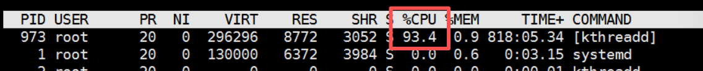
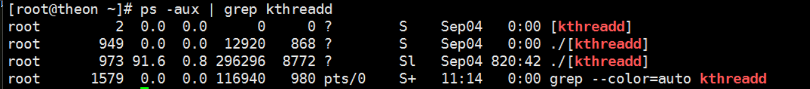
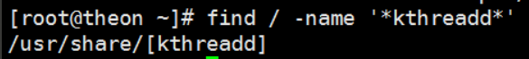
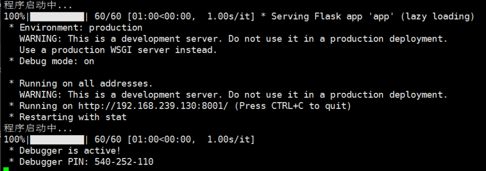
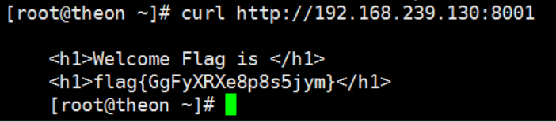

# 应急响应--简单

## 步骤

top命令查看系统进程,发现[kthreadd]异常占用cpu%95以上,推测为恶意进程



尝试使用ps aux命令查看进程路径,发现是相对路径

```bash
ps aux | grep kthreadd
```



尝试使用find命令查找恶意文件路径

```bash
find / -name '*kthreadd*'
```



路径为/usr/share/[kthreadd]

删除恶意文件并且停止恶意进程

```bash
rm -rf /usr/share/kthreadd
pkill -9 -f 'kthreadd'
```

top查看发现cpu占用恢复正常


启动flag程序

```bash
nohup /root/flags &
tail -f /root/nohup.out
```



查看flag
```bash
curl http://192.168.239.130:8001
```



flag{GgFyXRXe8p8s5jym}
恶意文件路径/usr/share
恶意文件名[kthreadd]
