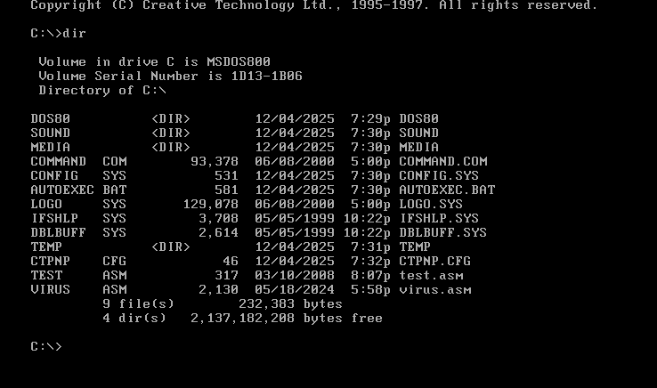
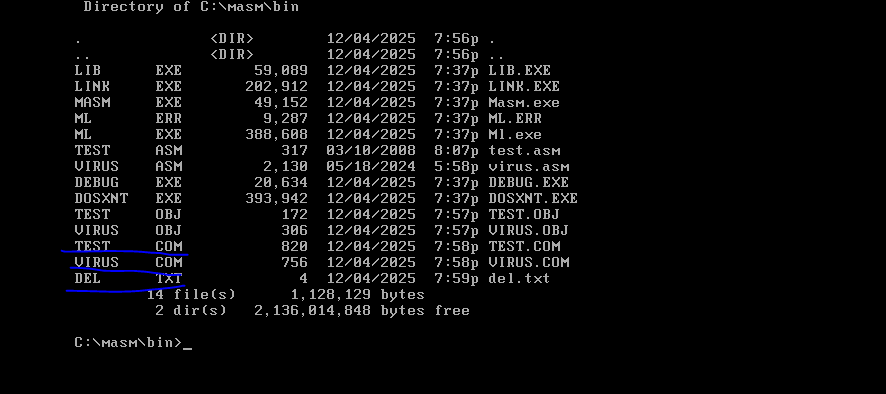
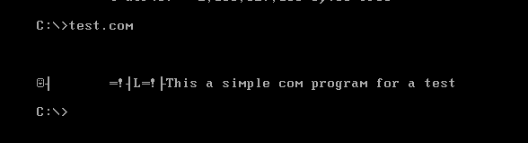
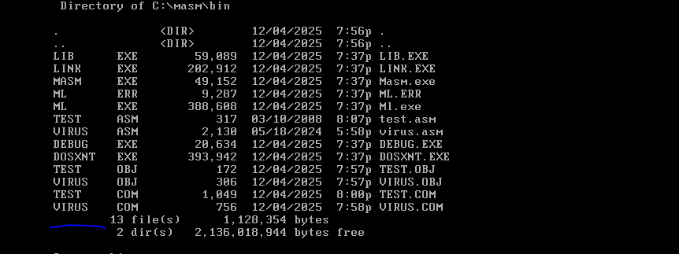
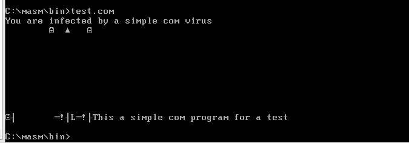

## COM文件病毒

### 实验目的

1. 掌握COM病毒的传播原理。
2. 掌握MASM611编译工具的使用。

### 实验环境

1. Vmware Workstation 15pro
2. DOS80
3. MASM611

### 实验内容
1. 分析由汇编语言编写的COM文件病毒的原理
2. 模拟COM病毒感染过程（virus\.com——>test\.com）
   
### 实验步骤

1. 将virus.asm和test.asm导入dos虚拟机



2. 编译virus.asm和test.asm为COM文件

```
masm test.asm
masm virus.asm
```
```
link test.obj
test.com
```
```
link virus.obj  
virus.com
```
3. 创建del.txt

```
echo 1 > del.txt
```



4. 模拟COM病毒感染过程

test\.com 未感染前



执行 virus\.com


此时重启dos虚拟机后发现del.txt已被删除

```
dir
```


再次执行 test\.com



test.com成功被感染

