## 引导区病毒实验

### 实验目的
掌握引导区病毒的原理

### 实验环境
1. VMware Workstation 17 pro
2. DOSBox-x
3. MASM611

### 实验内容
1. 分析由汇编语言编写的引导区病毒的原理
2. 模拟引导区病毒感染过程（软盘——>硬盘,硬盘——>空软盘）

### 实验步骤
1. 修改原始asm文件,指定显示为学号,空格需与学号的长度一致

两处cx的长度需要与输出一致
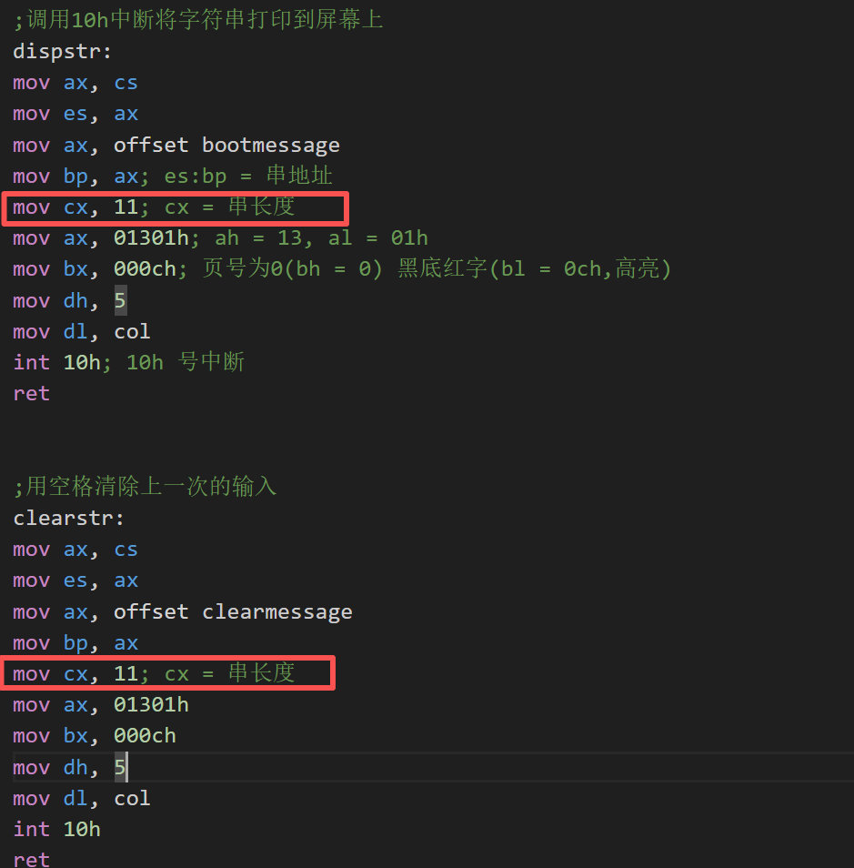
 

2. 编译+链接引导区病毒的asm文件并指定生成bin文件

 

3. 制作空软盘镜像
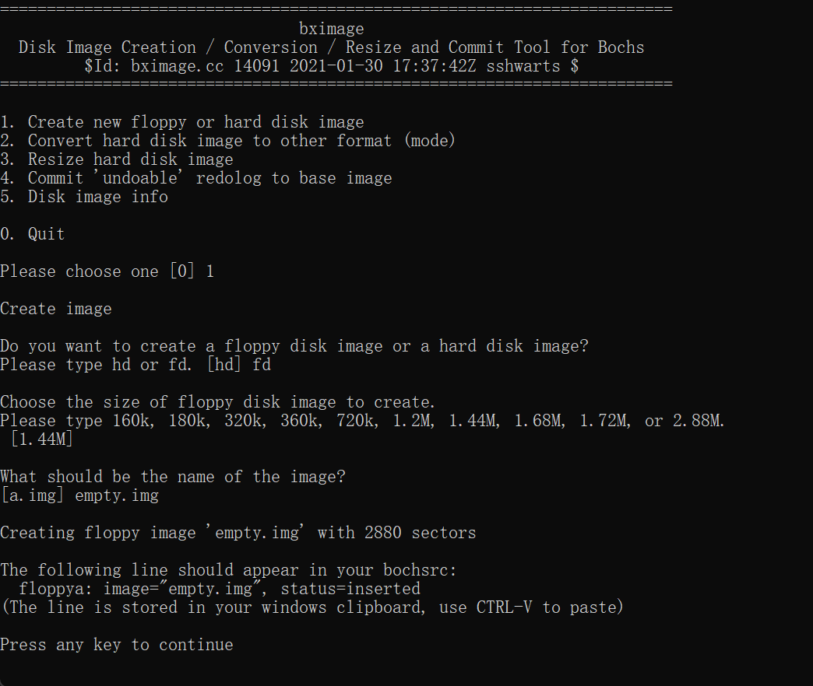
 

4. 制作virus.img文件
将bv.bin的0200h处后的512字节内容写入empty.img的前512字节
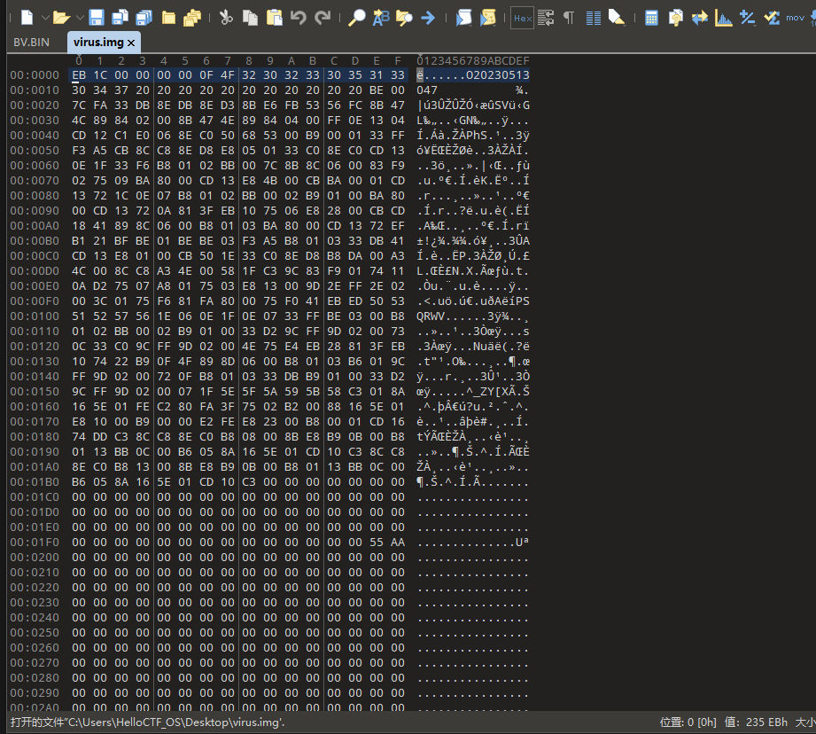
 

5. 测试com病毒
未使用病毒感染时,正常启动dos虚拟机如下
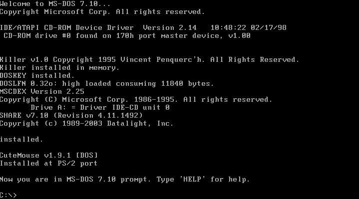

使用virus.img软盘启动dos虚拟机,如下
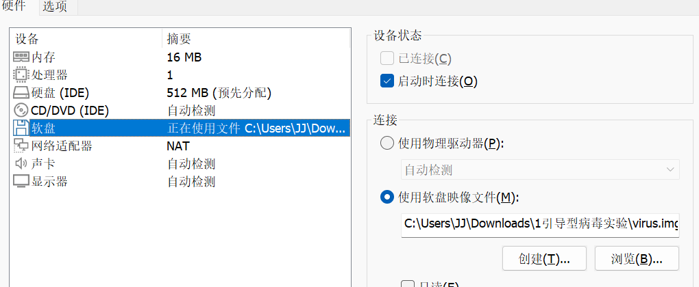
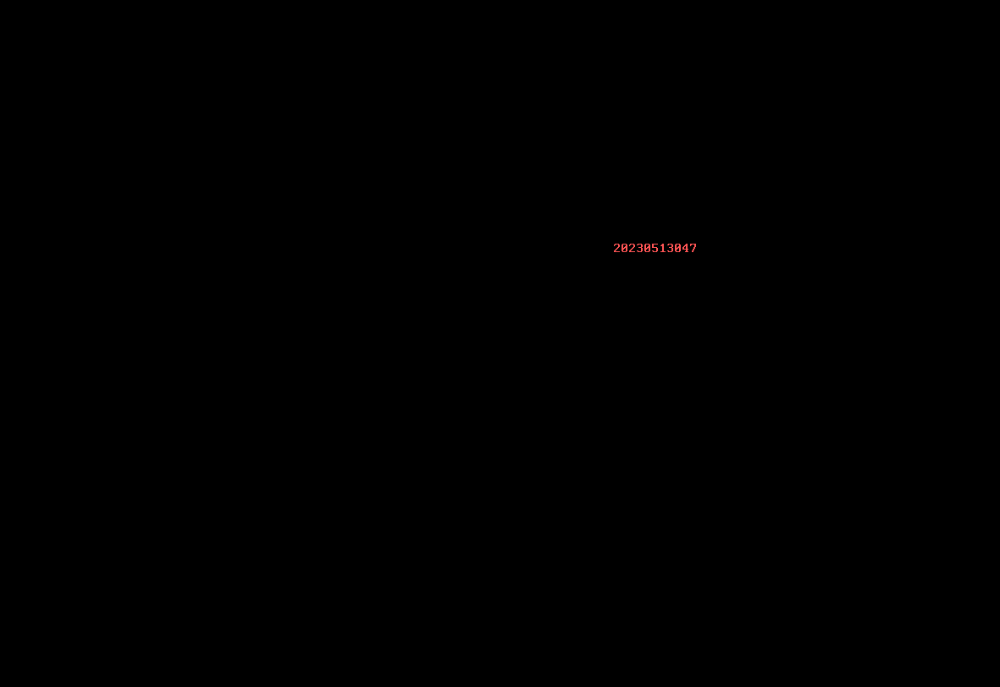
病毒执行成功,敲入任意键进入系统引导

 

6. 软盘感染硬盘
经过软盘启动后,病毒会感染硬盘的引导扇区,此时不连接软盘通过硬盘启动
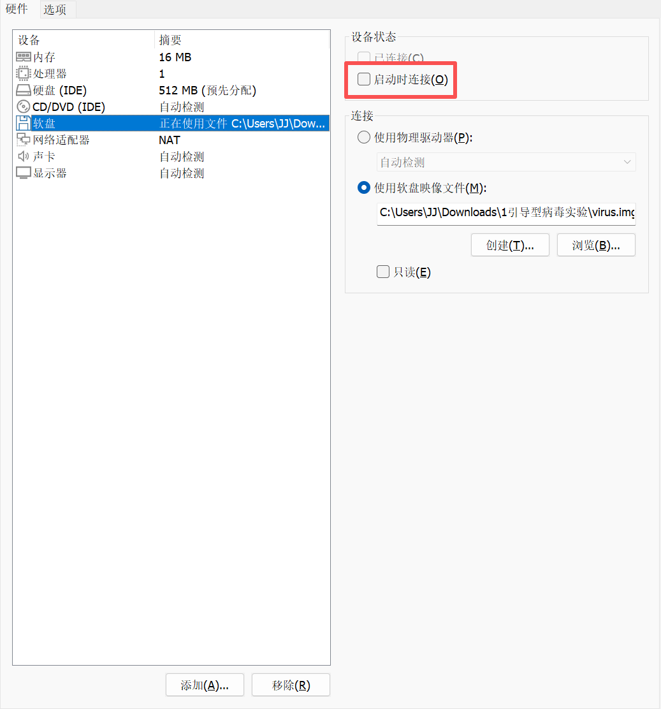

敲入任意键,进入系统引导
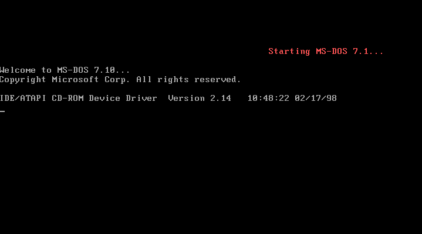
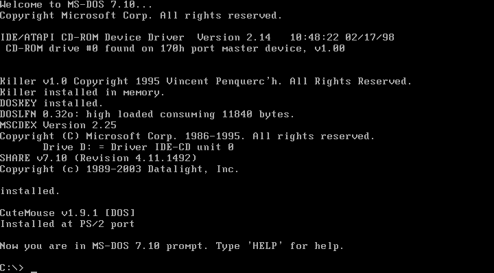
软盘成功感染硬盘
 

7. 硬盘传染空软盘
将virus.img软盘移除,添加新的空软盘empty.img
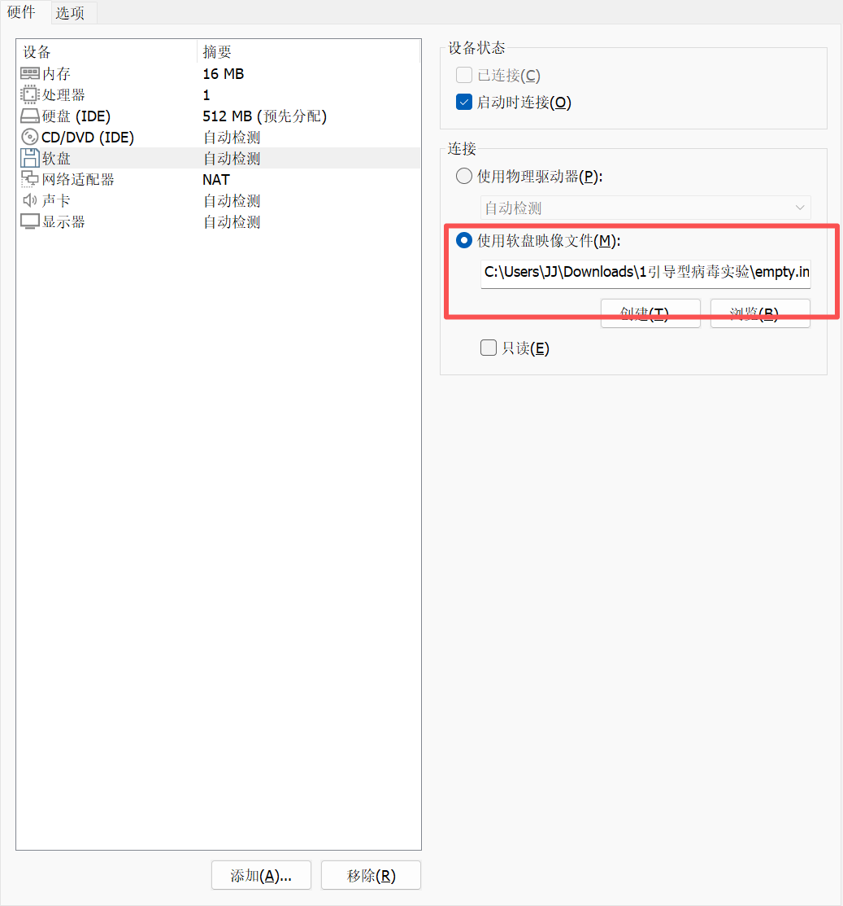
启动dos,并格式化empty.img
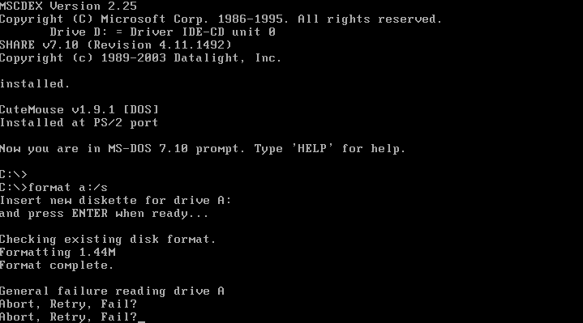
重启dos虚拟机,此时为受感染的空软盘启动
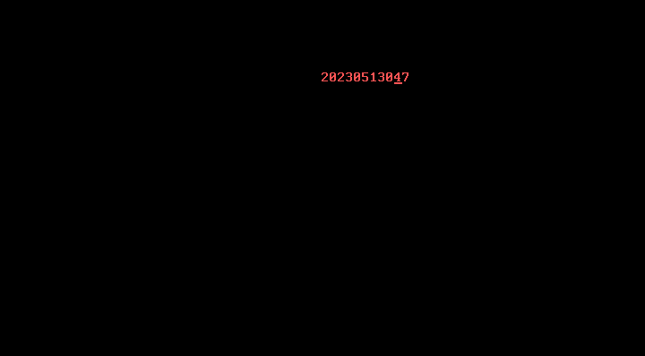
因为空软盘没有系统引导区,所以只能启动到如图所示的位置
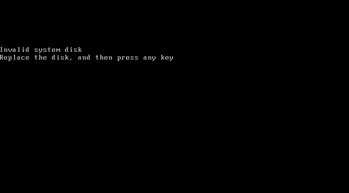

