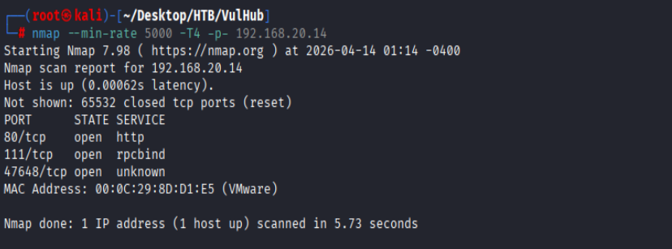
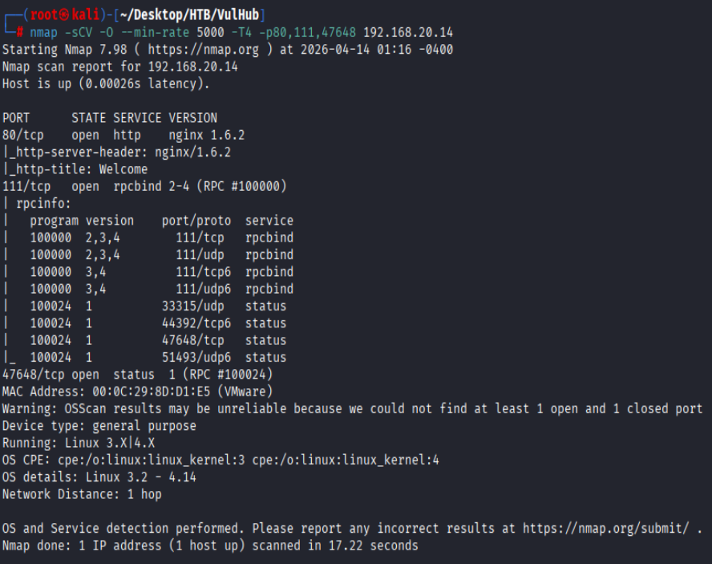
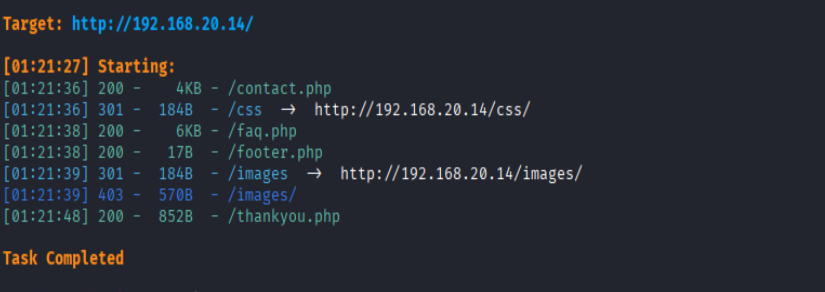
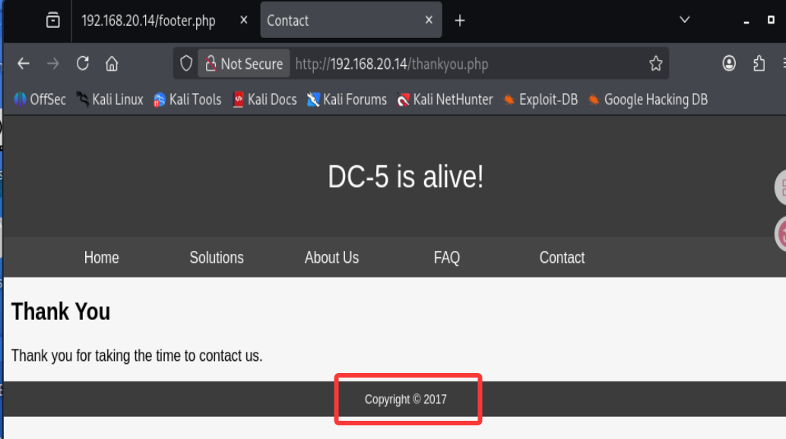
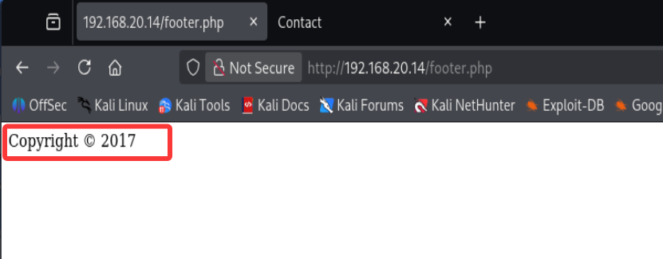
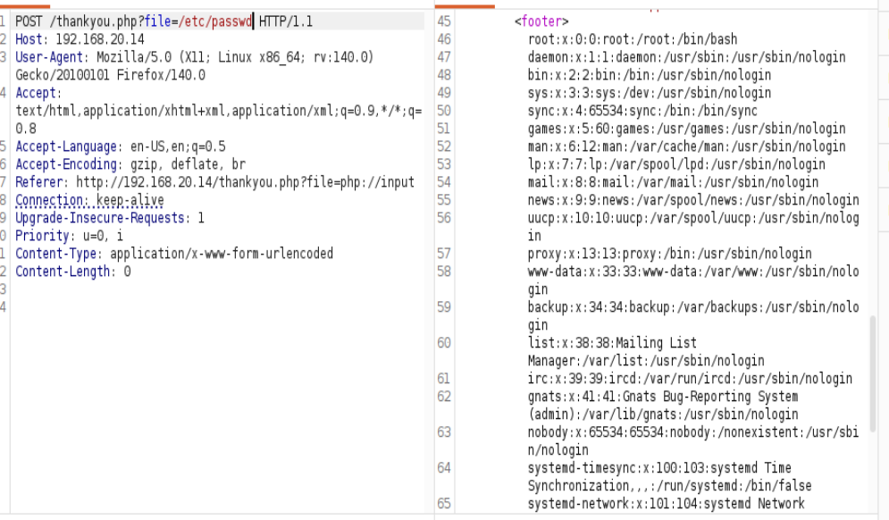
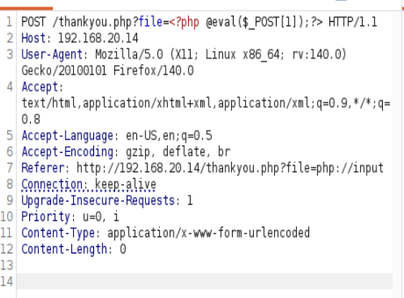
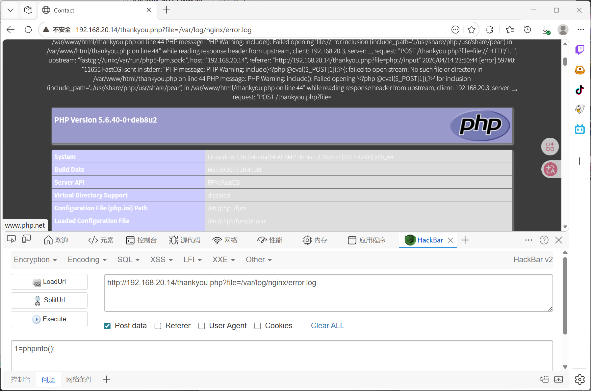
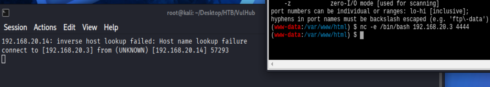
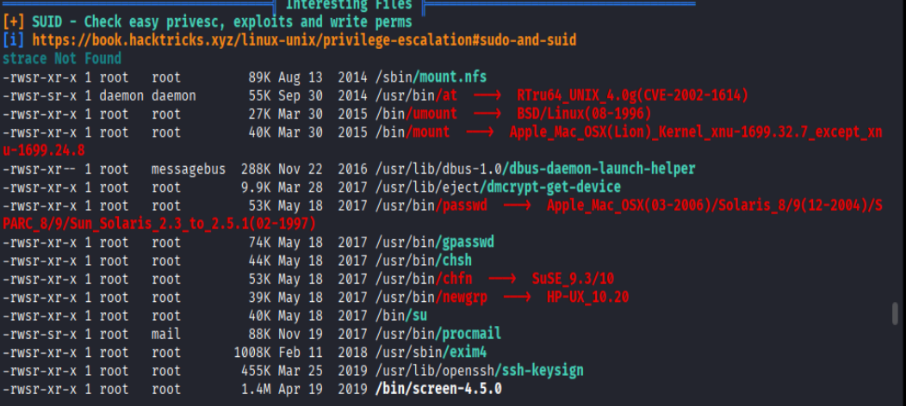

# VulHub DC-5

## 信息收集

### 内网扫描

```bash
arp-scan 10.10.10.0/24
```

得到目标IP为：`192.168.20.14`

### 端口扫描

```bash
nmap --min-rate 5000 -T4 -p- 192.168.20.14
```



#### 详细扫描

```bash
nmap -sCV -O --min-rate 5000 -T4 -p80,111,47648 192.168.20.14
```



### 目录扫描

```bash
dirsearch -u http://192.168.20.14
```



## LFI

`thankyou.php`底部年份会因网页刷新随机变化



同时注意到`footer.php`的年份也会因网页刷新随机变化



可以推测`thankyou.php`包含`footer.php`,经过测试参数为`file`



### 包含日志getshell

向日志中写入shell



包含日志中的shell



通过蚁剑终端使用nc反弹shell



## suid

```bash
find / -perm -4000 -type f 2>/dev/null
```



### screen 提权

`https://github.com/YasserREED/screen-v4.5.0-priv-escalate`

